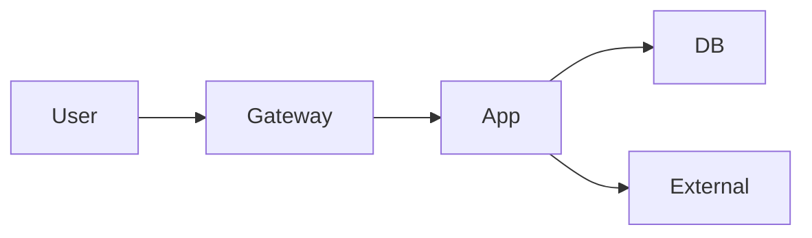

# Architecture At A Glance Template

目标文件：`docs/overview/architecture-at-a-glance.md`

````markdown
# 架构总览

## 摘要
- 一句话描述系统的核心职责与边界。
- 一句话说明最关键的请求链路和主要风险点。

## 你将了解
- 系统由哪些核心部分组成。
- 哪些页面适合继续深挖请求链路、失败模型和风险。
- 结构图应该如何阅读。

## 范围
- 范围内：核心入口、应用层、数据层、外部依赖。
- 范围外：未接入系统、历史迁移链路、非关键离线任务。

## 系统上下文
- 先用连续正文说明系统目标、外部依赖和边界。
- 至少引用 2 个核心入口或配置作为证据。

## 结构图（必填）


### 读图说明（必填）
- 先说明从哪个节点开始阅读。
- 再解释系统边界在哪里，哪些节点属于本系统、哪些属于外部系统。
- 最后指出后续深挖页分别展开哪一部分。

## 核心构成
### 入口层
- 负责什么，不负责什么。

### 编排层
- 谁在做跨模块编排，副作用在哪里发生。

### 持久化与外部依赖
- 数据落点、外部调用、失败传播入口在哪里。

## 关键链路
- 简述 1 条最重要的正常链路。
- 简述 1 条最重要的异常链路。
- 这里只做概览，详细逐跳解析放到 `architecture/request-lifecycle.md` 和 `architecture/failure-model.md`。

## 设计取舍
- 当前结构方案是什么。
- 替代方案是什么。
- 为什么当前方案更适合当前系统。

## 风险提示
- 至少列 3 个架构层面的风险或技术债。

## 相关页面
- `architecture/request-lifecycle.md`
- `architecture/failure-model.md`
- `architecture/design-decisions.md`
- `architecture/risks-and-tech-debt.md`
````
