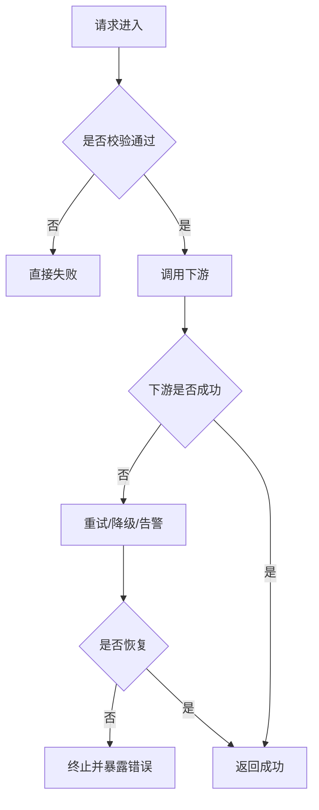

# Failure Model Template

目标文件：`docs/architecture/failure-model.md`

````markdown
# 失败模型

## 摘要
- 一句话说明系统最核心的失败来源。
- 一句话说明失败如何传播，以及主要恢复手段。

## 你将了解
- 哪些节点最容易失败。
- 失败如何在系统内传播。
- 系统采用了哪些恢复、降级、补偿或人工介入策略。

## 范围
- 范围内：核心请求链路、关键工作流、外部依赖失败、配置错误、数据冲突。
- 范围外：历史数据脏修复、纯人工流程、未上线能力。

## 失败来源概览
- 至少用 2 段正文说明失败来源：输入错误、依赖超时、数据冲突、配置错误、容量压力等。

## 故障 / 恢复图（必填）


### 读图说明（必填）
- 标明故障入口、传播方向、恢复分支与终止分支。
- 指出哪些故障由系统自动处理，哪些故障需要人工介入。

## 失败分类
### 输入类失败
- 参数、权限、协议、前置条件缺失。

### 依赖类失败
- 超时、限流、网络错误、第三方返回异常。

### 数据类失败
- 并发冲突、脏数据、幂等冲突、一致性问题。

### 配置与环境类失败
- 配置缺失、版本不兼容、部署差异、密钥错误。

## 异常传播链（必填）
| 触发点 | 原始故障 | 传播路径 | 对外表现 | 自动恢复 | 人工动作 |
|--------|----------|----------|----------|----------|----------|
| 下游服务 | `TimeoutError` | Service -> API | 503 / 错误码 | 重试或降级 | 检查依赖健康 |

- 至少展开 1 条传播链，用连续正文说明为什么会这样传播。

## 恢复策略
### 自动恢复
- 重试、降级、熔断、回退缓存、跳过非关键副作用。

### 补偿与回滚
- 哪些场景需要补偿，哪些场景只能终止。

### 人工介入
- 触发条件、入口、操作边界、恢复完成信号。

## 设计取舍
- 当前故障处理策略为什么成立。
- 替代策略为何未采用，以及代价是什么。

## 风险登记表（必填）
| 风险 | 触发条件 | 影响范围 | 可观测信号 | 缓解动作 |
|------|----------|----------|------------|----------|
| 下游持续超时 | p95 激增 | 主链路吞吐下降 | timeout rate / error log | 熔断 + 降级 |

## 相关页面
- `architecture/request-lifecycle.md`
- `workflows/exception-and-recovery.md`
- `workflows/troubleshooting-playbook.md`
- `appendix/evidence-index.md`
````
