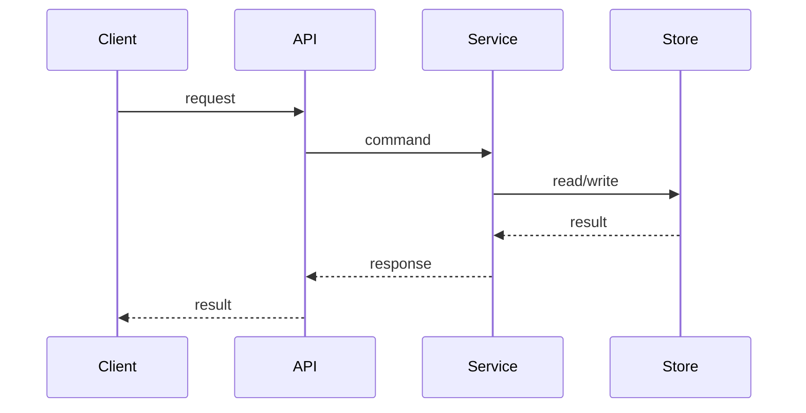

# Request Lifecycle Template

目标文件：`docs/architecture/request-lifecycle.md`

````markdown
# 请求生命周期

## 摘要
- 一句话说明这条请求链路解决什么问题。
- 一句话说明这条链路最关键的失败点在哪里。

## 你将了解
- 请求从入口到结果返回如何逐跳穿过系统。
- 每一跳的输入、输出、副作用和失败模式。
- 哪些异常会中断主链路，哪些异常会进入恢复路径。

## 范围
- 范围内：入口、鉴权、参数处理、服务编排、持久化、外部调用、返回。
- 范围外：离线补偿链路、独立批处理流程、人工后台修复流程。

## 背景
- 用 2 段以内正文说明为什么这条请求链路值得单独分析。

## 运行时图（必填）


### 读图说明（必填）
- 指明阅读顺序：从请求进入到返回结果。
- 指出关键跳点、最可能失败的节点和副作用发生点。
- 说明后文哪些小节分别展开正常流和异常流。

## 正常流逐跳解析（必填）
| 跳点 | 输入 | 输出 | 副作用 | 失败模式 | 恢复策略 |
|------|------|------|--------|----------|----------|
| Client -> API | 请求参数 | 规范化命令 | trace 注入 | 参数非法 | fail-fast |
| API -> Service | Command | 领域动作 | 鉴权 / 编排 | 权限不足 | 返回业务错误 |
| Service -> Store | 领域对象 | 持久化结果 | 写库 / 调外部服务 | 超时 / 冲突 | 重试 / 回滚 |

- 表格后必须再用连续正文解释最关键的 2-3 跳。

## 异常流逐跳解析（必填）
| 触发点 | 原始异常 | 传播路径 | 对外表现 | 可观测信号 | 恢复方式 |
|--------|----------|----------|----------|------------|----------|
| Service | `TimeoutError` | Service -> API | 503 / 业务错误码 | timeout 指标、error log | 重试 / 降级 |

- 说明哪些异常会直接失败，哪些异常会进入恢复分支。

## 边界条件与反例
- 说明至少 1 个“不走主链路”的场景。
- 说明至少 1 个配置或状态会改变默认行为的场景。

## 设计取舍
- 当前链路设计的优点是什么。
- 如果改成同步 / 异步、强一致 / 最终一致，会带来什么代价。

## 风险与观测
- 风险项至少包含：触发条件、影响范围、观测信号、缓解动作。

## 证据索引
- 将关键结论对应到入口文件、服务、仓储、配置键、测试资产。

## 相关页面
- `overview/architecture-at-a-glance.md`
- `architecture/failure-model.md`
- `workflows/core-business-flows.md`
- `appendix/evidence-index.md`
````
