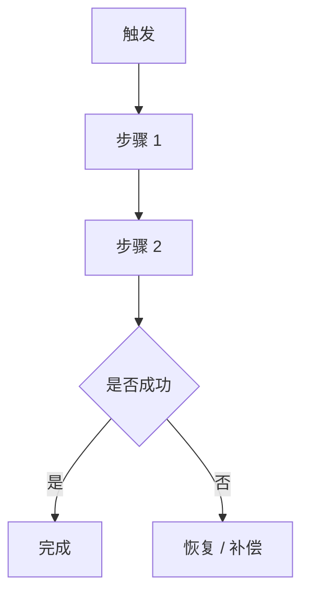
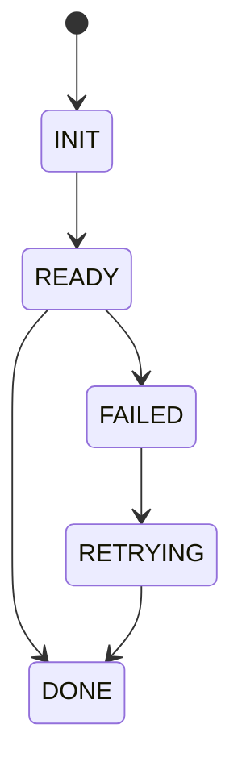

# Workflow Deep Dive Template

目标文件：`docs/workflows/workflow-<name>-deep-dive.md`

````markdown
# <workflow-name> 工作流深挖

## 摘要
- 一句话说明这条工作流完成什么业务目标。
- 一句话说明最关键的失败点或补偿点。

## 你将了解
- 谁会触发这条工作流，前置条件是什么。
- 主流程如何推进，状态如何变化。
- 异常出现时如何恢复、补偿或回滚。

## 范围
- 范围内：参与角色、系统动作、状态流转、异常处理。
- 范围外：其他工作流的内部细节、通用参考信息。

## 工作流背景
- 用 1-2 段正文交代这条工作流在整体系统中的位置。

## 工作流图（必填）


### 读图说明（必填）
- 说明从触发到结束的阅读顺序。
- 指出关键决策点、状态变化点和补偿入口。

## 参与者与前置条件
- 角色有哪些，各自负责什么。
- 前置条件来自哪些配置、状态或外部依赖。

## 主流程逐步解析（必填）
| 步骤 | 输入 | 输出 | 状态变化 | 副作用 | 失败模式 |
|------|------|------|----------|--------|----------|
| Step 1 | 触发请求 | 规范化上下文 | `INIT -> READY` | 记录日志 / 写状态 | 参数不完整 |

- 表格后必须再用连续正文解释最关键的 2-3 步。

## 异常与恢复（必填）
| 失败点 | 现象 | 自动恢复 | 补偿 / 回滚 | 人工介入 |
|--------|------|----------|-------------|----------|
| Step 2 | 下游超时 | retry / fallback | 补偿已写入状态 | 必要时人工重放 |

## 状态机（按需）


### 状态解释
- 说明合法状态转换。
- 说明非法状态如何被阻止或修复。

## 设计取舍
- 说明为什么采用当前工作流编排方式。
- 说明改为同步 / 异步、集中编排 / 分布式协作的代价。

## 风险与排障
- 至少列 3 个与这条工作流直接相关的风险。
- 给出首选排障顺序和观测信号。

## 证据索引
- 将关键步骤映射到代码入口、状态定义、配置键和测试资产。

## 相关页面
- `overview/workflow-map.md`
- `workflows/core-business-flows.md`
- `workflows/exception-and-recovery.md`
- `appendix/evidence-index.md`
````
