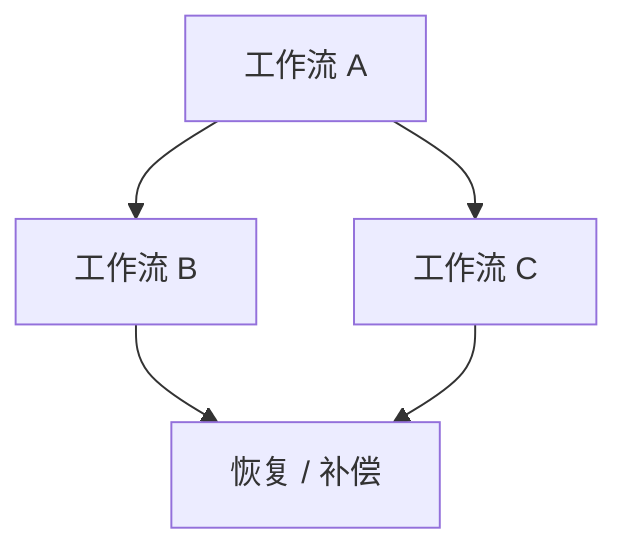

# Workflow Map Template

目标文件：`docs/overview/workflow-map.md`

````markdown
# 工作流地图

## 摘要
- 一句话说明系统最核心的业务闭环是什么。
- 一句话说明哪些工作流最值得单独深挖。

## 你将了解
- 系统里有哪些关键业务工作流。
- 这些工作流如何衔接、共享状态或共享模块。
- 哪些工作流有明显的失败恢复路径。

## 范围
- 范围内：核心业务闭环、关键状态转换、主要失败分支。
- 范围外：低价值边缘流程、一次性迁移脚本、纯内部操作脚本。

## 工作流总览
- 用连续正文说明系统的“主工作流”“支撑工作流”“恢复工作流”之间的关系。

## 工作流图（必填）


### 读图说明（必填）
- 说明阅读顺序和各工作流之间的依赖关系。
- 指出哪些工作流是主路径，哪些是异常补位路径。

## 核心工作流清单
| 工作流 | 目标 | 参与者 | 成功结束条件 | 失败结束条件 | 深挖页 |
|--------|------|--------|--------------|--------------|--------|
| 工作流 A | 完成主业务闭环 | 用户 / 系统 | 结果持久化成功 | 核心步骤失败 | `workflows/workflow-a-deep-dive.md` |

## 状态与边界
- 说明共享状态在哪里产生、在哪里被消费。
- 说明跨工作流边界：哪些工作流只能串行，哪些可以异步。

## 风险提示
- 指出最容易失控的 2-3 条工作流边界或切换点。

## 相关页面
- `workflows/core-business-flows.md`
- `workflows/exception-and-recovery.md`
- `workflows/rollback-and-compensation.md`
````
