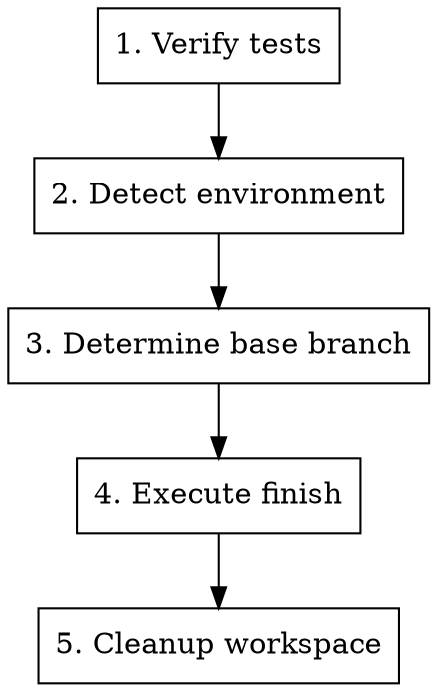

# 命令瘦身 + 变量系统 + Skill 统一 实施计划

> **For agentic workers:** REQUIRED SUB-SKILL: Use superpowers-pro:subagent-driven-development to implement this plan task-by-task. Steps use checkbox (`- [ ]`) syntax for tracking.

**Goal:** 命令瘦身委托 skill、全局变量系统控制 skill 行为、FINISH 步骤统一为确定性流程、新增 issue-scanning 和 refactor-assessment 两个 skill

**Architecture:** 新增 variables.json 作为全局变量定义的唯一真相源，扩展 session-start hook 注入变量默认值到会话上下文，skill frontmatter 只声明引用的变量名列表，命令文件瘦身只保留调用行 + 检查点 + 产出物。finishing-a-development-branch skill 重写为 auto 模式为主、interactive 模式为 fallback 的双分支结构。

**Tech Stack:** Bash（hook）、JSON（variables）、Markdown（skill、command）

---

## File Structure

| Operation | Path | Responsibility |
|-----------|------|----------------|
| Create | `.claude-plugin/variables.json` | 全局变量定义（finish-mode, review-mode） |
| Modify | `hooks/session-start` | 扩展：读取 variables.json 并注入会话上下文 |
| Rewrite | `skills/finishing-a-development-branch/SKILL.md` | auto 为主 + interactive fallback，引用 finish-mode |
| Modify | `skills/brainstorming/SKILL.md` | frontmatter 迁移 review-mode 到 variables 块 |
| Create | `skills/issue-scanning/SKILL.md` | /fix 第一步：系统性问题扫描 |
| Create | `skills/refactor-assessment/SKILL.md` | /refactor 第一步：重构评估 |
| Modify | `commands/feat.md` | 7 步委托 skill，1 步保留内联 |
| Modify | `commands/fix.md` | 7 步委托 skill，1 步保留内联；Step 1 改调 issue-scanning |
| Modify | `commands/refactor.md` | 7 步委托 skill，1 步保留内联；Step 1 改调 refactor-assessment |
| Modify | `commands/init.md` | 5 步委托 skill，3 步保留内联 |
| Modify | `.claude-plugin/plugin.json` | version 0.8.1 → 0.9.0 |
| Modify | `CHANGELOG.md` | 记录变更 |

---

### Task 1: 创建 variables.json

**Files:**
- Create: `.claude-plugin/variables.json`

- [ ] **Step 1: 创建变量定义文件**

```json
{
  "finish-mode": {
    "default": "auto",
    "values": ["auto", "interactive"],
    "description": "auto = 确定性合并推送清理; interactive = 菜单选择模式"
  },
  "review-mode": {
    "default": "section-by-section",
    "values": ["section-by-section", "full"],
    "description": "section-by-section = 分节审批; full = 一次展示"
  }
}
```

- [ ] **Step 2: 提交**

```bash
cd /Users/lijunyi/road/claude-harness
git add plugins/superpowers-pro/.claude-plugin/variables.json
git commit -m "feat(superpowers-pro): add variables.json for global skill configuration"
```

---

### Task 2: 扩展 session-start hook

**Files:**
- Modify: `hooks/session-start:1-57`

- [ ] **Step 1: 在 hook 中添加 variables.json 读取和注入逻辑**

在 `using_superpowers_content` 读取之后、`escape_for_json` 调用之前，添加 variables.json 读取逻辑。修改 `hooks/session-start`，在行 18（读取 using-superpowers 内容）之后插入变量读取：

```bash
# Read variables configuration
variables_content=""
variables_file="${PLUGIN_ROOT}/.claude-plugin/variables.json"
if [ -f "$variables_file" ]; then
    variables_raw=$(cat "$variables_file")
    # Format as compact key: value (options) — description per line
    variables_content=$(
        echo "$variables_raw" | python3 -c "
import json, sys
data = json.load(sys.stdin)
lines = []
for key, val in data.items():
    opts = ', '.join(val['values'])
    lines.append(f\"{key}: {val['default']} (可选: {opts}) — {val['description']}\")
print('\n'.join(lines))
" 2>/dev/null || echo ""
    )
fi
```

然后将 `session_context` 变量中的注入部分修改为：

将原来的：
```bash
session_context="<EXTREMELY_IMPORTANT>\nYou have superpowers.\n\n**Below is the full content of your 'superpowers-pro:using-superpowers' skill - your introduction to using skills. For all other skills, use the 'Skill' tool:**\n\n${using_superpowers_escaped}\n\n${warning_escaped}\n</EXTREMELY_IMPORTANT>"
```

改为：
```bash
variables_section=""
if [ -n "$variables_content" ]; then
    variables_escaped=$(escape_for_json "$variables_content")
    variables_section="\n\n[superpowers-pro variables]\n${variables_escaped}"
fi

session_context="<EXTREMELY_IMPORTANT>\nYou have superpowers.\n\n**Below is the full content of your 'superpowers-pro:using-superpowers' skill - your introduction to using skills. For all other skills, use the 'Skill' tool:**\n\n${using_superpowers_escaped}\n\n${warning_escaped}${variables_section}\n</EXTREMELY_IMPORTANT>"
```

- [ ] **Step 2: 测试 hook 输出**

```bash
cd /Users/lijunyi/road/claude-harness
bash plugins/superpowers-pro/hooks/session-start 2>/dev/null | python3 -c "
import sys, json
data = json.loads(sys.stdin.read())
ctx = data.get('hookSpecificOutput', {}).get('additionalContext', '') or data.get('additionalContext', '') or data.get('additional_context', '')
assert 'superpowers-pro variables' in ctx, 'variables section missing'
assert 'finish-mode' in ctx, 'finish-mode missing'
assert 'review-mode' in ctx, 'review-mode missing'
print('OK: variables injected')
"
```

Expected: `OK: variables injected`

- [ ] **Step 3: 提交**

```bash
cd /Users/lijunyi/road/claude-harness
git add plugins/superpowers-pro/hooks/session-start
git commit -m "feat(superpowers-pro): inject variables.json defaults into session context"
```

---

### Task 3: 重写 finishing-a-development-branch skill

**Files:**
- Rewrite: `skills/finishing-a-development-branch/SKILL.md`

- [ ] **Step 1: 写入新 skill 内容**

```markdown
---
name: finishing-a-development-branch
description: Use when implementation is complete and tests pass — guides completion of development work by executing merge, push, and cleanup, or presenting interactive options based on finish-mode variable
variables: [finish-mode]
---

# Finishing a Development Branch

## Overview

Complete development work by executing the finish workflow. Behavior controlled by `finish-mode` variable (defined in variables.json):

- **auto** (default): Deterministic merge → test → push → cleanup → delete branch
- **interactive**: Menu-based selection (merge locally / create PR / keep as-is / discard)

**Announce at start:** "I'm using the finishing-a-development-branch skill to complete this work."

## Variable Resolution

`finish-mode` resolved by priority:
1. User states preference in conversation ("用 interactive 模式")
2. Command invocation specifies value (e.g. `调用 skill（finish-mode: auto）`)
3. variables.json default (auto, injected by session-start hook)

## Process



### Step 1: Verify Tests

**Before any finish action, verify tests pass:**

```bash
npm test / cargo test / pytest / go test ./...
```

**If tests fail:**
```
Tests failing (<N> failures). Must fix before completing.
[Show failures]
Cannot proceed with merge/PR until tests pass.
```

Stop. Don't proceed to Step 2.

### Step 2: Detect Environment

```bash
GIT_DIR=$(cd "$(git rev-parse --git-dir)" 2>/dev/null && pwd -P)
GIT_COMMON=$(cd "$(git rev-parse --git-common-dir)" 2>/dev/null && pwd -P)
```

| State | Implication |
|-------|-------------|
| `GIT_DIR == GIT_COMMON` | Normal repo — no worktree cleanup needed |
| `GIT_DIR != GIT_COMMON`, named branch | Worktree — provenance-based cleanup applies |
| `GIT_DIR != GIT_COMMON`, detached HEAD | Externally managed — no merge, no cleanup |

### Step 3: Determine Base Branch

```bash
git merge-base HEAD main 2>/dev/null || git merge-base HEAD master 2>/dev/null
```

Or ask: "This branch split from main — is that correct?"

### Step 4: Execute Finish

Branch on `finish-mode`:

#### auto mode

Deterministic pipeline — no menu, no choices:

1. **Record initial branch** (branch where user started the workflow)
2. **Merge worktree branch to initial branch**
   - If no worktree detected (init-system scenario): skip merge, proceed to push
3. **Run tests on merged result** — failure → automatic rollback merge + report
4. **Push initial branch to remote**
5. **Cleanup worktree** (provenance check, Step 5)
6. **Delete impl branch**

#### interactive mode

Present menu based on environment:

**Named branch worktree or normal repo — 4 options:**

```
Implementation complete. What would you like to do?

1. Merge back to <base-branch> locally
2. Push and create a Pull Request
3. Keep the branch as-is (I'll handle it later)
4. Discard this work

Which option?
```

**Detached HEAD — 3 options:**

```
Implementation complete. You're on a detached HEAD (externally managed workspace).

1. Push as new branch and create a Pull Request
2. Keep as-is (I'll handle it later)
3. Discard this work

Which option?
```

Execute per option:

**Option 1: Merge Locally**
```bash
MAIN_ROOT=$(git -C "$(git rev-parse --git-common-dir)/.." rev-parse --show-toplevel)
cd "$MAIN_ROOT"
git checkout <base-branch>
git pull
git merge <feature-branch>
<test command>
```
Then: Cleanup (Step 5), delete branch: `git branch -d <feature-branch>`

**Option 2: Push and Create PR**
```bash
git push -u origin <feature-branch>
gh pr create --title "<title>" --body "$(cat <<'EOF'
## Summary
<2-3 bullets>

## Test Plan
- [ ] <verification steps>
EOF
)"
```
**Do NOT cleanup worktree** — user needs it for PR iteration.

**Option 3: Keep As-Is**
Report: "Keeping branch <name>. Worktree preserved at <path>."
**Don't cleanup.**

**Option 4: Discard**
**Confirm first:**
```
This will permanently delete:
- Branch <name>
- All commits: <commit-list>
- Worktree at <path>

Type 'discard' to confirm.
```
Wait for exact "discard". Then: Cleanup (Step 5), force-delete: `git branch -D <feature-branch>`

### Step 5: Cleanup Workspace

**Only runs for auto mode, or interactive Option 1 / Option 4.**

```bash
GIT_DIR=$(cd "$(git rev-parse --git-dir)" 2>/dev/null && pwd -P)
GIT_COMMON=$(cd "$(git rev-parse --git-common-dir)" 2>/dev/null && pwd -P)
WORKTREE_PATH=$(git rev-parse --show-toplevel)
```

**If `GIT_DIR == GIT_COMMON`:** Normal repo, no worktree to clean up. Done.

**If worktree under `.worktrees/`, `worktrees/`, or `~/.config/superpowers-pro/worktrees/`:** Superpowers-Pro owns it.

```bash
MAIN_ROOT=$(git -C "$(git rev-parse --git-common-dir)/.." rev-parse --show-toplevel)
cd "$MAIN_ROOT"
git worktree remove "$WORKTREE_PATH"
git worktree prune
```

**Otherwise:** Host environment owns the workspace. Do NOT remove. Use platform's workspace-exit tool if available.

## Quick Reference

| Mode | Merge | Push | Keep Worktree | Cleanup Branch |
|------|-------|------|---------------|----------------|
| auto | yes | yes | no | yes |
| interactive 1 | yes | — | no | yes |
| interactive 2 | — | yes | yes | no |
| interactive 3 | — | — | yes | no |
| interactive 4 | — | — | no | yes (force) |

## Common Mistakes

| Mistake | Fix |
|---------|-----|
| Proceeding with failing tests | Always verify tests first. Stop if they fail. |
| Merging without verifying tests on result | Run tests after merge, rollback if they fail. |
| Cleaning up worktree for interactive Option 2/3 | Only cleanup for auto mode and interactive 1/4. |
| Deleting branch before removing worktree | Remove worktree first, then delete branch. |
| Running git worktree remove from inside the worktree | Always cd to main repo root first. |
| Cleaning up harness-owned worktrees | Only clean up provenance directories. |
| No confirmation for interactive Option 4 | Require typed "discard" confirmation. |
```

- [ ] **Step 2: 提交**

```bash
cd /Users/lijunyi/road/claude-harness
git add plugins/superpowers-pro/skills/finishing-a-development-branch/SKILL.md
git commit -m "feat(superpowers-pro): rewrite finishing-a-development-branch with auto/interactive modes"
```

---

### Task 4: 迁移 brainstorming skill frontmatter

**Files:**
- Modify: `skills/brainstorming/SKILL.md:1-4`

- [ ] **Step 1: 修改 frontmatter**

将：
```yaml
---
name: brainstorming
description: "You MUST use this before any creative work - creating features, building components, adding functionality, or modifying behavior. Explores user intent, requirements and design before implementation."
review-mode: section-by-section
---
```

改为：
```yaml
---
name: brainstorming
description: "You MUST use this before any creative work - creating features, building components, adding functionality, or modifying behavior. Explores user intent, requirements and design before implementation."
variables: [review-mode]
---
```

- [ ] **Step 2: 更新 body 中 review-mode 的引用方式**

在 `## Review Modes` 章节（约 line 22-28），将：

```markdown
The `review-mode` frontmatter variable controls how the design is presented:
```

改为：

```markdown
The `review-mode` variable (defined in variables.json) controls how the design is presented:
```

在 `## Key Principles` 最后一行（约 line 160），将：

```markdown
- **Incremental validation** - Present design, get approval before moving on (only when `review-mode: section-by-section`)
```

改为：

```markdown
- **Incremental validation** - Present design, get approval before moving on (only when `review-mode` is `section-by-section`)
```

- [ ] **Step 3: 提交**

```bash
cd /Users/lijunyi/road/claude-harness
git add plugins/superpowers-pro/skills/brainstorming/SKILL.md
git commit -m "refactor(superpowers-pro): migrate brainstorming review-mode to variables block"
```

---

### Task 5: 瘦身 /feature 命令

**Files:**
- Modify: `commands/feat.md`

- [ ] **Step 1: 瘦身命令文件**

将全文替换为：

```markdown
---
description: "功能开发完整流水线 — 从需求构思到代码交付，8 步显式编排，防止步骤静默丢失"
argument-hint: "<feature-description>"
effort: high
---

# /feature — 功能开发工作流

你正在执行功能开发完整流水线。严格按照以下 8 步顺序执行，每步必须输出检查点，下一步开始前必须确认上一步检查点。

用户需求: $ARGUMENTS

## 检查点协议

- 步骤状态: PENDING(□) → IN_PROGRESS(○) → DONE(✓) / SKIPPED(⊘)
- 完成时输出: `━━━ [✓] Step N/8: <NAME> — <一句话结果>` + `    产出物: <文件路径或状态>`
- 跳过时输出: `━━━ [⊘] Step N/8: <NAME> — 用户跳过，原因: <原因>` + `    产出物: <实际状态>`
- 开始前校验: `━━━ [→] Step N/8: <NAME> — 前置检查: Step N-1 <NAME> ✓`
- 前置缺失: `━━━ [✗] Step N/8: <NAME> — 阻塞: Step N-1 未完成` → 停止

## 进度总览

▶ /feature 启动 — 功能开发工作流

- Step 1/8  BRAINSTORM    □  探索需求，产出 spec 文档
- Step 2/8  SPEC_REVIEW   □  spec 审批（唯一人类检查点）
- Step 3/8  ISOLATE       □  Worktree 隔离 + 基线验证
- Step 4/8  PLAN          □  拆解 bite-sized 任务
- Step 5/8  IMPLEMENT     □  TDD + 双重审查逐 task 执行
- Step 6/8  REVIEW        □  整体代码审查
- Step 7/8  VERIFY        □  验证门控
- Step 8/8  FINISH        □  合并到初始分支 + 推送 + 清理

---

## Step 1/8: BRAINSTORM

调用 `superpowers-pro:brainstorming` skill（review-mode: section-by-section）。

如果发现此需求不需要新设计（只是 bug 修复或小调整），停止并建议用户改用 `/fix` 或 `/refactor`。

检查点: `━━━ [✓] Step 1/8: BRAINSTORM — 设计文档已产出`
产出物: `docs/superpowers-pro/specs/YYYY-MM-DD-<topic>-design.md`

## Step 2/8: SPEC_REVIEW

**这是唯一的人类检查点。** 必须等待用户明确批准后才能继续。

- 展示设计文档内容
- 等待用户响应: 批准 / 要求修改 / 建议改用其他工作流
- 如果要求修改: 修改后重新展示，再次等待
- 如果建议改用其他工作流: 停止当前流程，提示用户使用建议的工作流

检查点: `━━━ [✓] Step 2/8: SPEC_REVIEW — 用户已批准设计文档`
产出物: 用户审批确认（对话状态）

## Step 3/8: ISOLATE

调用 `superpowers-pro:using-git-worktrees` skill。

检查点: `━━━ [✓] Step 3/8: ISOLATE — Worktree 已创建，基线测试通过`
产出物: worktree 路径 + 分支名 + 基线测试通过

## Step 4/8: PLAN

调用 `superpowers-pro:writing-plans` skill。

保存至 `docs/superpowers-pro/plans/YYYY-MM-DD-<feature-name>.md`。

检查点: `━━━ [✓] Step 4/8: PLAN — 实施计划已产出`
产出物: `docs/superpowers-pro/plans/YYYY-MM-DD-<feature-name>.md`

## Step 5/8: IMPLEMENT

调用 `superpowers-pro:subagent-driven-development` skill。

每个 task 强制执行:
1. `superpowers-pro:test-driven-development` — RED → GREEN → REFACTOR
2. spec reviewer 子代理审查 — 不通过则 implementer 修复后重新审查
3. code quality reviewer 子代理审查 — 不通过则 implementer 修复后重新审查

**无子代理可用时: 报错停止。**

连续执行所有 task，不在 task 之间暂停问人。

检查点: `━━━ [✓] Step 5/8: IMPLEMENT — 所有 task 完成`
产出物: 所有 task 标记完成 + 最终提交 SHA

## Step 6/8: REVIEW

调用 `superpowers-pro:requesting-code-review` skill。

检查点: `━━━ [✓] Step 6/8: REVIEW — 代码审查完成`
产出物: 审查报告 + 反馈处理结果

## Step 7/8: VERIFY

调用 `superpowers-pro:verification-before-completion` skill。

重读 spec 文档 + 计划，逐条检查需求覆盖率。未覆盖的 gap 必须记录。

检查点: `━━━ [✓] Step 7/8: VERIFY — 验证通过，需求覆盖率 N/M`
产出物: 验证命令输出 + 需求覆盖率报告

## Step 8/8: FINISH

调用 `superpowers-pro:finishing-a-development-branch` skill（finish-mode: auto）。

检查点: `━━━ [✓] Step 8/8: FINISH — 已合并到 <初始分支> 并推送`
产出物: 合并结果 + 推送结果 + 清理结果
```

- [ ] **Step 2: 提交**

```bash
cd /Users/lijunyi/road/claude-harness
git add plugins/superpowers-pro/commands/feat.md
git commit -m "refactor(superpowers-pro): slim /feature command — delegate execution to skills"
```

---

### Task 6: 瘦身 /fix 命令

**Files:**
- Modify: `commands/fix.md`

- [ ] **Step 1: 瘦身命令文件**

将全文替换为：

```markdown
---
description: "Bug 修复完整流水线 — 从问题扫描到修复交付，8 步显式编排，防止步骤静默丢失"
argument-hint: "<issue-description>"
effort: high
---

# /fix — Bug 修复工作流

你正在执行 Bug 修复完整流水线。严格按照以下 8 步顺序执行，每步必须输出检查点，下一步开始前必须确认上一步检查点。

问题描述: $ARGUMENTS

## 检查点协议

- 步骤状态: PENDING(□) → IN_PROGRESS(○) → DONE(✓) / SKIPPED(⊘)
- 完成时输出: `━━━ [✓] Step N/8: <NAME> — <一句话结果>` + `    产出物: <文件路径或状态>`
- 跳过时输出: `━━━ [⊘] Step N/8: <NAME> — 用户跳过，原因: <原因>` + `    产出物: <实际状态>`
- 开始前校验: `━━━ [→] Step N/8: <NAME> — 前置检查: Step N-1 <NAME> ✓`
- 前置缺失: `━━━ [✗] Step N/8: <NAME> — 阻塞: Step N-1 未完成` → 停止

## 进度总览

▶ /fix 启动 — Bug 修复工作流

  Step 1/8  DIAGNOSE      □  系统性问题扫描，产出 issue 文档
  Step 2/8  SPEC_REVIEW   □  issue 文档审批（唯一人类检查点）
  Step 3/8  ISOLATE       □  Worktree 隔离 + 基线验证
  Step 4/8  PLAN          □  拆解 bite-sized 任务
  Step 5/8  IMPLEMENT     □  TDD + 双重审查逐 task 执行
  Step 6/8  REVIEW        □  整体代码审查
  Step 7/8  VERIFY        □  验证门控 + 回归测试
  Step 8/8  FINISH        □  合并到初始分支 + 推送 + 清理

---

## Step 1/8: DIAGNOSE

调用 `superpowers-pro:issue-scanning` skill。

如果诊断发现此问题需要新设计（非简单 bug），停止并建议用户改用 `/feature`。

检查点: `━━━ [✓] Step 1/8: DIAGNOSE — 问题清单已产出`
产出物: `docs/superpowers-pro/issues/YYYY-MM-DD-<scope>-issues.md`

## Step 2/8: SPEC_REVIEW

**这是唯一的人类检查点。** 必须等待用户明确批准后才能继续。

- 展示 issue 文档内容
- 等待用户响应: 批准 / 要求修改 / 建议改用其他工作流
- 如果要求修改: 修改后重新展示，再次等待

检查点: `━━━ [✓] Step 2/8: SPEC_REVIEW — 用户已批准 issue 文档`
产出物: 用户审批确认（对话状态）

## Step 3/8: ISOLATE

调用 `superpowers-pro:using-git-worktrees` skill。

检查点: `━━━ [✓] Step 3/8: ISOLATE — Worktree 已创建，基线测试通过`
产出物: worktree 路径 + 分支名 + 基线测试通过

## Step 4/8: PLAN

调用 `superpowers-pro:writing-plans` skill。

保存至 `docs/superpowers-pro/plans/YYYY-MM-DD-<fix-name>.md`。

检查点: `━━━ [✓] Step 4/8: PLAN — 实施计划已产出`
产出物: `docs/superpowers-pro/plans/YYYY-MM-DD-<fix-name>.md`

## Step 5/8: IMPLEMENT

调用 `superpowers-pro:subagent-driven-development` skill。

每个 task 强制执行:
1. `superpowers-pro:test-driven-development` — RED → GREEN → REFACTOR
2. spec reviewer 子代理审查 — 不通过则 implementer 修复后重新审查
3. code quality reviewer 子代理审查 — 不通过则 implementer 修复后重新审查

**无子代理可用时: 报错停止。**

连续执行所有 task，不在 task 之间暂停问人。

检查点: `━━━ [✓] Step 5/8: IMPLEMENT — 所有 task 完成`
产出物: 所有 task 标记完成 + 最终提交 SHA

## Step 6/8: REVIEW

调用 `superpowers-pro:requesting-code-review` skill。

检查点: `━━━ [✓] Step 6/8: REVIEW — 代码审查完成`
产出物: 审查报告 + 反馈处理结果

## Step 7/8: VERIFY

调用 `superpowers-pro:verification-before-completion` skill。

执行完整门控: IDENTIFY → RUN → READ → VERIFY → ONLY THEN

**额外验证（回归测试）:**
- 重读 issue 文档中的复现条件
- 确认原始症状已消失
- 确认修复未引入新问题

检查点: `━━━ [✓] Step 7/8: VERIFY — 验证通过，原始症状已消失`
产出物: 验证命令输出 + 回归测试通过

## Step 8/8: FINISH

调用 `superpowers-pro:finishing-a-development-branch` skill（finish-mode: auto）。

检查点: `━━━ [✓] Step 8/8: FINISH — 已合并到 <初始分支> 并推送`
产出物: 合并结果 + 推送结果 + 清理结果
```

- [ ] **Step 2: 提交**

```bash
cd /Users/lijunyi/road/claude-harness
git add plugins/superpowers-pro/commands/fix.md
git commit -m "refactor(superpowers-pro): slim /fix command — delegate to issue-scanning and other skills"
```

---

### Task 7: 瘦身 /refactor 命令

**Files:**
- Modify: `commands/refactor.md`

- [ ] **Step 1: 瘦身命令文件**

将全文替换为：

```markdown
---
description: "重构/优化完整流水线 — 从目标评估到代码交付，8 步显式编排，防止步骤静默丢失"
argument-hint: "<refactor-target>"
effort: high
---

# /refactor — 重构/优化工作流

你正在执行重构/优化完整流水线。严格按照以下 8 步顺序执行，每步必须输出检查点，下一步开始前必须确认上一步检查点。

重构目标: $ARGUMENTS

## 检查点协议

- 步骤状态: PENDING(□) → IN_PROGRESS(○) → DONE(✓) / SKIPPED(⊘)
- 完成时输出: `━━━ [✓] Step N/8: <NAME> — <一句话结果>` + `    产出物: <文件路径或状态>`
- 跳过时输出: `━━━ [⊘] Step N/8: <NAME> — 用户跳过，原因: <原因>` + `    产出物: <实际状态>`
- 开始前校验: `━━━ [→] Step N/8: <NAME> — 前置检查: Step N-1 <NAME> ✓`
- 前置缺失: `━━━ [✗] Step N/8: <NAME> — 阻塞: Step N-1 未完成` → 停止

## 进度总览

▶ /refactor 启动 — 重构/优化工作流

  Step 1/8  ASSESS        □  评估重构目标，产出 refactor 文档
  Step 2/8  SPEC_REVIEW   □  refactor 文档审批（唯一人类检查点）
  Step 3/8  ISOLATE       □  Worktree 隔离 + 基线验证
  Step 4/8  PLAN          □  拆解 bite-sized 任务
  Step 5/8  IMPLEMENT     □  TDD + 双重审查逐 task 执行
  Step 6/8  REVIEW        □  整体代码审查
  Step 7/8  VERIFY        □  验证门控 + 行为不变性验证
  Step 8/8  FINISH        □  合并到初始分支 + 推送 + 清理

---

## Step 1/8: ASSESS

调用 `superpowers-pro:refactor-assessment` skill。

如果评估发现此问题实际是 bug（有错误行为），停止并建议用户改用 `/fix`。
如果评估发现需要新设计，停止并建议用户改用 `/feature`。

检查点: `━━━ [✓] Step 1/8: ASSESS — 重构目标已评估，refactor 文档已产出`
产出物: `docs/superpowers-pro/refactors/YYYY-MM-DD-<target>.md`

## Step 2/8: SPEC_REVIEW

**这是唯一的人类检查点。** 必须等待用户明确批准后才能继续。

- 展示 refactor 文档内容
- 等待用户响应: 批准 / 要求修改 / 建议改用其他工作流
- 如果要求修改: 修改后重新展示，再次等待

检查点: `━━━ [✓] Step 2/8: SPEC_REVIEW — 用户已批准 refactor 文档`
产出物: 用户审批确认（对话状态）

## Step 3/8: ISOLATE

调用 `superpowers-pro:using-git-worktrees` skill。

检查点: `━━━ [✓] Step 3/8: ISOLATE — Worktree 已创建，基线测试通过`
产出物: worktree 路径 + 分支名 + 基线测试通过

## Step 4/8: PLAN

调用 `superpowers-pro:writing-plans` skill。

保存至 `docs/superpowers-pro/plans/YYYY-MM-DD-<refactor-name>.md`。

检查点: `━━━ [✓] Step 4/8: PLAN — 实施计划已产出`
产出物: `docs/superpowers-pro/plans/YYYY-MM-DD-<refactor-name>.md`

## Step 5/8: IMPLEMENT

调用 `superpowers-pro:subagent-driven-development` skill。

每个 task 强制执行:
1. `superpowers-pro:test-driven-development` — RED → GREEN → REFACTOR
2. spec reviewer 子代理审查 — 不通过则 implementer 修复后重新审查
3. code quality reviewer 子代理审查 — 不通过则 implementer 修复后重新审查

**无子代理可用时: 报错停止。**

连续执行所有 task，不在 task 之间暂停问人。

检查点: `━━━ [✓] Step 5/8: IMPLEMENT — 所有 task 完成`
产出物: 所有 task 标记完成 + 最终提交 SHA

## Step 6/8: REVIEW

调用 `superpowers-pro:requesting-code-review` skill。

检查点: `━━━ [✓] Step 6/8: REVIEW — 代码审查完成`
产出物: 审查报告 + 反馈处理结果

## Step 7/8: VERIFY

调用 `superpowers-pro:verification-before-completion` skill。

执行完整门控: IDENTIFY → RUN → READ → VERIFY → ONLY THEN

**额外验证（行为不变性）:**
- 重读 refactor 文档中的行为不变性
- 逐条确认重构后行为未变
- 运行完整测试套件确认无回归

检查点: `━━━ [✓] Step 7/8: VERIFY — 验证通过，行为不变性已确认`
产出物: 验证命令输出 + 行为不变性确认

## Step 8/8: FINISH

调用 `superpowers-pro:finishing-a-development-branch` skill（finish-mode: auto）。

检查点: `━━━ [✓] Step 8/8: FINISH — 已合并到 <初始分支> 并推送`
产出物: 合并结果 + 推送结果 + 清理结果
```

- [ ] **Step 2: 提交**

```bash
cd /Users/lijunyi/road/claude-harness
git add plugins/superpowers-pro/commands/refactor.md
git commit -m "refactor(superpowers-pro): slim /refactor command — delegate to refactor-assessment and other skills"
```

---

### Task 8: 瘦身 /init-system 命令

**Files:**
- Modify: `commands/init.md`

- [ ] **Step 1: 瘦身命令文件**

将全文替换为：

```markdown
---
description: "系统初始化完整流水线 — 从 PRD 到架构设计到路线图到项目骨架，8 步显式编排"
argument-hint: "<project-name>"
effort: high
---

# /init-system — 系统初始化工作流

你正在执行系统初始化完整流水线。严格按照以下 8 步顺序执行，每步必须输出检查点，下一步开始前必须确认上一步检查点。

项目名称: $ARGUMENTS

## 检查点协议

- 步骤状态: PENDING(□) → IN_PROGRESS(○) → DONE(✓) / SKIPPED(⊘)
- 完成时输出: `━━━ [✓] Step N/8: <NAME> — <一句话结果>` + `    产出物: <文件路径或状态>`
- 跳过时输出: `━━━ [⊘] Step N/8: <NAME> — 用户跳过，原因: <原因>` + `    产出物: <实际状态>`
- 开始前校验: `━━━ [→] Step N/8: <NAME> — 前置检查: Step N-1 <NAME> ✓`
- 前置缺失: `━━━ [✗] Step N/8: <NAME> — 阻塞: Step N-1 未完成` → 停止

## 进度总览

▶ /init-system 启动 — 系统初始化工作流

  Step 1/8  PRD           □  产品需求文档（头脑风暴或竞品对标）
  Step 2/8  PRD_REVIEW    □  PRD 审批（人类检查点 1）
  Step 3/8  ARCHITECT     □  四层架构设计 + ADR
  Step 4/8  ARCH_REVIEW   □  架构文档审批（人类检查点 2）
  Step 5/8  SKELETON      □  创建项目骨架
  Step 6/8  ROADMAP       □  项目路线图（里程碑、功能点、迭代路径）
  Step 7/8  VERIFY        □  验证项目可运行
  Step 8/8  FINISH        □  初始提交 + 推送

---

## Step 1/8: PRD

调用 `superpowers-pro:prd-generation` skill。

检查点: `━━━ [✓] Step 1/8: PRD — PRD 已产出`
产出物: `docs/superpowers-pro/projects/<project>/YYYY-MM-DD-<project>-prd.md`

## Step 2/8: PRD_REVIEW

**人类检查点 1。** 必须等待用户明确批准后才能继续。

- 展示 PRD 内容
- 等待用户响应: 批准 / 要求修改 / 否决
- 如果要求修改: 修改后重新展示，再次等待

检查点: `━━━ [✓] Step 2/8: PRD_REVIEW — 用户已批准 PRD`
产出物: 用户审批确认（对话状态）

## Step 3/8: ARCHITECT

调用 `superpowers-pro:system-architect` skill。

确认 PRD 就绪（硬门控: 无 PRD 不做架构）。

检查点: `━━━ [✓] Step 3/8: ARCHITECT — 架构设计完成`
产出物: `docs/superpowers-pro/projects/<project>/YYYY-MM-DD-<project>-architecture.md` + `docs/superpowers-pro/projects/<project>/adr/` 下的 ADR 文件

## Step 4/8: ARCH_REVIEW

**人类检查点 2。** 必须等待用户明确批准后才能继续。

- 展示架构文档内容
- 等待用户响应: 批准 / 要求修改 / 否决
- 如果要求修改: 修改后重新展示，再次等待

检查点: `━━━ [✓] Step 4/8: ARCH_REVIEW — 用户已批准架构文档`
产出物: 用户审批确认（对话状态）

## Step 5/8: SKELETON

根据架构文档创建项目骨架。不写业务代码，只搭骨架。

- 创建目录结构（按架构定义的模块/服务划分）
- 创建配置文件（package.json / Cargo.toml / pyproject.toml / go.mod 等，根据技术栈）
- 安装基础依赖
- 创建 CI/CD 配置（如 GitHub Actions）
- 创建 README.md
- 创建 .gitignore
- 创建基础测试框架配置

检查点: `━━━ [✓] Step 5/8: SKELETON — 项目骨架已创建`
产出物: 项目目录结构 + 依赖安装完成

## Step 6/8: ROADMAP

基于已审批的 PRD 和架构文档制定项目路线图。

- 从 PRD 提取功能列表及优先级（P0/P1/P2）
- 从架构文档提取模块依赖关系
- 基于优先级 + 依赖关系编排里程碑
- 生成路线图文档

路线图文档结构:

```markdown
# <项目名称> 路线图

## 里程碑规划

### M1: <里程碑名>（<时间范围>）
**目标**: <一句话描述>
**交付功能点**:
- [ ] 功能 A（P0）
- [ ] 功能 B（P0）
**依赖前提**: 无 / M0 完成

### M2: ...

## 功能点排期

| 功能 | 优先级 | 目标里程碑 | 依赖 | 状态 |
|------|--------|-----------|------|------|
| 功能 A | P0 | M1 | — | □ |
| 功能 B | P0 | M1 | 功能 A | □ |

## 迭代路径

- **迭代 1**（M1）: 核心功能 MVP
- **迭代 2**（M2）: 增强功能
- ...

## 风险与缓解

| 风险 | 影响 | 缓解措施 |
|------|------|---------|
```

检查点: `━━━ [✓] Step 6/8: ROADMAP — 路线图已生成`
产出物: `docs/superpowers-pro/projects/<project>/YYYY-MM-DD-<project>-roadmap.md`

## Step 7/8: VERIFY

调用 `superpowers-pro:verification-before-completion` skill。

验证内容:
- build 成功（exit 0）
- lint 通过
- 基础测试框架可运行（哪怕 0 个测试）
- 目录结构符合架构文档定义

检查点: `━━━ [✓] Step 7/8: VERIFY — 项目可运行，架构覆盖率确认`
产出物: 验证命令输出 + 架构覆盖率确认

## Step 8/8: FINISH

调用 `superpowers-pro:finishing-a-development-branch` skill（finish-mode: auto）。

检查点: `━━━ [✓] Step 8/8: FINISH — 初始提交完成并推送`
产出物: 初始提交 SHA + 远端推送结果
```

- [ ] **Step 2: 提交**

```bash
cd /Users/lijunyi/road/claude-harness
git add plugins/superpowers-pro/commands/init.md
git commit -m "refactor(superpowers-pro): slim /init-system command — delegate to skills"
```

---

### Task 9: 更新 plugin.json 版本和 CHANGELOG

**Files:**
- Modify: `.claude-plugin/plugin.json`
- Modify: `CHANGELOG.md`

- [ ] **Step 1: 更新 plugin.json 版本**

将 `version` 从 `"0.8.1"` 改为 `"0.9.0"`。

- [ ] **Step 2: 更新 CHANGELOG.md**

在 `[Unreleased]` 的 `### Added` 下追加：

```markdown
- **variables.json: 全局变量配置** — 定义 finish-mode 和 review-mode 变量，支持全局默认 + 命令覆盖 + 会话覆盖三级优先级
- **session-start hook: 变量注入** — 读取 variables.json 并注入到会话上下文
- **finishing-a-development-branch: 重写为 auto/interactive 双模式** — auto 模式为确定性合并推送清理流程，interactive 模式保留菜单选择；引用 finish-mode 变量控制行为
- **brainstorming: 迁移 review-mode 到 variables 块** — frontmatter 从自定义字段改为 variables 列表引用 variables.json
- **issue-scanning: 新增技能** — /fix 第一步，系统性扫描指定领域的所有潜在问题，产出 P0/P1/P2 问题清单
- **refactor-assessment: 新增技能** — /refactor 第一步，评估代码结构/性能/可维护性，识别重构目标和行为不变性
- **命令瘦身: 四个命令委托 skill 执行** — /feature、/fix、/refactor、/init-system 有对应 skill 的步骤只保留调用行 + 检查点 + 产出物，执行细节委托给 skill
```

- [ ] **Step 3: 提交**

```bash
cd /Users/lijunyi/road/claude-harness
git add plugins/superpowers-pro/.claude-plugin/plugin.json plugins/superpowers-pro/CHANGELOG.md
git commit -m "chore(superpowers-pro): bump version to 0.9.0, update CHANGELOG"
```