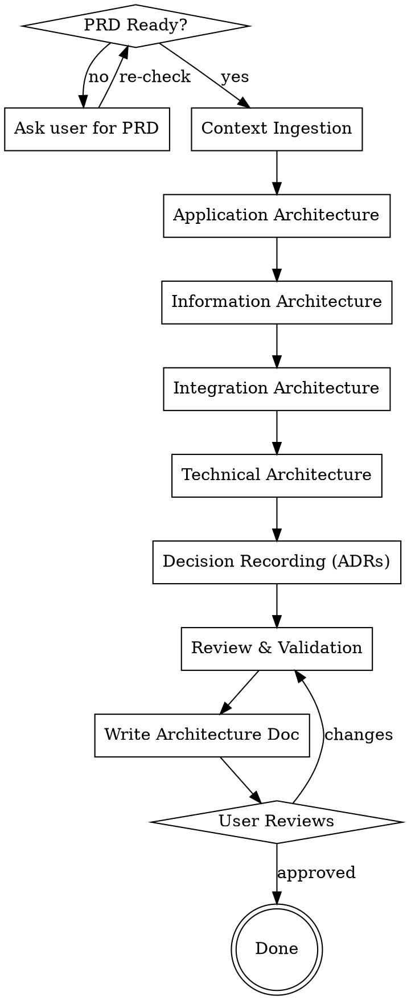
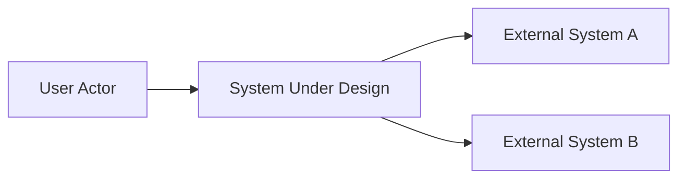
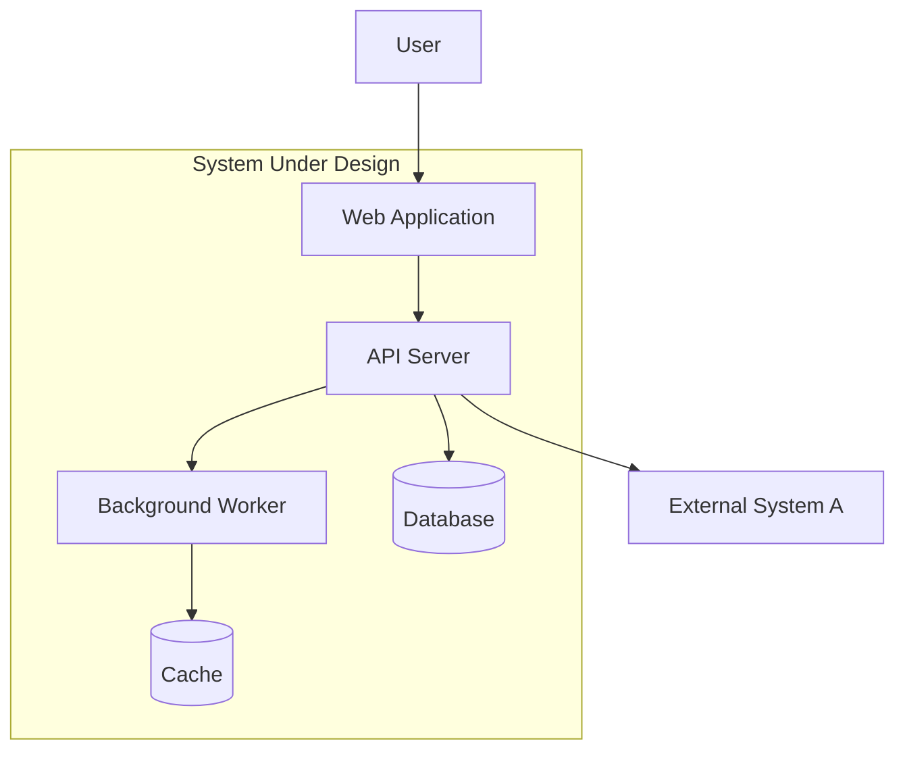
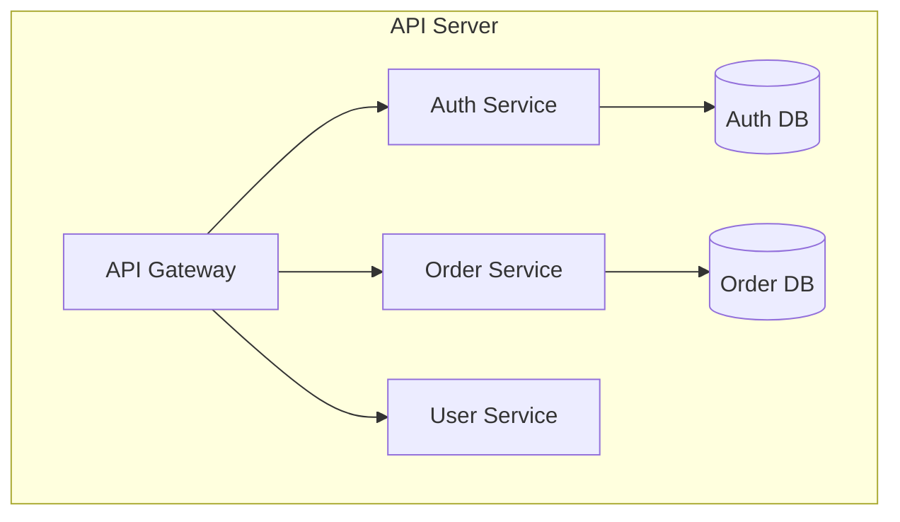
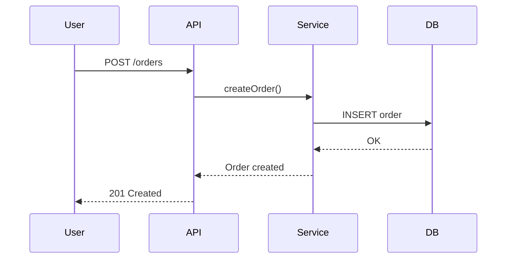
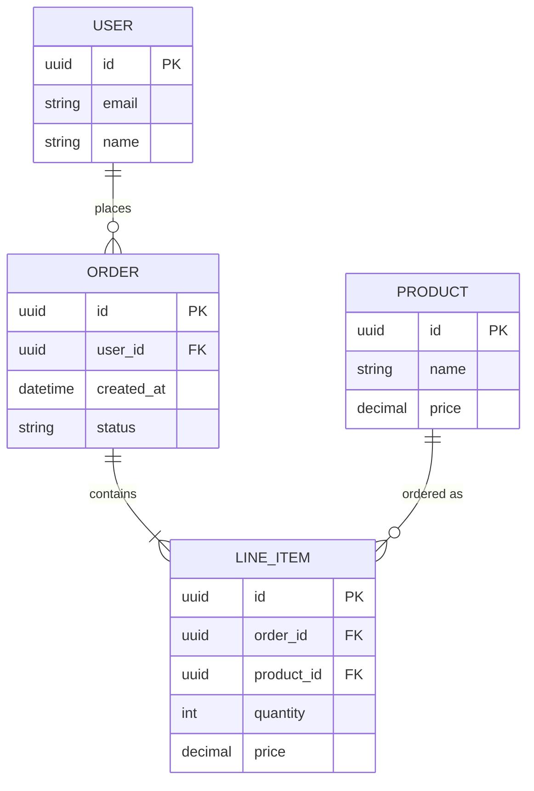
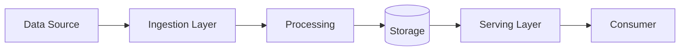
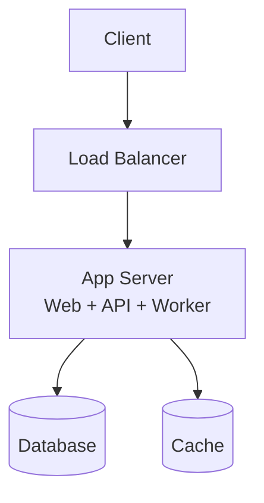
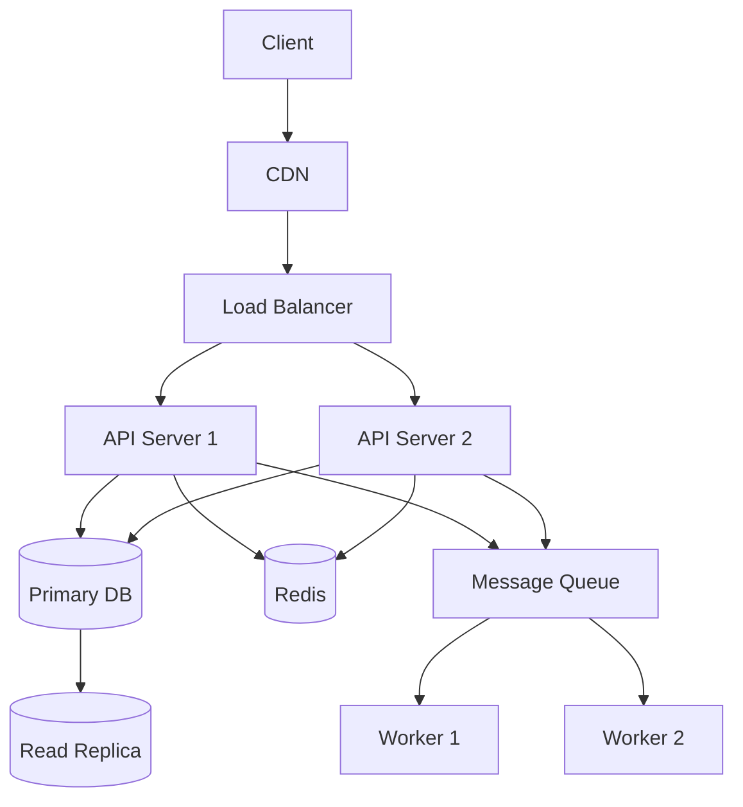

# System Architect Skill Implementation Plan

> **For agentic workers:** REQUIRED SUB-SKILL: Use superpowers:subagent-driven-development (recommended) or superpowers:executing-plans to implement this plan task-by-task. Steps use checkbox (`- [ ]`) syntax for tracking.

**Goal:** Create a `system-architect` skill in the superpowers-pro plugin that acts as AI system architect for 0→1 projects, consuming a PRD and producing a comprehensive architecture design document.

**Architecture:** Single skill with SKILL.md defining the 4-phase process (Context Ingestion → Architecture Design → Decision Recording → Review & Validation), plus 6 reference files in `references/` for detailed guidance per architecture dimension. The skill follows the same pattern as `writing-skills` (main SKILL.md + supporting files) and `systematic-debugging` (SKILL.md + reference docs).

**Tech Stack:** Markdown skill files, Mermaid diagrams, YAML frontmatter

---

### Task 1: Create skill directory and SKILL.md

**Files:**
- Create: `plugins/superpowers-pro/skills/system-architect/SKILL.md`

- [ ] **Step 1: Create the SKILL.md with frontmatter and Iron Law**

```markdown
---
name: system-architect
description: "Use when designing system architecture for a 0→1 project after PRD is validated — produces application, data, integration, and technical architecture with C4 diagrams, ADRs, and risk register. Triggers on: design architecture, system architecture, architect from scratch, architecture design, 架构设计, 系统架构"
---

# System Architect

AI acts as system architect for 0→1 projects. Consumes a validated PRD as input, produces a comprehensive architecture design document covering four dimensions: application, information, integration, and technical architecture.

<HARD-GATE>
NO ARCHITECTURE WITHOUT A VALIDATED PRD. The architect consumes functional requirements; it does not create them. Architecture decisions must trace back to specific PRD requirements. "Validated" means the PRD has been reviewed and approved by the user — the skill asks the user to confirm the PRD is ready before proceeding.
</HARD-GATE>

## Responsibility Boundaries

| Dimension | Owner | Input | Output |
|-----------|-------|-------|--------|
| Application Architecture | This skill | Functional requirements from PRD | C4 diagrams, service boundaries, API contracts |
| Information Architecture | This skill (lead) | Data requirements from PRD | Entity models, data flows, storage strategy |
| Integration Architecture | This skill | External dependencies from PRD | Interface contracts, protocols, sync strategy |
| Technical Architecture | This skill | Non-functional requirements from PRD | Tech stack, deployment topology, security, observability |
| Functional Architecture | Product (NOT this skill) | — | — |
| Business Architecture | Product (NOT this skill) | — | — |

The architect informs domain boundaries (making the functional model technically viable) but does not define what features exist or why.

## Checklist

You MUST create a task for each of these items and complete them in order:

1. **Confirm PRD readiness** — verify user has a validated PRD, ask for its location
2. **Context ingestion** — parse PRD, extract requirements, identify quality attributes, clarify ambiguities
3. **Application architecture** — C4 diagrams, service boundaries, API contracts, interaction sequences
4. **Information architecture** — domain model, data flows, storage strategy, consistency approach
5. **Integration architecture** — external interfaces, protocols, sync strategy, fault isolation
6. **Technical architecture** — tech stack, deployment topology, security, observability
7. **Decision recording** — write ADRs for key decisions
8. **Review & validation** — coverage, consistency, feasibility, risk identification
9. **Write architecture document** — save to `docs/specs/YYYY-MM-DD-<project>-architecture.md`
10. **User reviews architecture** — ask user to review before proceeding to dev-plan

## Process Flow



## Phase 1: Context Ingestion

**Input:** PRD document (required)

**Actions:**
- Read the PRD document
- Extract: functional requirements, non-functional requirements, constraints
- Identify key quality attributes (performance, availability, security, scalability, etc.) and rank by priority
- Extract external system dependencies and data requirements
- Clarify ambiguities — ask user one question at a time

**Output:** Structured requirements summary (internalized, not a standalone doc)

**Validation:** Can you point to where each quality attribute is addressed in the PRD? If not, ask the user.

## Phase 2: Architecture Design

Design in dependency order. Each dimension builds on the previous. After each dimension, run a validation gate: does every PRD requirement have a corresponding architecture element?

### 2.1 Application Architecture (first)

Subsequent dimensions depend on service boundaries defined here. See `references/application-architecture.md` for detailed guidance.

- C4 Context diagram → Container diagram → Component diagram
- Service/module boundary decomposition
- API contracts (interface definitions, communication patterns)
- Key interaction sequences

### 2.2 Information Architecture

Depends on application architecture's service boundaries. See `references/information-architecture.md` for detailed guidance.

- Core entities and relationships (domain model)
- Data flow diagrams
- Storage strategy (selection, read/write separation, caching)
- Data consistency approach

### 2.3 Integration Architecture

Depends on application architecture's interface definitions. See `references/integration-architecture.md` for detailed guidance.

- External system interface contracts
- Protocol selection and data formats
- Data synchronization strategy
- Fault isolation and degradation

### 2.4 Technical Architecture

Depends on constraints from the three above. See `references/technical-architecture.md` for detailed guidance.

- Tech stack selection (with alternatives and tradeoff reasoning)
- Deployment topology
- Security approach
- Observability approach

## Phase 3: Decision Recording

See `references/adr-template.md` for ADR format and examples.

- Record an ADR for each key architectural decision
- ADR format: Context → Decision → Alternatives Considered → Rationale → Consequences
- Must cover at minimum: service decomposition strategy, tech stack selection, data storage selection, integration protocol selection

## Phase 4: Review & Validation

See `references/architecture-review-checklist.md` for the full checklist.

- **Requirements coverage:** every PRD requirement mapped to an architecture element
- **Consistency check:** no contradictions across dimensions
- **Feasibility check:** tech selections match team capabilities and constraints
- **Risk identification:** flag high-risk architectural decisions with mitigation measures

## Output Document

Save to `docs/specs/YYYY-MM-DD-<project>-architecture.md` using this structure:

```markdown
# [Project Name] System Architecture Design

## 1. Overview
  - Project background (from PRD)
  - Key quality attributes and priority
  - Architecture constraints

## 2. Application Architecture
  ### 2.1 System Context (C4 Context)
  ### 2.2 Container View (C4 Container)
  ### 2.3 Component View (C4 Component)
  ### 2.4 Service Boundaries & API Contracts
  ### 2.5 Key Interaction Sequences

## 3. Information Architecture
  ### 3.1 Domain Model
  ### 3.2 Data Flows
  ### 3.3 Storage Strategy
  ### 3.4 Data Consistency Approach

## 4. Integration Architecture
  ### 4.1 External System Interfaces
  ### 4.2 Protocols & Data Formats
  ### 4.3 Data Synchronization Strategy
  ### 4.4 Fault Isolation & Degradation

## 5. Technical Architecture
  ### 5.1 Tech Stack Selection
  ### 5.2 Deployment Topology
  ### 5.3 Security Approach
  ### 5.4 Observability Approach

## 6. Architecture Decision Records (ADRs)

## 7. Risk Register
```

C4 diagrams use Mermaid:
- Context: `graph LR` or `flowchart LR`
- Container: `graph TB`
- Component: `graph TB`
- Data flow: `flowchart LR`

## Key Principles

- **PRD-first** — every architecture decision traces to a PRD requirement
- **Dependency order** — design dimensions in sequence, not in parallel
- **Validate after each dimension** — catch gaps early, don't accumulate debt
- **One question at a time** — when clarifying, don't overwhelm the user
- **Show, don't tell** — use Mermaid diagrams and concrete examples over abstract prose
- **YAGNI** — don't design for hypothetical future requirements; architect for what the PRD specifies
```

- [ ] **Step 2: Verify SKILL.md was created correctly**

Run: `wc -l plugins/superpowers-pro/skills/system-architect/SKILL.md`
Expected: ~150 lines

- [ ] **Step 3: Commit**

```bash
git add plugins/superpowers-pro/skills/system-architect/SKILL.md
git commit -m "feat: add system-architect skill SKILL.md"
```

---

### Task 2: Create application-architecture reference

**Files:**
- Create: `plugins/superpowers-pro/skills/system-architect/references/application-architecture.md`

- [ ] **Step 1: Write the application architecture reference**

```markdown
# Application Architecture Guide

Guidance for designing application architecture — the first and foundational dimension. All other dimensions depend on the service boundaries and API contracts defined here.

## C4 Model Templates

### Context Diagram

Shows the system as a whole and its relationships with users and external systems.



Key elements:
- One box for the entire system (no internals)
- External actors (users, systems) that interact with it
- Labeled arrows showing data/control flow direction

### Container Diagram

Zooms into the system, showing the high-level containers (applications, data stores, microservices).



Key elements:
- Each container is a separately deployable unit
- Show technology choices on each container (e.g., "React SPA", "Go API Server")
- Show data stores as cylinders
- Show communication protocols on arrows (e.g., "HTTPS/REST", "AMQP")

### Component Diagram

Zooms into a container, showing the components within it.



Key elements:
- Components are logical modules within a container
- Show responsibilities, not implementation details
- Keep at 5-10 components per container; if more, the container may need splitting

## Service Boundary Decomposition

### Methods

1. **Domain-Driven Design (DDD)** — identify bounded contexts from the PRD's domain language
2. **Decompose by business capability** — one service per distinct business function
3. **Decompose by subdomain** — core, supporting, generic subdomains

### Decision Criteria

| Factor | Favor Fewer Services | Favor More Services |
|--------|---------------------|---------------------|
| Team size | Small team | Large organization |
| Domain complexity | Simple domain | Complex, multiple bounded contexts |
| Scaling needs | Uniform load | Different scaling per function |
| Release independence | Single release cycle | Independent release cadence needed |

### Red Flags

- Service that depends on 5+ other services — boundary may be wrong
- Two services that always change together — consider merging
- Service with only CRUD operations — may not warrant independent deployment

## API Contract Design

### REST API Template

```
Resource: /api/v1/{resource}
Methods:
  GET    /api/v1/{resource}      — List (with pagination, filtering)
  GET    /api/v1/{resource}/{id} — Get by ID
  POST   /api/v1/{resource}      — Create
  PUT    /api/v1/{resource}/{id} — Full update
  PATCH  /api/v1/{resource}/{id} — Partial update
  DELETE /api/v1/{resource}/{id} — Delete

Request/Response:
  Content-Type: application/json
  Error format: { "error": { "code": "STRING", "message": "STRING" } }
```

### Event/Message Contract Template

```
Topic/Queue: {domain}.{event-type}
Schema:
  {
    "eventId": "UUID",
    "eventType": "STRING",
    "timestamp": "ISO-8601",
    "payload": { ... }
  }
```

## Interaction Sequences

Use Mermaid sequence diagrams for key flows:



Focus on: happy path first, then error paths, then edge cases. Document 3-5 key interactions that cover the most important user workflows from the PRD.
```

- [ ] **Step 2: Commit**

```bash
git add plugins/superpowers-pro/skills/system-architect/references/application-architecture.md
git commit -m "feat: add application-architecture reference for system-architect skill"
```

---

### Task 3: Create information-architecture reference

**Files:**
- Create: `plugins/superpowers-pro/skills/system-architect/references/information-architecture.md`

- [ ] **Step 1: Write the information architecture reference**

```markdown
# Information Architecture Guide

Guidance for designing information architecture — depends on application architecture's service boundaries to determine data ownership and flow boundaries.

## Domain Model

### Entity Identification

From the PRD, identify:
1. **Core entities** — the nouns that the business revolves around (User, Order, Product)
2. **Value objects** — attributes with no independent identity (Address, Money, DateRange)
3. **Aggregates** — consistency boundaries grouping entities (Order + LineItems)
4. **Relationships** — one-to-one, one-to-many, many-to-many

### Entity Relationship Diagram Template



### Data Ownership Rules

- Each aggregate is owned by exactly one service
- Services access other services' data only through APIs, not direct DB access
- If two services frequently need the same data, consider: (a) API composition, (b) data replication with event sync, (c) rethinking the boundary

## Data Flow

### Data Flow Diagram Template



### Key Questions

- Where does data enter the system? (user input, external APIs, file uploads, event streams)
- Where is data transformed? (validation, enrichment, aggregation)
- Where does data live at rest? (primary store, cache, search index, data warehouse)
- How does data leave the system? (API responses, reports, event notifications, exports)

## Storage Strategy

### Selection Matrix

| Need | Relational (PostgreSQL, MySQL) | Document (MongoDB) | Key-Value (Redis) | Search (Elasticsearch) | Object (S3) |
|------|------|------|------|------|------|
| Complex queries & joins | ★★★ | ★☆☆ | ☆☆☆ | ★★☆ | ☆☆☆ |
| Flexible schema | ★★☆ | ★★★ | ★☆☆ | ★★☆ | ★☆☆ |
| Low-latency reads | ★★☆ | ★★☆ | ★★★ | ★★☆ | ★☆☆ |
| Full-text search | ★☆☆ | ★★☆ | ☆☆☆ | ★★★ | ☆☆☆ |
| Large binary data | ★☆☆ | ★☆☆ | ☆☆☆ | ☆☆☆ | ★★★ |
| ACID transactions | ★★★ | ★★☆ | ☆☆☆ | ☆☆☆ | ☆☆☆ |

### Read/Write Separation Decision

Apply when:
- Read-heavy workload (read:write ratio > 5:1)
- Reads have different latency requirements than writes
- Reads can tolerate eventual consistency

Patterns:
- **CQRS** — separate read and write models, sync via events
- **Read replica** — database-level replication for read scaling
- **Cache-aside** — application manages cache explicitly (check cache → miss → fetch from DB → populate cache)

### Caching Strategy

| Pattern | Use When | Invalidation |
|---------|----------|-------------|
| Cache-aside | General purpose, read-heavy | TTL + explicit invalidation on write |
| Write-through | Cannot tolerate stale reads | Cache updated synchronously on write |
| Write-behind | Write-heavy, can tolerate brief inconsistency | Writes buffered, flushed asynchronously |

## Data Consistency

### Consistency Models

| Model | Guarantee | Use When |
|-------|-----------|----------|
| Strong consistency | Read always returns latest write | Financial transactions, inventory |
| Eventual consistency | Reads converge to latest over time | Social feeds, analytics, search indexes |
| Causal consistency | Causally related operations seen in order | Collaborative editing, messaging |

### Saga Pattern for Distributed Transactions

When a business operation spans multiple services:

**Choreography-based saga:** Each service publishes events; next service reacts.
```
Order Service: createOrder → publish OrderCreated
Inventory Service: reserveStock → publish StockReserved
Payment Service: processPayment → publish PaymentCompleted
Order Service: confirmOrder
```

**Orchestration-based saga:** A central orchestrator commands each step.
```
Orchestrator → Order Service: createOrder
Orchestrator → Inventory Service: reserveStock
Orchestrator → Payment Service: processPayment
Orchestrator → Order Service: confirmOrder
```

Choose choreography for simple flows (2-3 steps), orchestration for complex flows (4+ steps, conditional branching).
```

- [ ] **Step 2: Commit**

```bash
git add plugins/superpowers-pro/skills/system-architect/references/information-architecture.md
git commit -m "feat: add information-architecture reference for system-architect skill"
```

---

### Task 4: Create integration-architecture reference

**Files:**
- Create: `plugins/superpowers-pro/skills/system-architect/references/integration-architecture.md`

- [ ] **Step 1: Write the integration architecture reference**

```markdown
# Integration Architecture Guide

Guidance for designing integration architecture — depends on application architecture's interface definitions to determine what needs to connect to what.

## External System Interface Contracts

### Interface Specification Template

For each external system integration:

```markdown
### [External System Name]

**Purpose:** What data or capability this integration provides
**Direction:** Inbound (they call us) / Outbound (we call them) / Bidirectional
**Protocol:** REST / GraphQL / gRPC / Message Queue / File Transfer / WebSocket
**Authentication:** API Key / OAuth2 / mTLS / Basic Auth / None
**Data format:** JSON / XML / Protobuf / CSV / Binary

**Endpoints/Topics:**
| Direction | Path/Topic | Method/Action | Request Schema | Response Schema |
|-----------|-----------|---------------|----------------|-----------------|
| Outbound | /api/v1/resource | GET | - | { ... } |
| Inbound | /webhook/event | POST | { ... } | 200 OK |

**SLA:**
- Availability: 99.9% / best-effort
- Latency: p99 < 200ms / no guarantee
- Rate limit: 1000 req/min / unlimited

**Error handling:** Retry policy, circuit breaker threshold, fallback behavior
```

## Protocol Selection

| Protocol | Best For | Trade-offs |
|----------|----------|------------|
| REST (HTTP/JSON) | CRUD APIs, public APIs, simple integrations | Verbose, no streaming, request-response only |
| GraphQL | Flexible querying, frontend-driven data fetching | Complexity, N+1 risk, caching harder |
| gRPC | Internal service-to-service, low-latency, streaming | Binary protocol (hard to debug), requires proto definitions |
| Message Queue (AMQP) | Async workflows, event-driven, decoupling | Eventual consistency, ordering challenges, operational overhead |
| WebSocket | Real-time bidirectional (chat, live updates) | Connection management, scaling complexity |
| File Transfer (S3/SFTP) | Batch data exchange, large datasets | High latency, no real-time, scheduling complexity |

### Decision Framework

1. Is the interaction synchronous or asynchronous?
   - Sync → REST, GraphQL, gRPC
   - Async → Message Queue, File Transfer
2. Is it internal (our services) or external (third-party)?
   - Internal → gRPC or REST (your choice)
   - External → REST (most widely supported)
3. Is real-time push needed?
   - Yes → WebSocket or Server-Sent Events
   - No → Standard request-response or polling

## Data Synchronization Strategy

### Patterns

| Pattern | How It Works | Use When |
|---------|-------------|----------|
| **API Polling** | Periodically call external API for updates | External system has no push mechanism; data changes infrequently |
| **Webhook** | External system pushes events to our endpoint | External system supports webhooks; need near-real-time |
| **Change Data Capture (CDC)** | Monitor DB changelog (e.g., Debezium) | Need to sync from databases we control; no application-level events |
| **Event Stream** | Publish/subscribe to event topics | High-volume, multiple consumers, need replay capability |
| **Batch ETL** | Scheduled extract-transform-load jobs | Large datasets, acceptable latency (hours), data warehousing |

### Consistency Across Systems

- **Source of truth:** Define which system owns each data entity. Other systems hold projections or cached copies.
- **Conflict resolution:** Last-write-wins, application-level merge, or manual resolution — decide upfront.
- **Idempotency:** All sync operations must be idempotent. Use correlation IDs to deduplicate.

## Fault Isolation & Degradation

### Circuit Breaker Pattern

```
States: CLOSED (normal) → OPEN (failing) → HALF-OPEN (testing recovery)

Configuration:
- Failure threshold: N failures in M seconds → open circuit
- Open duration: wait before testing recovery
- Half-open: allow 1 request through; if success → close, if fail → stay open
```

### Fallback Strategies

| Strategy | Implementation | Use When |
|----------|---------------|----------|
| **Cached response** | Return last known good response | Data doesn't change rapidly, stale data acceptable |
| **Default value** | Return a hardcoded sensible default | Non-critical data, better than error |
| **Graceful degradation** | Disable the feature, show message | Feature is non-essential to core flow |
| **Queue and retry** | Store request, process when recovered | Operation must succeed eventually, can wait |

### Timeout Strategy

- **Connect timeout:** 2-5 seconds (fast fail on unreachable)
- **Read timeout:** Match external system's p99 latency + 50% buffer
- **Total timeout:** Connect + Read + 1 retry budget

### Bulkhead Pattern

Isolate external system calls into separate thread pools or connection pools so that one slow external system cannot exhaust resources needed by others.
```

- [ ] **Step 2: Commit**

```bash
git add plugins/superpowers-pro/skills/system-architect/references/integration-architecture.md
git commit -m "feat: add integration-architecture reference for system-architect skill"
```

---

### Task 5: Create technical-architecture reference

**Files:**
- Create: `plugins/superpowers-pro/skills/system-architect/references/technical-architecture.md`

- [ ] **Step 1: Write the technical architecture reference**

```markdown
# Technical Architecture Guide

Guidance for designing technical architecture — depends on constraints from application, information, and integration architecture to make informed technology and infrastructure choices.

## Tech Stack Selection

### Selection Framework

For each technology category, evaluate candidates against these criteria:

| Criterion | Weight | Description |
|-----------|--------|-------------|
| **Team expertise** | High | Does the team have experience? Learning curve cost? |
| **Ecosystem maturity** | High | Libraries, tools, community support, documentation |
| **Performance fit** | Medium | Does it meet the quality attributes from PRD? |
| **Operational fit** | Medium | Monitoring, debugging, deployment complexity |
| **Long-term viability** | Medium | Active maintenance, adoption trend, vendor lock-in risk |
| **Cost** | Low-Medium | License, hosting, developer productivity |

### Decision Record Template

For each tech selection, document:

```markdown
### [Category]: [Selected Technology]

**Alternatives considered:**
1. [Option A] — [brief description, why rejected]
2. [Option B] — [brief description, why rejected]
3. [Selected] — [brief description, why chosen]

**Rationale:** [2-3 sentences on key differentiator]

**Risk:** [What could go wrong, mitigation]
```

### Common Categories

| Category | Options (examples) |
|----------|-------------------|
| Frontend framework | React, Vue, Svelte, Next.js, Nuxt |
| Backend language | Go, Node.js, Python, Java, Rust |
| Backend framework | Express, FastAPI, Spring Boot, Gin |
| Primary database | PostgreSQL, MySQL, MongoDB, DynamoDB |
| Cache | Redis, Memcached |
| Message queue | RabbitMQ, Kafka, SQS, NATS |
| Search | Elasticsearch, Meilisearch, Typesense |
| Object storage | S3, GCS, MinIO |
| Container orchestration | Kubernetes, ECS, Docker Compose |
| CI/CD | GitHub Actions, GitLab CI, CircleCI |
| Monitoring | Prometheus + Grafana, Datadog, New Relic |

## Deployment Topology

### Patterns

| Pattern | Diagram | Use When |
|---------|---------|----------|
| **Single server** | App + DB on one machine | MVP, low traffic, simple ops |
| **App + DB split** | App server(s) + managed DB | Most web apps, moderate traffic |
| **Microservices** | Multiple services + service mesh | Complex domain, independent scaling |
| **Serverless** | Functions + managed services | Event-driven, variable traffic, low ops |

### Single Server



### App + DB Split



### Key Infrastructure Decisions

- **Load balancing:** L4 (TCP) vs L7 (HTTP), health check strategy
- **Database:** Managed vs self-hosted, backup strategy, disaster recovery
- **Secrets management:** Vault, AWS Secrets Manager, environment variables (dev only)
- **Networking:** VPC design, public/private subnets, security groups

## Security Approach

### Security Checklist

- [ ] **Authentication:** How users prove identity (JWT, session cookies, OAuth2)
- [ ] **Authorization:** How permissions are enforced (RBAC, ABAC, ACL)
- [ ] **Data encryption:** At rest (AES-256) and in transit (TLS 1.2+)
- [ ] **Input validation:** Server-side validation for all user input
- [ ] **Secrets management:** No secrets in code, use vault or managed secrets
- [ ] **API security:** Rate limiting, CORS, input sanitization
- [ ] **Dependency security:** Automated vulnerability scanning (Dependabot, Snyk)
- [ ] **Audit logging:** Who did what, when, from where
- [ ] **Network security:** VPC, security groups, WAF if public-facing
- [ ] **Compliance:** GDPR, SOC2, HIPAA — if applicable from PRD constraints

### Threat Modeling (Lightweight)

For each major component, consider:
1. **Spoofing** — Can an attacker impersonate a user or service?
2. **Tampering** — Can data be modified in transit or at rest?
3. **Repudiation** — Can actions be denied? (audit logs)
4. **Information disclosure** — Can data be leaked?
5. **Denial of service** — Can the system be overwhelmed?
6. **Elevation of privilege** — Can a user gain unauthorized access levels?

## Observability Approach

### Three Pillars

| Pillar | Tool Examples | What It Answers |
|--------|--------------|----------------|
| **Metrics** | Prometheus, CloudWatch, Datadog | "How many? How fast? How often?" |
| **Logs** | ELK Stack, Loki, CloudWatch Logs | "What happened? What was the state?" |
| **Traces** | Jaeger, Zipkin, AWS X-Ray | "Where did the request go? Where is the bottleneck?" |

### Must-Have Metrics

- **RED metrics (for services):** Rate, Errors, Duration (latency)
- **USE metrics (for resources):** Utilization, Saturation, Errors
- **Business metrics:** Orders/min, active users, conversion rate

### Alerting Strategy

- **Page immediately:** Service down, error rate > 5%, data loss
- **Page during business hours:** High latency (p99 > threshold), disk > 80%
- **Ticket/notify:** Gradual trends, capacity planning signals

### Dashboard Structure

1. **Overview dashboard** — system health at a glance (traffic, errors, latency, uptime)
2. **Service dashboards** — per-service RED metrics + dependencies
3. **Infrastructure dashboard** — CPU, memory, disk, network per node
4. **Business dashboard** — key business metrics from PRD
```

- [ ] **Step 2: Commit**

```bash
git add plugins/superpowers-pro/skills/system-architect/references/technical-architecture.md
git commit -m "feat: add technical-architecture reference for system-architect skill"
```

---

### Task 6: Create ADR template reference

**Files:**
- Create: `plugins/superpowers-pro/skills/system-architect/references/adr-template.md`

- [ ] **Step 1: Write the ADR template reference**

```markdown
# Architecture Decision Record (ADR) Template

## Format

Each ADR follows this structure:

```markdown
## ADR-[N]: [Title]

**Status:** Proposed / Accepted / Deprecated / Superseded by ADR-[M]

**Context:**
[What is the issue that we're seeing that is motivating this decision or change? Include any forces at play: technical, organizational, schedule, constraints.]

**Decision:**
[What is the change that we're proposing and/or doing?]

**Alternatives Considered:**
1. [Alternative A] — [brief description]
2. [Alternative B] — [brief description]
3. [Alternative C] — [brief description]

**Rationale:**
[Why did we choose this option over the alternatives? What are the key tradeoffs?]

**Consequences:**
- [Positive consequence]
- [Negative consequence or risk]
- [What becomes easier or harder to do because of this change]
```

## Example ADRs

### ADR-1: Use PostgreSQL as Primary Database

**Status:** Accepted

**Context:**
The system needs a primary data store for user accounts, orders, and product catalog. The PRD requires ACID transactions for order processing and complex queries for reporting. Team has 3 developers with PostgreSQL experience.

**Decision:**
Use PostgreSQL 15 as the primary relational database.

**Alternatives Considered:**
1. MySQL 8 — widely deployed, but weaker JSON support and fewer advanced index types
2. MongoDB — flexible schema, but no ACID transactions across documents (needed for orders)
3. DynamoDB — fully managed, but single-table design pattern is unfamiliar and limits query flexibility

**Rationale:**
PostgreSQL provides the strongest combination of ACID compliance, query flexibility, and team expertise. JSONB columns handle semi-structured data when needed. The operational burden is acceptable given team experience.

**Consequences:**
- Schema migrations require careful planning (use migration tool)
- Read scaling requires read replicas (not built-in sharding)
- Team can leverage existing knowledge — faster development

### ADR-2: Monolith-First Architecture

**Status:** Accepted

**Context:**
The project is a new system with 2-3 developers. The PRD identifies 4 major functional areas but the team is small and domain boundaries are not yet well-understood. Premature decomposition risks creating distributed monolith.

**Decision:**
Start as a modular monolith with clear internal module boundaries. Design for future decomposition but deploy as a single unit initially.

**Alternatives Considered:**
1. Microservices from day one — allows independent deployment but adds operational complexity disproportionate to team size
2. Serverless functions — good for event-driven workloads but poor fit for the request-response dominant pattern in the PRD

**Rationale:**
A modular monolith preserves deployment simplicity while enforcing boundary discipline internally. When a module needs independent scaling or deployment, it can be extracted with minimal disruption because boundaries are already defined.

**Consequences:**
- Must maintain strict module boundaries internally (no cross-module DB access)
- Single deployment unit means coordinated releases
- Future extraction to microservices is straightforward if boundaries are respected

## Required ADRs

At minimum, the architecture document must include ADRs for:

1. **Service decomposition strategy** — monolith vs microservices vs modular monolith
2. **Tech stack selection** — primary language, framework, and rationale
3. **Data storage selection** — primary database and rationale
4. **Integration protocol selection** — how services/systems communicate

Additional ADRs should be recorded for any decision where:
- There were viable alternatives
- The choice has significant tradeoffs
- Future developers would benefit from understanding why
```

- [ ] **Step 2: Commit**

```bash
git add plugins/superpowers-pro/skills/system-architect/references/adr-template.md
git commit -m "feat: add adr-template reference for system-architect skill"
```

---

### Task 7: Create architecture-review-checklist reference

**Files:**
- Create: `plugins/superpowers-pro/skills/system-architect/references/architecture-review-checklist.md`

- [ ] **Step 1: Write the architecture review checklist reference**

```markdown
# Architecture Review Checklist

Run this checklist after completing all four architecture dimensions. Each check must pass before the architecture document is finalized.

## 1. Requirements Coverage

For each requirement in the PRD:

- [ ] Functional requirement has a corresponding service/component in the application architecture
- [ ] Non-functional requirement (performance, availability, etc.) has a corresponding design element in the technical architecture
- [ ] Data requirement has a corresponding entity and storage strategy in the information architecture
- [ ] External dependency has a corresponding integration contract in the integration architecture

**If any requirement is uncovered:** Go back to the relevant architecture dimension and add the missing element. Do not proceed with gaps.

## 2. Cross-Dimension Consistency

- [ ] Service boundaries in application architecture match data ownership in information architecture (no service accessing another's data directly)
- [ ] API contracts in application architecture match the protocols selected in integration architecture
- [ ] Tech stack in technical architecture supports the communication patterns defined in application architecture
- [ ] Deployment topology in technical architecture supports the availability requirements from the PRD
- [ ] Security approach covers all external interfaces defined in integration architecture
- [ ] Observability covers all services defined in application architecture

**If contradictions found:** Resolve by revisiting the earlier dimension (dependency order: application → information → integration → technical).

## 3. Feasibility

- [ ] Team has experience with the selected tech stack (or has a realistic learning plan)
- [ ] Selected infrastructure is available within the project's cloud/provider constraints
- [ ] Third-party services in integration architecture have accessible APIs and acceptable SLAs
- [ ] Budget constraints from PRD are respected (no expensive managed services if budget is tight)
- [ ] Timeline constraints are realistic given the architecture complexity

**If feasibility issues found:** Adjust tech selections or simplify the architecture. Document the constraint in the risk register.

## 4. Risk Identification

For each risk, document:

```markdown
### Risk: [Title]
**Likelihood:** High / Medium / Low
**Impact:** High / Medium / Low
**Mitigation:** [What to do about it]
**Contingency:** [What to do if it materializes]
```

### Common Risk Categories to Check

- [ ] **Technical risk** — unproven technology, complex integration, performance unknowns
- [ ] **Organizational risk** — team skill gaps, key person dependency, vendor lock-in
- [ ] **Schedule risk** — architecture complexity vs timeline, external dependency availability
- [ ] **Operational risk** — monitoring gaps, deployment complexity, disaster recovery
- [ ] **Security risk** — sensitive data handling, authentication gaps, compliance requirements

## 5. Completeness

- [ ] All C4 levels present (Context, Container, Component for key containers)
- [ ] Domain model covers all entities from PRD
- [ ] All external systems have interface contracts
- [ ] ADRs cover the 4 required decisions (decomposition, tech stack, data storage, integration protocol)
- [ ] Risk register has at least 3 entries
- [ ] Mermaid diagrams render correctly (valid syntax)

## Pass Criteria

All checks in sections 1-4 must pass. Section 5 (Completeness) can have minor gaps if noted in the risk register with a plan to address them.
```

- [ ] **Step 2: Commit**

```bash
git add plugins/superpowers-pro/skills/system-architect/references/architecture-review-checklist.md
git commit -m "feat: add architecture-review-checklist reference for system-architect skill"
```

---

### Task 8: Update plugin version and add CHANGELOG entry

**Files:**
- Modify: `plugins/superpowers-pro/.claude-plugin/plugin.json`
- Create: `plugins/superpowers-pro/CHANGELOG.md`

- [ ] **Step 1: Update plugin.json version from 0.1.0 to 0.2.0**

This is a minor version bump (new skill added).

Change `"version": "0.1.0"` to `"version": "0.2.0"` in `plugins/superpowers-pro/.claude-plugin/plugin.json`.

- [ ] **Step 2: Create CHANGELOG.md**

```markdown
# Changelog

All notable changes to the superpowers-pro plugin will be documented in this file.

The format is based on [Keep a Changelog](https://keepachangelog.com/en/1.1.0/),
and this project adheres to [Semantic Versioning](https://semver.org/spec/v2.0.0.html).

## [Unreleased]

### Added
- `system-architect` skill — AI acts as system architect for 0→1 projects, consuming PRD and producing architecture design covering application, information, integration, and technical dimensions with C4 diagrams, ADRs, and risk register
```

- [ ] **Step 3: Commit**

```bash
git add plugins/superpowers-pro/.claude-plugin/plugin.json plugins/superpowers-pro/CHANGELOG.md
git commit -m "chore: bump superpowers-pro to 0.2.0, add CHANGELOG for system-architect skill"
```

---

### Task 9: Update using-superpowers router to include system-architect

**Files:**
- Modify: `plugins/superpowers-pro/skills/using-superpowers/SKILL.md`

- [ ] **Step 1: Add system-architect to the Skill Priority section**

In the `using-superpowers/SKILL.md`, find the "Skill Priority" section. After the existing content about process skills and implementation skills, add a note about the system-architect skill's position in the priority order.

Add after the line that says `"Let's build X" → brainstorming first, then implementation skills.`:

```
"Design the architecture" → system-architect (after PRD, before dev-plan).
```

- [ ] **Step 2: Commit**

```bash
git add plugins/superpowers-pro/skills/using-superpowers/SKILL.md
git commit -m "feat: add system-architect routing to using-superpowers skill"
```

---

## Self-Review

### Spec Coverage

| Spec Section | Task |
|-------------|------|
| Iron Law | Task 1 (SKILL.md HARD-GATE) |
| Responsibility Boundaries | Task 1 (SKILL.md table) |
| Phase 1: Context Ingestion | Task 1 (SKILL.md Phase 1) |
| Phase 2: Architecture Design - Application | Task 1 (SKILL.md) + Task 2 (reference) |
| Phase 2: Architecture Design - Information | Task 1 (SKILL.md) + Task 3 (reference) |
| Phase 2: Architecture Design - Integration | Task 1 (SKILL.md) + Task 4 (reference) |
| Phase 2: Architecture Design - Technical | Task 1 (SKILL.md) + Task 5 (reference) |
| Phase 3: Decision Recording | Task 1 (SKILL.md) + Task 6 (reference) |
| Phase 4: Review & Validation | Task 1 (SKILL.md) + Task 7 (reference) |
| File Structure | Tasks 1-7 |
| Output Document Structure | Task 1 (SKILL.md) |
| Integration with Superpowers-Pro | Task 9 (router update) |
| Version + Changelog | Task 8 |

All spec sections covered. No gaps.

### Placeholder Scan

No TBDs, TODOs, or placeholder patterns found. All code blocks contain complete content.

### Type Consistency

- Skill name `system-architect` used consistently across all tasks
- File paths all use `plugins/superpowers-pro/skills/system-architect/` prefix
- Reference file names match between SKILL.md references and Task 2-7 file paths
- Version bump 0.1.0 → 0.2.0 consistent across Task 8
