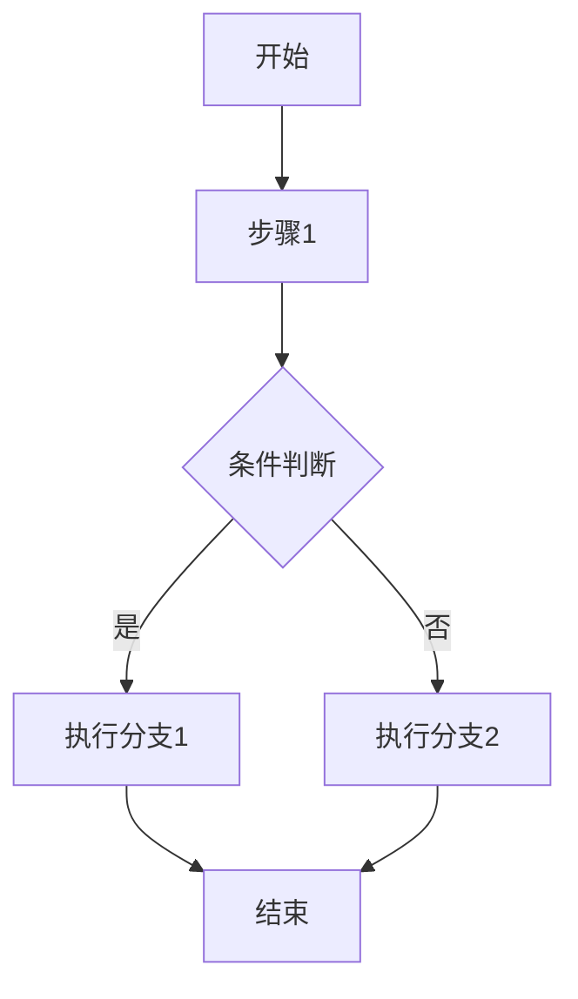
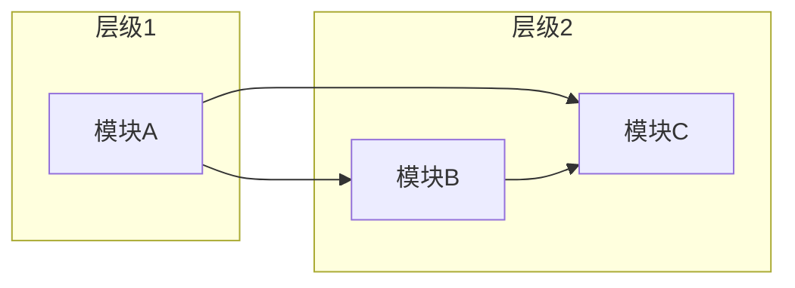

# 源码功能点识别

## 概述

给定一个代码库或子系统，系统性地识别其中所有功能点，按模块分组，输出结构化的功能编目文档。

**核心方法：** 先探索代码结构建立模块地图，再逐模块深入源码追踪调用链，提取每个功能点的入口、行为、边界和依赖关系，最后以"总览表 + 模块详述"的形式组织输出。

**与相关技能的区别：**

| 技能 | 聚焦点 | 输出 |
|------|--------|------|
| 本技能 | 全子系统功能点识别与编目 | 单篇文档：总览表 + 模块详述 |
| deep-functional-analysis | 单一功能/机制的深度剖析 | 单篇文档：问题驱动深挖 |
| codebase-to-docs | 完整架构 + 工作流文档体系 | 多页文档站点 |
| system-architecture-analysis | C4 模型架构结构 | 单篇架构图文档 |

## 何时使用

- 用户说"分析这个系统/模块有哪些功能"
- 用户说"梳理源码中的功能点"、"识别功能清单"
- 用户说"从代码反向工程出功能规格"
- 用户需要快速了解一个子系统"能做什么"
- 用户需要对功能点做编号、分类、编目

**不适用：** 单一机制的深度原理 → 使用 `deep-functional-analysis`；完整文档体系生成 → 使用 `codebase-to-docs`

## 核心原则

### 功能点定义原则

一个功能点应满足：
- **可独立描述**：有自己的入口（API/函数/命令/事件）和行为边界
- **可独立触发**：用户或系统可以通过某种方式单独激活它
- **有明确输出**：执行后产生可观察的结果（返回值、副作用、状态变更）

功能点不是代码结构单元（类、文件、模块），而是从外部可感知的系统能力。同一个类可能贡献多个功能点，同一个功能点也可能跨多个类实现。

### 两级编目原则

输出必须包含两个层级：

1. **模块层**：按职责划分的功能域，每个模块包含一组相关功能点
2. **功能点层**：模块内的最小可识别功能单元，带编号和一句话描述

模块划分应反映系统的职责边界，而非目录结构。如果目录结构与职责边界不一致，以职责为准。

### 深度分析原则

每个功能点的提取不能只看函数签名和注释。需要：
- **追踪调用链**：从入口函数出发，跟随关键调用至少 2 层深度
- **理解行为边界**：明确功能的触发条件、执行路径、输出结果
- **识别依赖关系**：功能点之间的调用、数据流、共享状态
- **捕捉设计决策**：实现中体现的权衡取舍、安全考量、性能策略

### 证据支撑原则

- 每个功能点必须关联到具体的源码位置（文件路径 + 关键符号）
- 每个关键行为描述必须有代码证据
- 禁止无源码依据的功能点推测

## 工作流程

### Step 1：范围界定

```
1.1 确认分析目标（哪个系统/子系统/模块）
1.2 确认边界（包含什么、排除什么）
1.3 确认输出路径和语言（默认：项目 docs/ 目录，中文）
1.4 确认粒度偏好（模块概览 + 功能点详述，或仅模块概览）
```

**产出：** 分析范围 + 输出路径 + 粒度确认

**重要：** 如果用户指定的范围过大（如"分析整个项目"），主动建议缩小到特定子系统。功能点识别在子系统级别效果最佳，过大的范围会导致功能点数量爆炸、模块边界模糊。

### Step 2：结构探索

```
2.1 扫描目录结构（Glob 搜索文件名模式）
2.2 识别入口文件（main、__init__、index、router、handler 等）
2.3 识别公共 API 表面（export、@app.route、tool 注册等）
2.4 读取 README 或现有文档获取高层描述
2.5 绘制初步模块地图（哪些目录/文件组属于哪个职责域）
```

**产出：** 目录结构概览 + 初步模块地图

**方法：** 并行读取多个入口文件和配置文件，快速建立对系统结构的理解。不要逐个文件线性阅读——先用广度优先建立地图，再有选择地深度阅读。

### Step 3：模块划分与功能点提取

对每个识别出的模块：

```
3.1 定位模块入口（主类、主函数、路由注册、工具注册等）
3.2 追踪模块对外暴露的能力（公开方法、命令、事件处理器等）
3.3 每个对外能力提取为一个功能点，编号 F1, F2, ...
3.4 深入每个功能点的调用链（至少 2 层），理解：
    - 触发条件：何时被激活
    - 执行路径：主要逻辑流
    - 关键分支：异常处理、条件分支
    - 输出结果：返回值、副作用、状态变更
    - 依赖关系：调用的其他功能点或外部服务
3.5 识别模块间依赖（跨模块调用、共享数据、事件通信）
```

**产出：** 每个模块的功能点清单 + 功能点详细描述

**方法：** 使用 Grep 搜索函数定义、类定义、装饰器、路由注册等模式，快速定位功能入口。对关键函数使用 Read 工具深入阅读实现。对长文件，先看函数/方法列表再选择性阅读。

### Step 4：交叉验证

```
4.1 检查功能点覆盖度：是否有公开 API 未被识别为功能点？
4.2 检查功能点独立性：是否有重复功能点？（不同入口但实际做同一件事）
4.3 检查模块归属：功能点是否放在了正确的模块下？
4.4 检查边界：排除范围外的内容是否真的被排除了？
```

**产出：** 验证后的功能点清单

### Step 5：文档生成

```
5.1 生成功能总览表（按模块分组，每个功能点一行：编号、名称、一句话描述）
5.2 生成模块详述（每个模块一节：模块职责 + 功能点详细描述 + 源码证据）
5.3 为复杂功能点绘制 mermaid 流程图
5.4 生成依赖关系说明（模块间依赖 + 功能点间依赖 + mermaid 模块依赖图）
5.5 生成源码索引（所有涉及的文件路径 + 职责 + 关键符号）
```

**产出：** 完整文档写入文件

**重要：** 最终文档必须使用 Write 工具写入文件，禁止在 CLI 中输出完整内容。CLI 中仅输出简要摘要。

## 输出结构

文档章节结构：

```
一、概述                    — 分析目标、范围、方法
二、功能总览                — 按模块分组的功能点表格
三、{模块A名称}             — 模块职责 + 功能点详述
    F{N}. {功能点名称}      — 触发条件、执行路径、输出结果、依赖关系、源码证据
四、{模块B名称}             — 同上
...
五、模块间依赖关系          — 模块间的调用和数据流
六、源码索引                — 所有涉及的源码文件
七、总结                    — 核心洞察 + 关键发现
```

### 功能总览表格式

按模块分组，每个功能点占一行：

| 编号 | 功能点 | 说明 |
|------|--------|------|
| F1 | {名称} | {一句话描述} |
| F2 | {名称} | {一句话描述} |
| ... | ... | ... |

### 功能点详述格式

每个功能点应包含以下要素（以子标题或结构化段落呈现）：

```
F{N}. {功能点名称}

触发条件：{何时被激活}
执行路径：{主要逻辑流，追踪调用链至少 2 层}
关键分支：{异常处理、条件分支}
输出结果：{返回值、副作用、状态变更}
依赖关系：{调用的其他功能点或外部服务}
源码证据：{文件路径} -> {关键函数/类}
```

**何时需要 mermaid 流程图：**
- 功能点有 3 个以上的执行步骤
- 功能点有多个条件分支（if/else/switch）
- 功能点有并发或并行执行路径
- 功能点涉及多个子系统或模块间的交互

**mermaid 流程图规范：**


- 使用 `graph TD`（从上到下）或 `graph LR`（从左到右）
- 节点文字简洁，不超过 20 字
- 条件分支用 `{ }` 形状
- 并行路径用 `|` 标签
- 复杂流程可拆分多个子图

不需要每个功能点都画流程图——简单的功能点可以简洁描述，复杂的功能点需要流程图辅助理解。

## 分析策略

### 入口识别模式

不同类型的系统有不同的功能入口模式：

| 系统类型 | 入口模式 | 搜索策略 |
|----------|----------|----------|
| CLI 工具 | 命令注册、argparse | 搜索 `add_parser`、`@click.command`、命令分发 |
| Web 服务 | 路由注册 | 搜索 `@app.route`、`@router`、handler 注册 |
| Agent 系统 | 工具注册 | 搜索 `tool`、`register`、function 定义 |
| 库/SDK | 公开 API | 搜索 `export`、`__all__`、公开类/函数 |
| 事件驱动 | 事件处理器 | 搜索 `on_event`、`subscribe`、handler 注册 |
| 插件系统 | 插件接口 | 搜索 hook、extension point、plugin 注册 |

### 调用链追踪策略

追踪调用链时，优先关注：
1. **入口函数的参数**：参数定义了功能的输入边界
2. **主要分支逻辑**：if/switch/case 定义了功能的不同行为路径
3. **对外调用**：调用其他模块/服务的地方定义了依赖关系
4. **异常处理**：try/catch 定义了功能的失败边界
5. **返回值构造**：返回值的组装定义了功能的输出

不要追踪纯粹的内部辅助函数（如日志、格式化）——它们是实现细节，不是功能行为。

### 模块划分策略

当目录结构与职责边界不一致时，以下信号帮助识别正确的模块边界：
- **共享状态**：操作同一组数据的功能点属于同一模块
- **变更频率**：经常一起修改的功能点属于同一模块
- **依赖方向**：相互调用的功能点可能属于同一模块；单向依赖的适合分开
- **命名模式**：前缀或后缀相同的功能点（如 `skill_*`、`*_handler`）可能属于同一模块

### 模块间依赖图规范

在"模块间依赖关系"章节，必须提供 mermaid 模块依赖图：



- 按调用方向分层：被调用者在左，调用者在右
- 使用子图分组相关模块
- 标注依赖类型（同步调用、事件通知、数据共享）

## 常见陷阱

| 陷阱 | 正确做法 |
|------|----------|
| 把每个类/文件当成一个功能点 | 功能点是系统能力，不是代码结构；一个类可能贡献多个功能点 |
| 只看函数签名不读实现 | 必须追踪调用链至少 2 层，理解实际行为 |
| 按目录结构划分模块 | 按职责边界划分，目录结构只是参考 |
| 功能点描述只写"处理请求" | 必须写明触发条件、执行路径、输出结果 |
| 把内部辅助函数也编为功能点 | 只编目对外可感知的功能，内部函数是实现细节 |
| 编号后不再调整 | 初步编号后，交叉验证时可能需要合并或拆分 |
| 范围过大导致功能点爆炸 | 主动建议缩小到子系统级别 |

## 输出方式

### 文件输出规则

1. **默认路径：** 项目根目录下 `docs/` 目录，文件名格式 `{分析目标kebab-case}-functional-analysis.md`
2. **用户指定路径优先**
3. **使用 Write 工具写入文件**
4. **CLI 中仅输出简要摘要**（不超过 10 行），包含：
   - 输出文件路径
   - 模块数量 + 功能点总数
   - 核心发现（1-2 条）

### CLI 摘要示例

```
功能分析文档已写入：docs/hermes-skills-evolution-functional-analysis.md

范围：Hermes Agent Skills 自演化机制
结果：6 个模块，28 个功能点
核心发现：安全扫描模块覆盖 85+ 威胁模式但缺少运行时防御；行为引导仅 2 个功能点却是系统最关键的控制面
```

## 验收标准

交付前须将下列待勾选框逐项勾为已满足。

### 完整性

- [ ] 所有模块已识别并命名
- [ ] 每个模块的功能点已提取并编号
- [ ] 每个功能点有触发条件、执行路径、输出结果
- [ ] 模块间依赖关系已描述
- [ ] 源码索引已生成（所有涉及的文件）

### 准确性

- [ ] 每个功能点有关联的源码位置（文件路径 + 关键符号）
- [ ] 关键行为描述有代码证据支撑
- [ ] 无无源码依据的功能点推测
- [ ] 已进行交叉验证（覆盖度、独立性、归属、边界）

### 深度

- [ ] 调用链追踪至少 2 层深度
- [ ] 识别了关键分支和异常处理
- [ ] 识别了设计决策和权衡取舍（如有）
- [ ] 复杂功能点有详细的调用链描述

### 可读性

- [ ] 功能总览表按模块分组
- [ ] 模块详述结构一致
- [ ] 简单功能点简洁描述，复杂功能点详细描述
- [ ] 文档已写入文件，CLI 中仅有简要摘要

### 流程图规范

- [ ] 3 步以上的功能点有 mermaid 流程图
- [ ] 多分支条件的功能点有流程图
- [ ] 模块间依赖关系有 mermaid 模块依赖图
- [ ] 流程图使用正确的语法（graph TD/LR，节点形状，分支标签）
- [ ] 流程图节点文字简洁（不超过 20 字）

**以上验证项已全部满足，本轮交付物符合本技能质量契约。**
