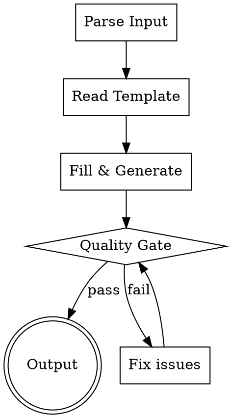

# 编写 Command 文件

## 概述

根据用户输入生成符合最佳实践的 Claude Code command 定义文件（`.claude/commands/*.md`）。

**核心原则：** command 是轻量级指令，应简洁直接，一个 command 做一件事。

## The Iron Law

```
NO COMMAND FILE WITHOUT A CLEAR DESCRIPTION AND CONCISE INSTRUCTIONS
```

没有 description 的 command 不会出现在自动补全中。没有清晰指令的 command 产生不可预测的行为。

## Process Flow



## Step 1: 解析输入

从用户消息中提取以下参数。未明确的参数根据上下文推断合理默认值，不与用户交互。

| 参数 | 推断规则 |
|------|---------|
| name | 从用户描述提取，转 kebab-case（文件名即命令名） |
| description | 从用户意图推导，描述何时使用 |
| argument-hint | 如用户提到参数则提取 |
| arguments | 如用户提到具名参数则提取 |
| allowed-tools | 如需预授权工具则提取 |
| model | 未指定则不填 |
| effort | 未指定则不填 |
| instructions | 从用户描述提取核心指令 |

## Step 2: 读取模板

读取 `templates/command-template.md`，获取标准结构。

## Step 3: 填充生成

将解析的参数填充到模板中，生成完整的 command 文件内容。

**Body 写作要求：**
- 直接写指令，不需要角色定义（command 不是 agent）
- 简洁直接，一个 command 做一件事
- 如需参数，用 `$ARGUMENTS`、`$0`、`$1` 或具名 `$name` 引用
- 可用 `!`command`` 语法注入动态内容

## Step 4: Quality Gate

生成后必须逐项检查：

- [ ] **description**: 清晰描述命令用途和使用场景，< 500 字符
- [ ] **argument-hint**（如有）: 与 arguments 定义一致
- [ ] **arguments**（如有）: 参数名合法，有描述
- [ ] **Body**: 非空，指令清晰
- [ ] **无占位符**: 无 {{}}、TODO、TBD
- [ ] **单一职责**: 一个 command 只做一件事
- [ ] **命令名**: kebab-case，与文件名一致

任何一项不通过，立即修正后重新检查。

## Step 5: 输出

写入文件到目标路径：
- 个人级：`~/.claude/commands/<name>.md`
- 项目级：`<project>/.claude/commands/<name>.md`

优先写入个人级，除非用户明确指定项目级。

## Command vs Skill vs Agent

| 特性 | Command | Skill | Agent |
|------|---------|-------|-------|
| 文件格式 | 单个 .md | 目录 + SKILL.md | 单个 .md |
| 触发方式 | 仅 `/name` | `/name` 或自动 | Claude 委派 |
| 上下文 | 主对话 | 主对话 | 隔离子对话 |
| 工具访问 | 继承所有 | 继承所有 | 可限制 |
| 复杂度 | 轻量指令 | 完整工作流 | 完整角色 |
| 支持文件 | 无 | 有（scripts/references/assets） | 无 |

**选择原则：**
- 简单指令、一次性操作 → command
- 可复用工作流、需要参考材料 → skill
- 需要隔离上下文、工具限制 → agent

## Common Mistakes

| 问题 | 修正 |
|------|------|
| command 做了太多事 | 拆分为多个 command 或改为 skill |
| body 缺少具体指令 | 添加步骤化指令 |
| 参数引用错误 | 用 $ARGUMENTS 或 $N 引用 |
| description 太长 | 精简到 < 500 字符 |
| 与 skill 功能重叠 | command 做轻量调度，skill 做实际工作 |

## Red Flags - STOP

- command 超过 50 行（应考虑改为 skill）
- command 包含复杂工作流（应改为 skill）
- command 需要支持文件（应改为 skill）
- 同名 command 已存在且用户未要求修改

**遇到 Red Flag：停止输出，先修正问题。**

## Integration

- 本 skill 由 `claude-ext-author` agent 调度
- 如需评估 command 效果，读取 `references/command-eval-workflow.md`
- 如需查看完整的 frontmatter 字段说明，读取 `references/command-fields.md`
