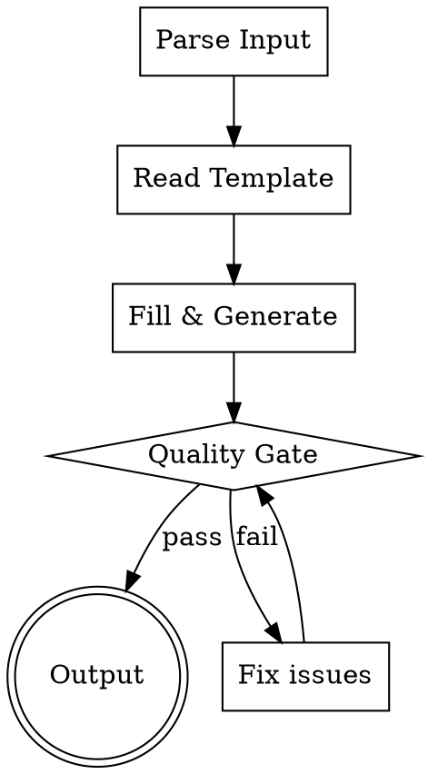

# 编写 Skill 文件

## 概述

根据用户输入生成符合最佳实践的 Claude Code skill 目录结构（`skills/<name>/SKILL.md` + 支持文件）。

**核心原则：** skill 是可复用的技术参考指南。好的 skill 让 Claude 在正确时机被触发，在加载后执行正确的行为。

## The Iron Law

```
NO SKILL WITHOUT A VALIDATED DESCRIPTION AND PROGRESSIVE DISCLOSURE
```

没有有效 description 的 skill 不会被触发。没有 progressive disclosure 的 skill 浪费上下文窗口。

## Process Flow



## Step 1: 解析输入

从用户消息中提取以下参数。未明确的参数根据上下文推断合理默认值，不与用户交互。

| 参数 | 推断规则 |
|------|---------|
| name | 从用户描述提取，转 kebab-case，优先用动名词（-ing） |
| description | 从用户意图推导，以 "Use when..." 开头，只描述触发条件 |
| disable-model-invocation | 默认 false（允许自动触发） |
| user-invocable | 默认 true（用户可 `/name` 调用） |
| allowed-tools | 如需预授权工具则提取 |
| context | 如需在子代理中运行则设为 fork |
| agent | 如需指定子代理类型则提取 |
| paths | 如需限制激活路径则提取 |
| shell | 如需指定 shell 则提取（bash / powershell） |
| skill_type | 推断：discipline / workflow / technique / reference |
| overview | 从用户描述提取核心原则 |
| when_to_use | 从用户描述提取使用场景 |
| process | 从用户描述提取工作流程 |
| common_mistakes | 从领域知识推断常见错误 |

## Step 2: 读取模板

读取 `templates/skill-template.md`，获取标准结构。

根据 skill_type 选择对应的 body 模式：

### 纪律执行型 (discipline)

```
Overview → Iron Law → Process Flow → Steps → Common Mistakes → Red Flags → Integration
```

适用于：规则、验证、TDD 等需要强制遵守的 skill

### 工作流型 (workflow)

```
Overview → Checklist → Process Flow → Steps → Key Principles → Integration
```

适用于：多步骤流程、需要按顺序执行的 skill

### 技术型 (technique)

```
Overview → When to Use → Core Pattern → Quick Reference → Implementation → Common Mistakes
```

适用于：具体方法、操作指南

### 参考型 (reference)

```
Overview → Quick Reference → Detailed Sections → Common Mistakes
```

适用于：API 文档、语法指南

## Step 3: 填充生成

将解析的参数填充到模板中，生成完整的 SKILL.md 内容。

**Body 写作要求：**

- **Progressive disclosure**：SKILL.md < 500 行，超出部分拆到 references/
- **Description = 触发条件**：不含工作流摘要，只描述 "Use when..."
- **解释 why**：不写 "ALWAYS do X"，写 "X prevents Y because Z"
- **流程图**：仅用于非显而易见的决策点，不用来展示线性流程
- **代码示例**：一个好例子胜过五个平庸的，选最相关的语言
- **支持文件**：> 100 行的重型参考 → references/，可复用工具 → scripts/，输出模板 → assets/

### 目录结构生成

根据内容需要创建支持目录：

```
skill-name/
├── SKILL.md              # 必须有
├── scripts/              # 可执行脚本（按需）
├── references/           # 参考文档（按需）
└── assets/               # 模板和资源（按需）
```

**创建规则：**
- SKILL.md body > 500 行 → 必须拆到 references/
- 有可复用脚本 → scripts/
- 有输出模板 → assets/
- 无需支持文件 → 只创建 SKILL.md

### SKILL.md 中引用支持文件

```markdown
**完整字段参考**：读取 `references/skill-fields.md`
**评估流程**：读取 `references/skill-eval-workflow.md`
```

引用指向一级文件，不要嵌套引用。

## Step 4: Quality Gate

生成后必须逐项检查：

- [ ] **name**: kebab-case，仅小写字母和连字符，max 64 字符
- [ ] **description**: 以 "Use when..." 开头，第三人称，不含工作流摘要，< 500 字符
- [ ] **SKILL.md body** < 500 行
- [ ] **Progressive disclosure**: 重型内容已拆到 references/
- [ ] **支持文件引用**: 一级深度，无嵌套引用
- [ ] **无占位符**: 无 {{}}、TODO、TBD
- [ ] **流程图**: 仅用于非显而易见决策
- [ ] **代码示例**: 最多一个语言，完整可运行
- [ ] **目录结构**: 符合 skill 解剖学

任何一项不通过，立即修正后重新检查。

## Step 5: 输出

写入文件到目标路径：
- 个人级：`~/.claude/skills/<name>/SKILL.md`
- 项目级：`<project>/.claude/skills/<name>/SKILL.md`

优先写入个人级，除非用户明确指定项目级。同时创建必要的支持目录和文件。

## Common Mistakes

| 问题 | 修正 |
|------|------|
| description 包含工作流摘要 | 删除工作流描述，只保留触发条件 |
| description 用第一/第二人称 | 改为第三人称 |
| SKILL.md 超过 500 行 | 拆分到 references/，在 SKILL.md 中引用 |
| 流程图用于线性流程 | 改为编号列表 |
| 多语言代码示例 | 只保留最相关的一种 |
| 支持文件嵌套引用 | 保持一级深度 |
| name 含大写或下划线 | 转 kebab-case |
| name 用名词而非动词 | 改为动名词（-ing）或动作词 |
| 缺少 Overview | 添加 1-2 句核心原则 |
| 过多 MUST/NEVER | 解释 why 代替强制 |

## Red Flags - STOP

- description 包含 "does X and then Y"（工作流摘要）
- SKILL.md body > 500 行且未拆分
- 嵌套引用（references/ 引用其他 references/）
- 同名 skill 已存在且用户未要求修改
- skill 做的事应该用 agent 或 command

**遇到 Red Flag：停止输出，先修正问题。**

## Integration

- 本 skill 由 `claude-ext-author` agent 调度
- 如需查看完整的 frontmatter 字段说明，读取 `references/skill-fields.md`
- 如需了解 skill 解剖学和目录结构，读取 `references/skill-anatomy.md`
- 如需评估 skill 效果，读取 `references/skill-eval-workflow.md`
