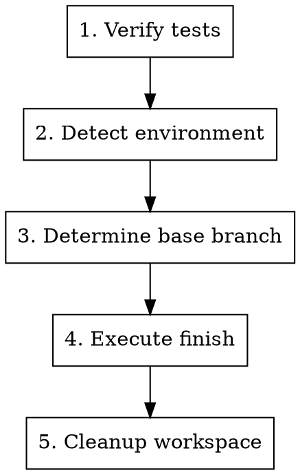

# Finishing a Development Branch

## Overview

Complete development work by executing the finish workflow. Behavior controlled by `finish-mode` variable (defined in variables.json):

- **auto** (default): Deterministic merge → test → push → cleanup → delete branch
- **interactive**: Menu-based selection (merge locally / create PR / keep as-is / discard)

**Announce at start:** "I'm using the finishing-a-development-branch skill to complete this work."

## Variable Resolution

`finish-mode` resolved by priority:
1. User states preference in conversation ("用 interactive 模式")
2. Command invocation specifies value (e.g. `调用 skill（finish-mode: auto）`)
3. variables.json default (auto, injected by session-start hook)

## Process



### Step 1: Verify Tests

**Before any finish action, verify tests pass:**

```bash
npm test / cargo test / pytest / go test ./...
```

**If tests fail:**
```
Tests failing (<N> failures). Must fix before completing.
[Show failures]
Cannot proceed with merge/PR until tests pass.
```

Stop. Don't proceed to Step 2.

### Step 2: Detect Environment

```bash
GIT_DIR=$(cd "$(git rev-parse --git-dir)" 2>/dev/null && pwd -P)
GIT_COMMON=$(cd "$(git rev-parse --git-common-dir)" 2>/dev/null && pwd -P)
```

| State | Implication |
|-------|-------------|
| `GIT_DIR == GIT_COMMON` | Normal repo — no worktree cleanup needed |
| `GIT_DIR != GIT_COMMON`, named branch | Worktree — provenance-based cleanup applies |
| `GIT_DIR != GIT_COMMON`, detached HEAD | Externally managed — no merge, no cleanup |

### Step 3: Determine Base Branch

```bash
git merge-base HEAD main 2>/dev/null || git merge-base HEAD master 2>/dev/null
```

Or ask: "This branch split from main — is that correct?"

### Step 4: Execute Finish

Branch on `finish-mode`:

#### auto mode

Deterministic pipeline — no menu, no choices:

1. **Record initial branch** (branch where user started the workflow)
2. **Merge worktree branch to initial branch**
   - If no worktree detected (init-system scenario): skip merge, proceed to push
3. **Run tests on merged result** — failure → automatic rollback merge + report
4. **Push initial branch to remote**
5. **Cleanup worktree** (provenance check, Step 5)
6. **Delete impl branch**

#### interactive mode

Present menu based on environment:

**Named branch worktree or normal repo — 4 options:**

```
Implementation complete. What would you like to do?

1. Merge back to <base-branch> locally
2. Push and create a Pull Request
3. Keep the branch as-is (I'll handle it later)
4. Discard this work

Which option?
```

**Detached HEAD — 3 options:**

```
Implementation complete. You're on a detached HEAD (externally managed workspace).

1. Push as new branch and create a Pull Request
2. Keep as-is (I'll handle it later)
3. Discard this work

Which option?
```

Execute per option:

**Option 1: Merge Locally**
```bash
MAIN_ROOT=$(git -C "$(git rev-parse --git-common-dir)/.." rev-parse --show-toplevel)
cd "$MAIN_ROOT"
git checkout <base-branch>
git pull
git merge <feature-branch>
<test command>
```
Then: Cleanup (Step 5), delete branch: `git branch -d <feature-branch>`

**Option 2: Push and Create PR**
```bash
git push -u origin <feature-branch>
gh pr create --title "<title>" --body "$(cat <<'EOF'
## Summary
<2-3 bullets>

## Test Plan
- [ ] <verification steps>
EOF
)"
```
**Do NOT cleanup worktree** — user needs it for PR iteration.

**Option 3: Keep As-Is**
Report: "Keeping branch <name>. Worktree preserved at <path>."
**Don't cleanup.**

**Option 4: Discard**
**Confirm first:**
```
This will permanently delete:
- Branch <name>
- All commits: <commit-list>
- Worktree at <path>

Type 'discard' to confirm.
```
Wait for exact "discard". Then: Cleanup (Step 5), force-delete: `git branch -D <feature-branch>`

### Step 5: Cleanup Workspace

**Only runs for auto mode, or interactive Option 1 / Option 4.**

```bash
GIT_DIR=$(cd "$(git rev-parse --git-dir)" 2>/dev/null && pwd -P)
GIT_COMMON=$(cd "$(git rev-parse --git-common-dir)" 2>/dev/null && pwd -P)
WORKTREE_PATH=$(git rev-parse --show-toplevel)
```

**If `GIT_DIR == GIT_COMMON`:** Normal repo, no worktree to clean up. Done.

**If worktree under `.worktrees/`, `worktrees/`, or `~/.config/superpowers-pro/worktrees/`:** Superpowers-Pro owns it.

```bash
MAIN_ROOT=$(git -C "$(git rev-parse --git-common-dir)/.." rev-parse --show-toplevel)
cd "$MAIN_ROOT"
git worktree remove "$WORKTREE_PATH"
git worktree prune
```

**Otherwise:** Host environment owns the workspace. Do NOT remove. Use platform's workspace-exit tool if available.

## Quick Reference

| Mode | Merge | Push | Keep Worktree | Cleanup Branch |
|------|-------|------|---------------|----------------|
| auto | yes | yes | no | yes |
| interactive 1 | yes | — | no | yes |
| interactive 2 | — | yes | yes | no |
| interactive 3 | — | — | yes | no |
| interactive 4 | — | — | no | yes (force) |

## Common Mistakes

| Mistake | Fix |
|---------|-----|
| Proceeding with failing tests | Always verify tests first. Stop if they fail. |
| Merging without verifying tests on result | Run tests after merge, rollback if they fail. |
| Cleaning up worktree for interactive Option 2/3 | Only cleanup for auto mode and interactive 1/4. |
| Deleting branch before removing worktree | Remove worktree first, then delete branch. |
| Running git worktree remove from inside the worktree | Always cd to main repo root first. |
| Cleaning up harness-owned worktrees | Only clean up provenance directories. |
| No confirmation for interactive Option 4 | Require typed "discard" confirmation. |
