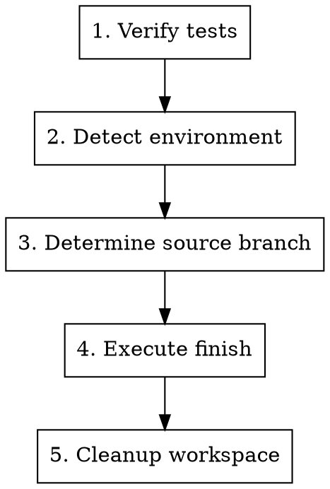

# Finishing a Development Branch

## Overview

Complete development work by executing the finish workflow. Behavior controlled by `finish-mode` variable (defined in variables.json):

- **auto** (default): Deterministic merge → test → push → cleanup → delete branch
- **interactive**: Menu-based selection (merge locally / create PR / keep as-is / discard)

**Announce at start:** "I'm using the finishing-a-development-branch skill to complete this work."

## Variable Resolution

`finish-mode` resolved by priority:
1. User states preference in conversation ("用 interactive 模式")
2. Command invocation specifies value (e.g. `调用 skill（finish-mode: auto）`)
3. variables.json default (auto, injected by session-start hook)

## Process



### Step 1: Verify Tests

**Before any finish action, verify tests pass:**

```bash
npm test / cargo test / pytest / go test ./...
```

**If tests fail:**
```
Tests failing (<N> failures). Must fix before completing.
[Show failures]
Cannot proceed with merge/PR until tests pass.
```

Stop. Don't proceed to Step 2.

### Step 2: Detect Environment

```bash
GIT_DIR=$(cd "$(git rev-parse --git-dir)" 2>/dev/null && pwd -P)
GIT_COMMON=$(cd "$(git rev-parse --git-common-dir)" 2>/dev/null && pwd -P)
```

| State | Implication |
|-------|-------------|
| `GIT_DIR == GIT_COMMON` | Normal repo — no worktree cleanup needed |
| `GIT_DIR != GIT_COMMON`, named branch | Worktree — provenance-based cleanup applies |
| `GIT_DIR != GIT_COMMON`, detached HEAD | Externally managed — no merge, no cleanup |

### Step 3: Determine Source Branch

读取 worktree 元数据，决定合并目标。**不依赖主仓库 HEAD**。

```bash
# 1. 优先读取 worktree-local config（git 2.20+）
SOURCE=$(git config --worktree superpowers.sourceBranch 2>/dev/null)

# 2. fallback 到文件
if [ -z "$SOURCE" ]; then
  SOURCE_FILE="$(git rev-parse --git-path superpowers-source)"
  [ -f "$SOURCE_FILE" ] && SOURCE=$(cat "$SOURCE_FILE")
fi

# 3. 仍空 → 暂停询问用户（老 worktree / 手动 git worktree add）
if [ -z "$SOURCE" ]; then
  CANDIDATE=$(git merge-base HEAD main 2>/dev/null \
              || git merge-base HEAD master 2>/dev/null \
              || echo "未知")
  echo "未找到此 worktree 的源分支元数据（可能是手动 git worktree add 创建）。"
  echo "候选源分支推断：$CANDIDATE"
  echo "请确认源分支名（或输入 'pr' 跳过本地 merge 走 PR/MR 路径）："
  read SOURCE
fi
```

**特殊值**：
- `SOURCE = pr`：跳过 auto merge 子流程，转走 PR/MR 创建路径（见 `references/pr-mr-creation.md`）。
- `SOURCE` 为空且非交互（无 stdin）：报错退出，提示用户手动 finish。

详见 `references/source-resolution.md`。

### Step 4: Execute Finish

Branch on `finish-mode`:

#### auto mode

源分支感知的确定性流水线，**主仓库 HEAD 全程不变**。

```bash
SOURCE_BRANCH="$SOURCE"  # 来自 Step 3
WT_BRANCH=$(git branch --show-current)
WT_PATH=$(git rev-parse --show-toplevel)

# === 特殊路径短路 ===

# A. SOURCE == "pr" → 走 PR/MR 创建路径（见 references/pr-mr-creation.md）
if [ "$SOURCE_BRANCH" = "pr" ]; then
  # 跳到 PR/MR 创建路径，完成后保留 worktree
  # 实现细节见 interactive Option 2 / references/pr-mr-creation.md
  exit 0
fi

# B. /init 工作流（无源分支或源==当前分支）→ push only
if [ "$WT_BRANCH" = "$SOURCE_BRANCH" ] || [ -z "$SOURCE_BRANCH" ]; then
  git push -u origin "$WT_BRANCH"
  # cleanup worktree (Step 5)
  exit 0
fi

# C. worktree HEAD == source HEAD（无新提交，已合并）→ skip merge
if [ "$(git rev-parse HEAD)" = "$(git rev-parse "$SOURCE_BRANCH" 2>/dev/null)" ]; then
  echo "Worktree branch HEAD == source branch HEAD, nothing to merge. Skipping."
  # 仍执行 cleanup（Step 5）
  exit 0
fi

# === Source 形态检测 ===

# 查找 source branch 是否在 active worktree 中
SOURCE_WT=$(git worktree list --porcelain | \
  awk -v src="refs/heads/$SOURCE_BRANCH" '
    /^worktree / { wt=$2 }
    /^branch / { if ($2 == src) print wt }
  ')

# SOURCE_WT 非空 → source 在某个 worktree 内 active
# SOURCE_WT 空 → source 仅为 ref，无 active worktree

# === Merge 路径决策 ===

if [ -n "$SOURCE_WT" ]; then
  # --- 2a: source 在 active worktree → cd 进去 merge ---

  # 校验 source worktree 干净
  if ! git -C "$SOURCE_WT" diff --quiet || ! git -C "$SOURCE_WT" diff --cached --quiet; then
    echo "Source worktree at $SOURCE_WT has uncommitted changes."
    echo "Please commit or stash them, then reply 'continue' to resume finish."
    exit 1
  fi

  pushd "$SOURCE_WT" > /dev/null
  if ! git merge --no-ff "$WT_BRANCH" -m "Merge $WT_BRANCH into $SOURCE_BRANCH"; then
    echo "Merge conflict detected. Conflicted files:"
    git diff --name-only --diff-filter=U
    echo "Please resolve conflicts and commit, then reply 'continue' to resume finish."
    popd > /dev/null
    exit 1
  fi
  RUN_DIR="$SOURCE_WT"
  popd > /dev/null

elif git fetch . "$WT_BRANCH:$SOURCE_BRANCH" 2>/dev/null; then
  # --- 2b: source 仅 ref + worktree 已 fast-forward source → 直接更新 ref ---
  echo "Fast-forwarded $SOURCE_BRANCH to $WT_BRANCH HEAD"
  RUN_DIR="$WT_PATH"  # 当前 worktree 即为 ff 后等价代码
  SKIP_MERGE_TEST=true  # ff 等同已验证，无需 merge 后测试

else
  # --- 2c: source 仅 ref + 非 ff → 临时 worktree 处理 ---
  TMP_WT=$(mktemp -d -t superpowers-merge-XXXXXX)
  trap "git worktree remove --force '$TMP_WT' 2>/dev/null; rm -rf '$TMP_WT'" EXIT

  git worktree add "$TMP_WT" "$SOURCE_BRANCH"
  pushd "$TMP_WT" > /dev/null
  if ! git merge --no-ff "$WT_BRANCH" -m "Merge $WT_BRANCH into $SOURCE_BRANCH"; then
    echo "Merge conflict in temporary worktree at $TMP_WT."
    echo "This is rare (non-ff with no active source worktree)."
    echo "Please cd to $TMP_WT to resolve, then reply 'continue' to resume finish."
    popd > /dev/null
    exit 1
  fi
  RUN_DIR="$TMP_WT"
  popd > /dev/null
fi

# === 运行测试（merge 结果）===
if [ "${SKIP_MERGE_TEST:-false}" != "true" ]; then
  pushd "$RUN_DIR" > /dev/null
  # <test command>  # npm test / cargo test / pytest / go test ./...
  TEST_EXIT=$?
  popd > /dev/null

  if [ $TEST_EXIT -ne 0 ]; then
    echo "Tests failed after merge. Rolling back merge commit."
    (cd "$RUN_DIR" && git reset --hard HEAD~1)
    # 2c 情况下，trap 会清理临时 worktree
    exit 1
  fi
fi

# === Push 远程 source branch ===
pushd "$RUN_DIR" > /dev/null
if ! git push origin "$SOURCE_BRANCH"; then
  echo "Push rejected (likely non-ff: origin/$SOURCE_BRANCH has new commits)."
  echo "Please pull and resolve in $RUN_DIR, then reply 'continue' to resume finish."
  popd > /dev/null
  exit 1
fi
popd > /dev/null

# === 清理临时 worktree（仅 2c）===
if [ -n "${TMP_WT:-}" ] && [ -d "$TMP_WT" ]; then
  git worktree remove "$TMP_WT"
  trap - EXIT
fi

# === 清理当前 worktree（Step 5 既有逻辑）+ 删除分支 ===
```

**关键不变量**：
- 全流程**不执行** `cd $MAIN_ROOT && git checkout`
- 冲突 / push 失败时退出，等待用户回复 "continue" 后再调用 skill 续跑
- 2b（fast-forward）跳过 merge 后测试，因为代码组合与 worktree 已完全等价

测试与回滚位置详见 `references/source-resolution.md` 第 5 节。

#### interactive mode

Present menu based on environment:

**Named branch worktree or normal repo — 4 options:**

```
Implementation complete. What would you like to do?

1. Merge back to <source-branch> locally
2. Push and create a Pull Request
3. Keep the branch as-is (I'll handle it later)
4. Discard this work

Which option?
```

**Detached HEAD — 3 options:**

```
Implementation complete. You're on a detached HEAD (externally managed workspace).

1. Push as new branch and create a Pull Request
2. Keep as-is (I'll handle it later)
3. Discard this work

Which option?
```

Execute per option:

**Option 1: Merge Locally**
```bash
MAIN_ROOT=$(git -C "$(git rev-parse --git-common-dir)/.." rev-parse --show-toplevel)
cd "$MAIN_ROOT"
git checkout <source-branch>
git pull
git merge <feature-branch>
<test command>
```
Then: Cleanup (Step 5), delete branch: `git branch -d <feature-branch>`

**Option 2: Push and Create PR**
```bash
git push -u origin <feature-branch>
gh pr create --title "<title>" --body "$(cat <<'EOF'
## Summary
<2-3 bullets>

## Test Plan
- [ ] <verification steps>
EOF
)"
```
**Do NOT cleanup worktree** — user needs it for PR iteration.

**Option 3: Keep As-Is**
Report: "Keeping branch <name>. Worktree preserved at <path>."
**Don't cleanup.**

**Option 4: Discard**
**Confirm first:**
```
This will permanently delete:
- Branch <name>
- All commits: <commit-list>
- Worktree at <path>

Type 'discard' to confirm.
```
Wait for exact "discard". Then: Cleanup (Step 5), force-delete: `git branch -D <feature-branch>`

### Step 5: Cleanup Workspace

**Only runs for auto mode, or interactive Option 1 / Option 4.**

```bash
GIT_DIR=$(cd "$(git rev-parse --git-dir)" 2>/dev/null && pwd -P)
GIT_COMMON=$(cd "$(git rev-parse --git-common-dir)" 2>/dev/null && pwd -P)
WORKTREE_PATH=$(git rev-parse --show-toplevel)
```

**If `GIT_DIR == GIT_COMMON`:** Normal repo, no worktree to clean up. Done.

**If worktree under `.worktrees/`, `worktrees/`, or `~/.config/superpowers-pro/worktrees/`:** Superpowers-Pro owns it.

```bash
MAIN_ROOT=$(git -C "$(git rev-parse --git-common-dir)/.." rev-parse --show-toplevel)
cd "$MAIN_ROOT"
git worktree remove "$WORKTREE_PATH"
git worktree prune
```

**Otherwise:** Host environment owns the workspace. Do NOT remove. Use platform's workspace-exit tool if available.

## Quick Reference

| Mode | Merge | Push | Keep Worktree | Cleanup Branch |
|------|-------|------|---------------|----------------|
| auto | yes | yes | no | yes |
| interactive 1 | yes | — | no | yes |
| interactive 2 | — | yes | yes | no |
| interactive 3 | — | — | yes | no |
| interactive 4 | — | — | no | yes (force) |

## Common Mistakes

| Mistake | Fix |
|---------|-----|
| Proceeding with failing tests | Always verify tests first. Stop if they fail. |
| Merging without verifying tests on result | Run tests after merge, rollback if they fail. |
| Cleaning up worktree for interactive Option 2/3 | Only cleanup for auto mode and interactive 1/4. |
| Deleting branch before removing worktree | Remove worktree first, then delete branch. |
| Running git worktree remove from inside the worktree | Always cd to main repo root first. |
| Cleaning up harness-owned worktrees | Only clean up provenance directories. |
| No confirmation for interactive Option 4 | Require typed "discard" confirmation. |
