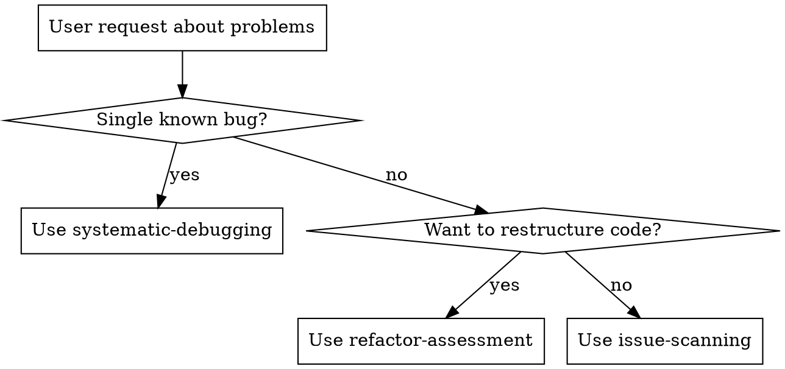
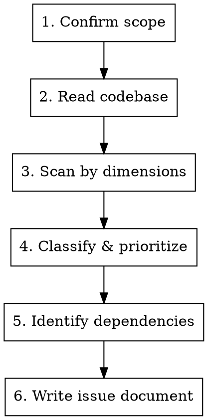

# Issue Scanning

## Overview

Systematically discover all potential issues in a specified domain. Produces a prioritized issue catalog — not a root-cause diagnosis for a single bug.

**Breadth-first, not depth-first.** You are cataloging problems, not fixing them.

## When to Use

- User asks to check/audit/scan a module, feature, or domain for problems
- /fix workflow Step 1 (DIAGNOSE)
- Any request about "all issues in X" or "problems with Y"

## When NOT to Use

- Single known bug with known symptoms → use `superpowers-pro:systematic-debugging`
- Refactoring assessment → use `superpowers-pro:refactor-assessment`
- Code review of your own changes → use `superpowers-pro:requesting-code-review`



## Process



### Step 1: Confirm Scope

Before reading any code, confirm with the user:
- **What** to scan (module, feature, directory, domain)
- **Which dimensions** matter (not all apply to every scan)
- **Depth**: surface audit vs deep analysis

If the user's request describes a single known bug ("修复 X 崩溃"), treat it as a focused scan around that bug's area, not a broad survey.

### Step 2: Read Codebase

Read all relevant files — code, tests, config, types. Use subagents for parallel reading when scope is large.

### Step 3: Scan by Dimensions

Check each dimension that applies to the scope:

| Dimension | What to look for |
|-----------|-----------------|
| Correctness | Logic errors, boundary conditions, off-by-one, missing edge cases |
| Error handling | Uncaught exceptions, swallowed errors, missing validation |
| Performance | N+1 queries, unnecessary recomputation, memory leaks, blocking ops |
| Security | Injection, auth bypass, data exposure, privilege escalation |
| Compatibility | API changes, version mismatches, deprecated usage |
| Consistency | Naming conventions, patterns, style divergences |
| Test coverage | Untested paths, flaky tests, missing assertions |

**Stay in scan mode.** Record findings, don't fix them.

### Step 4: Classify & Prioritize

Every issue gets a priority:

| Priority | Meaning |
|----------|---------|
| P0 | Must fix — data loss, security breach, production crash |
| P1 | Should fix — incorrect behavior, significant performance impact |
| P2 | Nice to fix — code quality, minor inconsistencies, improvement suggestions |

### Step 5: Identify Dependencies

Map relationships between issues:
- **Causal**: Issue A causes Issue B (fix A first)
- **Blocking**: Issue A blocks fix for Issue B
- **Related**: Issues share a common root cause

### Step 6: Write Issue Document

Save to `docs/superpowers-pro/issues/YYYY-MM-DD-<scope>-issues.md`:

```markdown
# 问题扫描: <scope>

## 扫描维度
<dimensions covered>

## 问题清单

### P0 — 必须修复
- [ ] <description> — <file:line> — <impact>

### P1 — 建议修复
- [ ] <description> — <file:line> — <impact>

### P2 — 改进建议
- [ ] <description> — <file:line> — <impact>

## 问题间依赖
<causal/blocking/related relationships>
```

## Common Mistakes

| Mistake | Fix |
|---------|-----|
| Jumping into fixing issues | Stay in scan mode. Catalog only. |
| Treating all issues equally | Always classify P0/P1/P2 |
| Skipping scope confirmation | Confirm scope first. Saves rework. |
| Going depth-first on one issue | Breadth-first across all dimensions, then depth on P0s |
| Ignoring dependencies | Two related P2s may together be a P0 |
| Producing unstructured output | Use the document template. Write to file. |
