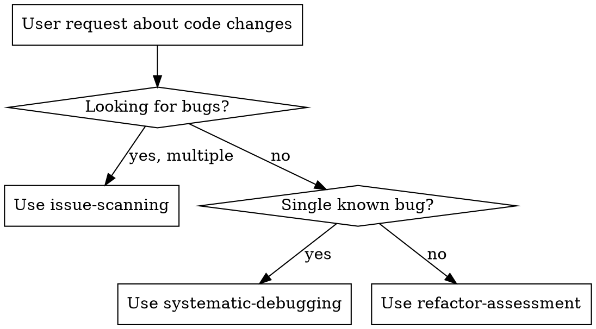
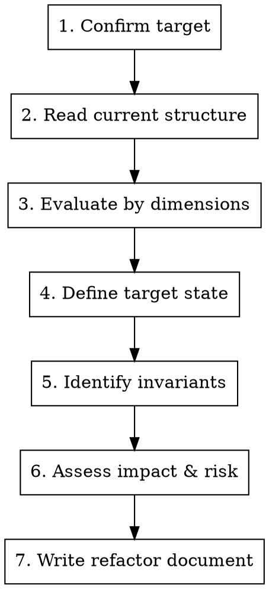

# Refactor Assessment

## Overview

Evaluate a code area for refactoring potential. Produces a structured refactor document with current problems, target state, and invariants — not a list of code changes.

**Assess first, refactor later.** You are defining what to change and why, not making changes.

## When to Use

- User asks to refactor/restructure/clean up a module or code area
- /refactor workflow Step 1 (ASSESS)
- Any request about "improve the structure of X" or "make Y more maintainable"

## When NOT to Use

- Bug scanning → use `superpowers-pro:issue-scanning`
- Single bug diagnosis → use `superpowers-pro:systematic-debugging`
- Code review of your own changes → use `superpowers-pro:requesting-code-review`



## Process



### Step 1: Confirm Target

Before reading code, confirm with the user:
- **What** to refactor (module, feature, directory, code area)
- **Why** they want to refactor (pain points, goals)
- **Constraints** (timeline, backwards compatibility, team familiarity)

### Step 2: Read Current Structure

Read all relevant files — code, tests, types, imports. Map the current architecture: module boundaries, data flow, dependency graph. Use subagents for parallel reading when scope is large.

### Step 3: Evaluate by Dimensions

| Dimension | What to assess |
|-----------|---------------|
| Structure | Module boundaries, single responsibility, coupling, cohesion |
| Maintainability | Readability, cyclomatic complexity, duplication, naming |
| Performance | Bottlenecks, unnecessary computation, resource usage |
| Testability | Dependency injection, side-effect isolation, mockability |

Rate each dimension: **Healthy / Needs work / Critical**. Provide evidence, not opinions.

### Step 4: Define Target State

Describe what the code should look like after refactoring:
- New module boundaries and responsibilities
- Changed data flows or interfaces
- Simplified or removed abstractions

**Be specific.** "Improve readability" is not a target. "Extract validation logic into a separate module with a typed interface" is.

### Step 5: Identify Invariants

List behaviors that MUST NOT change during refactoring:
- Public API signatures and return types
- Observed runtime behavior (for untested code, document what it currently does)
- Performance characteristics that users depend on
- Integration points with other systems

**This is the safety net.** If you can't articulate invariants, you can't refactor safely.

### Step 6: Assess Impact & Risk

- **Impact scope**: Which files, modules, teams are affected
- **Risk points**: What could break, how likely, how detectable
- **Migration path**: Can this be done incrementally or is it big-bang

### Step 7: Write Refactor Document

Save to `docs/superpowers-pro/refactors/YYYY-MM-DD-<target>.md`:

```markdown
# 重构评估: <target>

## 当前问题
<why refactor is needed, per dimension>

## 重构目标
<specific target state>

## 行为不变性
<behaviors that must not change>

## 影响范围
<affected files/modules/teams>

## 风险点
<what could break, likelihood, detection>
```

## Common Mistakes

| Mistake | Fix |
|---------|-----|
| Starting to refactor immediately | Assess first. Produce document. Get approval. |
| Vague target state | Be specific about new structure, not just "cleaner" |
| Skipping invariants | No invariants = unsafe refactor. Always list them. |
| Ignoring risk assessment | Every refactor can break things. Assess risk. |
| Scope creep | Stick to the confirmed target. Don't refactor adjacent code. |
| Only listing problems | Problems without a target state leave direction unclear |
