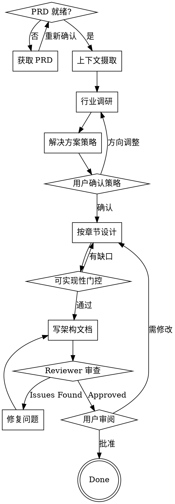

# System Architect

AI 担任 0→1 项目的系统架构师。消费已审批的 PRD 作为输入，产出**可实现**的架构设计文档——不仅是图表和接口，而是算法、状态机、数据 Schema、错误处理和恢复策略，开发者可以直接据此实现。

<HARD-GATE>
NO ARCHITECTURE WITHOUT A VALIDATED PRD. 架构师消费功能需求，不创造功能需求。架构决策必须可追溯到 PRD 具体需求。"已审批"指 PRD 经过用户审阅并批准——技能在开始前会向用户确认 PRD 是否就绪。
</HARD-GATE>

## 职责边界

| 维度 | 归属 | 输入 | 产出 |
|------|------|------|------|
| 技术选型与架构决策 | 本技能 | PRD 约束 + 非功能需求 | 选型对比表 + ADR |
| 总体架构 + 模块设计 | 本技能 | PRD 功能需求 | C4 图 + 模块边界 + 核心链路 |
| 数据与存储设计 | 本技能（主导） | PRD 数据需求 | 实体模型 + Schema + 存储策略 |
| 接口与通信设计 | 本技能 | PRD 集成需求 | 接口契约 + 错误处理 + 故障隔离 |
| 代码库与工程结构 | 本技能 | 架构决策 | 目录结构 + 分层 + 依赖约束 |
| 非功能设计 | 本技能 | PRD 非功能需求 | 可用性 + 性能 + 安全 + 可观测性 |
| 功能架构 | 产品（非本技能） | — | — |
| 业务架构 | 产品（非本技能） | — | — |

架构师影响领域边界（使功能模型技术可行），但不定义功能的存在或原因。

## Anti-Patterns 警告

架构文档最常见的失败模式。详见 `references/anti-patterns.md`。

| Anti-Pattern | 症状 | 修复 |
|-------------|------|------|
| 接口-only | 组件只有接口签名 | 每个接口需要：错误类型 + 至少 1 个使用示例 + 主方法的算法/伪代码 |
| Happy-path-only | 序列图只有成功流 | 每个序列必须包含 ≥1 错误/降级路径 |
| 标签-only 组件 | 组件名无职责描述 | 每个组件需要：职责 + 关键方法 + 不做什么 |
| 状态机无触发 | 状态转换无触发条件 | 每个状态转换需要：触发事件 + 守卫条件 + 副作用 |
| 扩展点无示例 | "用策略模式" 无接口签名 | 每个扩展点需要：接口签名 + 1 个实现示例 + 注册机制 |
| Schema-less 数据 | "存为 JSON" 无字段 | 每个持久化数据需要具体的 Schema 示例 |
| 质量标签化 | "高性能" 无具体设计 | 非功能设计必须有具体机制和量化目标 |
| 缺少 Non-Goals | 无"不做的事" | Non-Goals 章节必须存在且非空（≥3 条） |

## Checklist

必须为以下每一项创建任务并按顺序完成：

1. **确认 PRD 就绪** — 验证用户有已审批的 PRD，获取其位置
2. **上下文摄取** — 解析 PRD，提取需求，建立追溯矩阵，识别质量属性，澄清歧义
3. **行业调研** — 派发 architecture-researcher subagent，研究 2-3 个现有系统的解决方案
4. **解决方案策略** — 3-5 句核心架构决策总览，与用户确认方向
5. **按章节设计** — 按输出文档模板 11 章顺序设计，每章验证覆盖
6. **可实现性门控** — 每个组件能否从文档独立实现？
7. **写架构文档** — 保存到 `docs/<project>/YYYY-MM-DD-<project>-architecture.md`
8. **Architecture Reviewer 审查** — 派发 reviewer subagent，循环修复直到通过
9. **用户审阅** — 交给用户审阅，修改后重新 Step 8-9

## Process Flow



## Phase 1: PRD 确认与上下文摄取

### Step 1: 确认 PRD 就绪

向用户确认 PRD 已审批，获取文档路径。PRD 未就绪则等待，不开始设计。

### Step 2: 上下文摄取

**输入：** PRD 文档（必须）

**动作：**
- 读取 PRD 文档
- 提取：功能需求、非功能需求、约束
- 识别关键质量属性（性能、可用性、安全、扩展性等），按优先级排序
- 提取外部系统依赖和数据需求
- **建立需求-架构追溯矩阵** — 每个 PRD 需求标注对应哪个架构章节
- 澄清歧义 — 每次向用户提一个问题

**追溯矩阵格式：**

```markdown
| PRD 需求 | 架构章节 | 设计元素 |
|---------|---------|---------|
| P0 Agent-模型自动路由 | §5 模块设计 | RoutingManager |
| NFR 性能 <100ms | §9 非功能设计 | 调度延迟优化 |
```

**验证：** 每个 PRD 需求是否映射到架构章节？每个质量属性是否可定位？如不能，向用户提问。

## Phase 2: 调研与策略

### Step 3: 行业调研

派发 **architecture-researcher** subagent（读取 `architecture-researcher-prompt.md` 获取 prompt）。

**输入：** PRD 核心技术挑战

**输出：** 2-3 个业界模式的研究摘要

**研究成果的归宿：** 不产出独立文档，织入架构文档各章节作为设计依据。每个主要设计选择标注参考的业界模式。

**示例：**
```
Hook 执行管线（§5）使用 Rollup 式执行语义：
- pre-process = sequential（waterfall）— hook 链式修改 task/config
- orchestration = first（bail）— 首个决策的 hook 胜出
- post-process = parallel — 独立后处理 hook
```

**验证：** 每个 TOP 3 技术挑战是否至少有 1 个业界模式？如果没有，继续调研。

### Step 4: 解决方案策略

**产出：** 3-5 句核心架构决策总览——让读者 30 秒内理解架构核心思路。

**示例：**
```
Claude Orchestrator 采用进程内插件架构，以三原语（委托/路由/持久）为核心编排原语。
工作流通过自研 YAML DSL 定义，由 DAGEngine 状态机驱动执行。
模型路由使用规则优先的三级解析管线（explicit→category→default）。
编辑操作通过 BLAKE2b 行级哈希验证。
Hook 管线参考 Rollup 执行语义，按阶段使用 sequential/first/parallel 模式。
```

**向用户确认：** 方案策略方向是否正确？确认后再进入详细设计。

## Phase 3: 架构设计

### Step 5: 按章节设计

按输出文档模板 11 章顺序设计。详见 `references/architecture-guide.md` 的各章模板和指引。

**设计顺序与依赖：**
- §3 技术选型 → §4 总体架构（选型决定架构）
- §4 总体架构 → §5 模块设计（静态结构→模块拆分）
- §5 模块设计 → §6 数据设计 + §7 接口设计（模块→数据和接口）
- §3-7 → §8 代码库结构（架构→工程落地）
- §9 非功能设计引用 §4-7（横切约束贯穿各层）
- §10 部署 → §11 风险与演进（运维+演进）

**每章完成后运行验证门：** 本章是否覆盖了追溯矩阵中映射到本章节的 PRD 需求？

**全深度要求**（详见 `references/depth-requirements.md`）：

| 元素 | 必须达到的深度 |
|------|--------------|
| 组件/模块 | 职责 + 关键方法 + 不做什么 + 伪代码（非平凡逻辑）+ 状态机（有状态组件） |
| API 契约 | 接口 + 错误类型 + 1 个使用示例 |
| 状态机 | 状态 + 触发条件 + 守卫条件 + 副作用 |
| 交互序列 | happy path + ≥1 错误/降级路径 |
| 算法 | 伪代码或逐步流程 |
| 数据 Schema | 每个持久化数据的 JSON/YAML 样本 |
| 技术选型 | 选定方案 + 备选方案 + 选型理由 + 风险 |
| 错误处理 | 外部错误 → 内部错误 → 调用方可见错误（完整映射链） |
| 非功能设计 | 具体的设计决策 + 量化目标，不是模糊标签 |

**章节简化规则：**

| 章节 | 何时可简化 | 何时必须写 |
|------|-----------|-----------|
| §7 接口与通信设计 | 无外部依赖时 | 有外部系统集成时 |
| §10 部署与运维设计 | 单进程插件/库 | 有部署选择时 |

其余章节永远必须。

## Phase 4: 验证与交付

### Step 6: 可实现性门控

**对每个组件回答：**

1. **能实现？** 输入/输出类型 + 错误类型 + 算法
2. **能测试？** 可测接口 + 可观测状态 + 边界条件
3. **能调试？** 审计/日志点 + 错误传播链 + 状态恢复
4. **能扩展？** 接口签名 + 1 个实现示例 + 注册机制

**任何组件未通过：** 回到相关章节补充缺失深度，不得带着缺口继续。

**红旗信号：**
- 组件只有接口名（无算法）
- 状态机无触发条件
- 错误处理写"处理错误"但无具体错误类型
- 扩展点写"用策略模式"但无接口签名
- 数据存储无 Schema 示例
- 技术选型无备选方案对比

### Step 7: 写架构文档

按输出文档模板结构写文档，保存到 `docs/<project>/YYYY-MM-DD-<project>-architecture.md`

C4 图使用 Mermaid：
- Context: `graph LR` or `flowchart LR`
- Container: `graph TB`
- Component: `graph TB`
- Data flow: `flowchart LR`
- State machine: `stateDiagram-v2`
- Sequence: `sequenceDiagram`

### Step 8: Architecture Reviewer 审查

派发 **architecture-reviewer** subagent（读取 `architecture-reviewer-prompt.md` 获取 prompt）。

**审查循环：**
1. 派发 reviewer
2. reviewer 返回 Status: Approved / Issues Found
3. Issues Found → 修复问题，回到 Step 7
4. Approved → 进入 Step 9

### Step 9: 用户审阅

将文档交给用户审阅。用户可要求修改，修改后重新执行 Step 8-9。

## 输出文档模板

```markdown
# [项目名] 系统架构设计

> 日期 | 版本 | PRD 版本

## 1. 文档概述
  - 文档目的
  - 系统简介
  - 名词解释
  - 参考文档

## 2. 业务背景与系统目标
  ### 2.1 业务背景
    - 当前问题（系统割裂/能力重复/扩展困难等）
  ### 2.2 系统目标
    - 建设目标（量化指标优先）
  ### 2.3 MVP 范围
    - 第一阶段做什么
  ### 2.4 Non-Goals
    - 明确不做的事 + 原因 + 何时可能重新考虑

## 3. 技术选型与架构决策
  ### 3.1 选型原则
  ### 3.2 架构模式选型
    - 对比表（方案/优点/缺点/是否采用）+ 选型理由
  ### 3.3 核心技术选型
    - 对比表（能力/候选方案/选型原因/风险）
  ### 3.4 ADR 汇总
    - 链接到具体 ADR（见附录 B 或内联）
  ### 3.5 技术风险评估

## 4. 总体架构设计
  ### 4.1 架构原则
  ### 4.2 系统总体架构图
    - C4 Context + Container
  ### 4.3 核心链路设计
    - 关键交互序列（happy path + 错误路径）
    - 时序图

## 5. 模块设计
  ### 5.1 [模块 1]
    - 职责（做什么/不做什么）
    - 核心能力
    - 关键方法 + 伪代码（非平凡逻辑）
    - 状态机（有状态模块）
  ### 5.2 [模块 2]
  ...（按领域/子域展开）
  ### 5.N 模块关系图

## 6. 数据与存储设计
  ### 6.1 核心数据模型
    - ER 图 + 聚合边界
  ### 6.2 存储选型
    - 每种数据：存储位置/格式/读写模式/原因
    - Schema 示例
  ### 6.3 数据流转
    - 每步变换：输入/输出/执行者/触发条件
  ### 6.4 数据一致性
    - 具体机制（非标签），恢复过程

## 7. 接口与通信设计
  ### 7.1 API 规范
    - 风格 + 版本策略
  ### 7.2 服务间通信
    - 同步/异步模式 + 协议
  ### 7.3 事件清单
    - 事件名/发布者/订阅者/载荷 Schema
  ### 7.4 外部系统集成
    - 接口契约 + 错误处理链 + 故障隔离

## 8. 代码库与工程结构设计
  ### 8.1 仓库策略
    - Monorepo vs Multi-repo（对比表）
  ### 8.2 目录结构
    - 完整目录树
  ### 8.3 分层结构
    - 层级 + 依赖方向 + 禁止依赖
  ### 8.4 模块依赖关系
    - 依赖图
  ### 8.5 公共模块设计
  ### 8.6 工程规范
    - API/包结构/DTO/异常/日志规范

## 9. 非功能设计
  ### 9.1 可用性设计
    - 多副本/熔断/限流/重试/灰度
  ### 9.2 性能设计
    - 容量预估 + 热路径分析 + 优化策略
  ### 9.3 安全设计
    - 认证/授权/数据安全/威胁模型
  ### 9.4 可观测性
    - 日志/Metrics/Trace + 关键指标定义

## 10. 部署与运维设计
  ### 10.1 环境划分
  ### 10.2 部署架构
    - 拓扑图
  ### 10.3 CI/CD
  ### 10.4 配置管理

## 11. 风险与架构演进
  ### 11.1 风险登记
    - 每项：描述/影响/可能性/缓解措施/应急方案
  ### 11.2 架构演进路线
    - 按指标触发，不是按时间规划
  ### 11.3 迁移计划（有现有系统时）
    - 当前状态 → 目标状态路径
    - 向后兼容策略
    - 分阶段迁移步骤

## 附录 A：需求追溯矩阵
  - PRD 需求 → 架构章节 → 设计元素

## 附录 B：架构决策记录（ADRs）
  - 详见 references/adr-template.md 格式

## 附录 C：业界模式参考
  - 架构决策 → 参考系统 → 借鉴模式 → 本项目应用
```

**文档语言：** 跟随项目文档语言约定（中文项目用中文，英文项目用英文）。

## 关键原则

- **PRD-first** — 每个架构决策可追溯到 PRD 需求（追溯矩阵强制执行）
- **全深度可实现** — 架构文档就是详细设计文档，每个组件深到可直接实现
- **模式锚定** — 每个非平凡设计选择参考业界模式，或说明为何偏离
- **可实现** — 未参与设计的开发者能从文档独立实现每个组件
- **每章验证** — 每章完成后检查是否覆盖了映射到该章的 PRD 需求
- **一次一问** — 澄清歧义时不要一次抛出多个问题
- **Show, don't tell** — Mermaid 图 > 具体 Schema > 伪代码 > 抽象描述
- **YAGNI** — 不为假设性未来需求设计；为 PRD 指定的需求架构
- **错误路径一等公民** — 每个 happy path 必须附带错误处理和降级策略
- **选型有据** — 技术选型必须有对比表，说明为什么选、为什么不选
