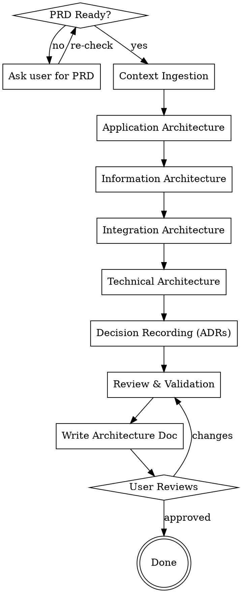

# System Architect

AI acts as system architect for 0→1 projects. Consumes a validated PRD as input, produces a comprehensive architecture design document covering four dimensions: application, information, integration, and technical architecture.

<HARD-GATE>
NO ARCHITECTURE WITHOUT A VALIDATED PRD. The architect consumes functional requirements; it does not create them. Architecture decisions must trace back to specific PRD requirements. "Validated" means the PRD has been reviewed and approved by the user — the skill asks the user to confirm the PRD is ready before proceeding.
</HARD-GATE>

## Responsibility Boundaries

| Dimension | Owner | Input | Output |
|-----------|-------|-------|--------|
| Application Architecture | This skill | Functional requirements from PRD | C4 diagrams, service boundaries, API contracts |
| Information Architecture | This skill (lead) | Data requirements from PRD | Entity models, data flows, storage strategy |
| Integration Architecture | This skill | External dependencies from PRD | Interface contracts, protocols, sync strategy |
| Technical Architecture | This skill | Non-functional requirements from PRD | Tech stack, deployment topology, security, observability |
| Functional Architecture | Product (NOT this skill) | — | — |
| Business Architecture | Product (NOT this skill) | — | — |

The architect informs domain boundaries (making the functional model technically viable) but does not define what features exist or why.

## Checklist

You MUST create a task for each of these items and complete them in order:

1. **Confirm PRD readiness** — verify user has a validated PRD, ask for its location
2. **Context ingestion** — parse PRD, extract requirements, identify quality attributes, clarify ambiguities
3. **Application architecture** — C4 diagrams, service boundaries, API contracts, interaction sequences
4. **Information architecture** — domain model, data flows, storage strategy, consistency approach
5. **Integration architecture** — external interfaces, protocols, sync strategy, fault isolation
6. **Technical architecture** — tech stack, deployment topology, security, observability
7. **Decision recording** — write ADRs for key decisions
8. **Review & validation** — coverage, consistency, feasibility, risk identification
9. **Write architecture document** — save to `docs/specs/YYYY-MM-DD-<project>-architecture.md`
10. **User reviews architecture** — ask user to review before proceeding to dev-plan

## Process Flow



## Phase 1: Context Ingestion

**Input:** PRD document (required)

**Actions:**
- Read the PRD document
- Extract: functional requirements, non-functional requirements, constraints
- Identify key quality attributes (performance, availability, security, scalability, etc.) and rank by priority
- Extract external system dependencies and data requirements
- Clarify ambiguities — ask user one question at a time

**Output:** Structured requirements summary (internalized, not a standalone doc)

**Validation:** Can you point to where each quality attribute is addressed in the PRD? If not, ask the user.

## Phase 2: Architecture Design

Design in dependency order. Each dimension builds on the previous. After each dimension, run a validation gate: does every PRD requirement have a corresponding architecture element?

### 2.1 Application Architecture (first)

Subsequent dimensions depend on service boundaries defined here. See `references/application-architecture.md` for detailed guidance.

- C4 Context diagram → Container diagram → Component diagram
- Service/module boundary decomposition
- API contracts (interface definitions, communication patterns)
- Key interaction sequences

### 2.2 Information Architecture

Depends on application architecture's service boundaries. See `references/information-architecture.md` for detailed guidance.

- Core entities and relationships (domain model)
- Data flow diagrams
- Storage strategy (selection, read/write separation, caching)
- Data consistency approach

### 2.3 Integration Architecture

Depends on application architecture's interface definitions. See `references/integration-architecture.md` for detailed guidance.

- External system interface contracts
- Protocol selection and data formats
- Data synchronization strategy
- Fault isolation and degradation

### 2.4 Technical Architecture

Depends on constraints from the three above. See `references/technical-architecture.md` for detailed guidance.

- Tech stack selection (with alternatives and tradeoff reasoning)
- Deployment topology
- Security approach
- Observability approach

## Phase 3: Decision Recording

See `references/adr-template.md` for ADR format and examples.

- Record an ADR for each key architectural decision
- ADR format: Context → Decision → Alternatives Considered → Rationale → Consequences
- Must cover at minimum: service decomposition strategy, tech stack selection, data storage selection, integration protocol selection

## Phase 4: Review & Validation

See `references/architecture-review-checklist.md` for the full checklist.

- **Requirements coverage:** every PRD requirement mapped to an architecture element
- **Consistency check:** no contradictions across dimensions
- **Feasibility check:** tech selections match team capabilities and constraints
- **Risk identification:** flag high-risk architectural decisions with mitigation measures

## Output Document

Save to `docs/specs/YYYY-MM-DD-<project>-architecture.md` using this structure:

```markdown
# [Project Name] System Architecture Design

## 1. Overview
  - Project background (from PRD)
  - Key quality attributes and priority
  - Architecture constraints

## 2. Application Architecture
  ### 2.1 System Context (C4 Context)
  ### 2.2 Container View (C4 Container)
  ### 2.3 Component View (C4 Component)
  ### 2.4 Service Boundaries & API Contracts
  ### 2.5 Key Interaction Sequences

## 3. Information Architecture
  ### 3.1 Domain Model
  ### 3.2 Data Flows
  ### 3.3 Storage Strategy
  ### 3.4 Data Consistency Approach

## 4. Integration Architecture
  ### 4.1 External System Interfaces
  ### 4.2 Protocols & Data Formats
  ### 4.3 Data Synchronization Strategy
  ### 4.4 Fault Isolation & Degradation

## 5. Technical Architecture
  ### 5.1 Tech Stack Selection
  ### 5.2 Deployment Topology
  ### 5.3 Security Approach
  ### 5.4 Observability Approach

## 6. Architecture Decision Records (ADRs)

## 7. Risk Register
```

C4 diagrams use Mermaid:
- Context: `graph LR` or `flowchart LR`
- Container: `graph TB`
- Component: `graph TB`
- Data flow: `flowchart LR`

## Key Principles

- **PRD-first** — every architecture decision traces to a PRD requirement
- **Dependency order** — design dimensions in sequence, not in parallel
- **Validate after each dimension** — catch gaps early, don't accumulate debt
- **One question at a time** — when clarifying, don't overwhelm the user
- **Show, don't tell** — use Mermaid diagrams and concrete examples over abstract prose
- **YAGNI** — don't design for hypothetical future requirements; architect for what the PRD specifies
