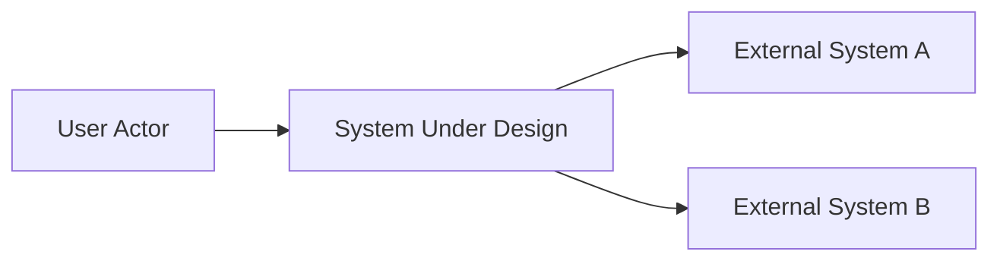
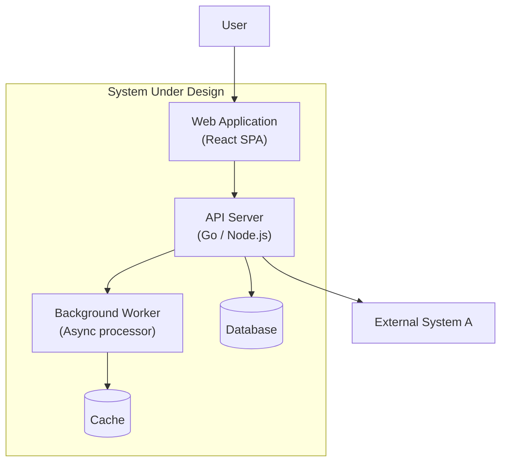
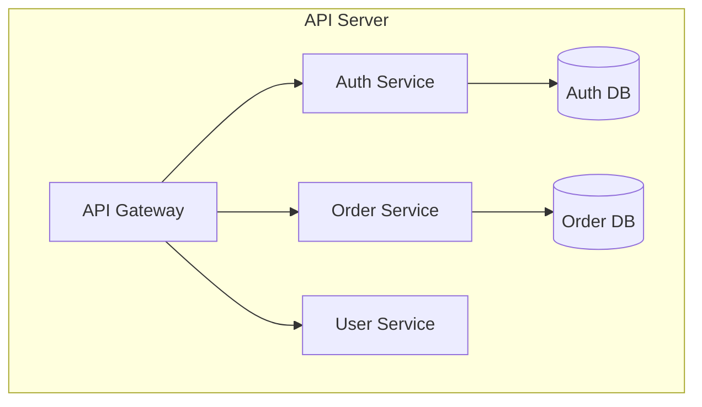
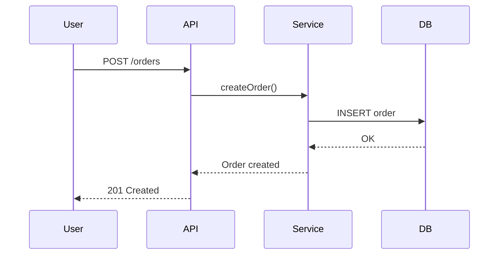

# Application Architecture Guide

Guidance for designing application architecture — the first and foundational dimension. All other dimensions depend on the service boundaries and API contracts defined here.

## C4 Model Templates

### Context Diagram

Shows the system as a whole and its relationships with users and external systems.



Key elements:
- One box for the entire system (no internals)
- External actors (users, systems) that interact with it
- Labeled arrows showing data/control flow direction

### Container Diagram

Zooms into the system, showing the high-level containers (applications, data stores, microservices).



Key elements:
- Each container is a separately deployable unit
- Show technology choices on each container (e.g., "React SPA", "Go API Server")
- Show data stores as cylinders
- Show communication protocols on arrows (e.g., "HTTPS/REST", "AMQP")

### Component Diagram

Zooms into a container, showing the components within it.



Key elements:
- Components are logical modules within a container
- Show responsibilities, not implementation details
- Keep at 5-10 components per container; if more, the container may need splitting

## Service Boundary Decomposition

### Methods

1. **Domain-Driven Design (DDD)** — identify bounded contexts from the PRD's domain language
2. **Decompose by business capability** — one service per distinct business function
3. **Decompose by subdomain** — core, supporting, generic subdomains

### Decision Criteria

| Factor | Favor Fewer Services | Favor More Services |
|--------|---------------------|---------------------|
| Team size | Small team | Large organization |
| Domain complexity | Simple domain | Complex, multiple bounded contexts |
| Scaling needs | Uniform load | Different scaling per function |
| Release independence | Single release cycle | Independent release cadence needed |

### Red Flags

- Service that depends on 5+ other services — boundary may be wrong
- Two services that always change together — consider merging
- Service with only CRUD operations — may not warrant independent deployment

## API Contract Design

### REST API Template

```
Resource: /api/v1/{resource}
Methods:
  GET    /api/v1/{resource}      — List (with pagination, filtering)
  GET    /api/v1/{resource}/{id} — Get by ID
  POST   /api/v1/{resource}      — Create
  PUT    /api/v1/{resource}/{id} — Full update
  PATCH  /api/v1/{resource}/{id} — Partial update
  DELETE /api/v1/{resource}/{id} — Delete

Request/Response:
  Content-Type: application/json
  Error format: { "error": { "code": "STRING", "message": "STRING" } }
```

### Event/Message Contract Template

```
Topic/Queue: {domain}.{event-type}
Schema:
  {
    "eventId": "UUID",
    "eventType": "STRING",
    "timestamp": "ISO-8601",
    "payload": { ... }
  }
```

## Interaction Sequences

Use Mermaid sequence diagrams for key flows:



Focus on: happy path first, then error paths, then edge cases. Document 3-5 key interactions that cover the most important user workflows from the PRD.
