# Architecture Design Guide

按 11 章结构组织的架构设计指引，提供模板、决策框架和示例。

---

## §3 技术选型与架构决策

### 3.1 选型原则

每个技术选型必须基于以下原则，并在文档中说明选择依据：

| 原则 | 优先级 | 说明 |
|------|--------|------|
| 成熟稳定优先 | 高 | 优先选择经过生产验证的技术，避免前沿但未稳定的方案 |
| 团队技术栈优先 | 高 | 团队已有经验的技术优先，降低学习成本与交付风险 |
| 社区生态优先 | 高 | 社区活跃度、第三方库丰富度、文档质量 |
| 性能匹配度 | 中 | 技术方案是否满足 PRD 中的质量属性要求 |
| 运维匹配度 | 中 | 监控、调试、部署的复杂度 |
| 长期可行性 | 中 | 维护活跃度、采用趋势、供应商锁定风险 |
| 云原生兼容 | 低-中 | 是否支持容器化、K8s、弹性伸缩 |
| 成本 | 低-中 | 许可证费用、托管成本、开发效率 |

### 3.2 架构模式选型对比

| 方案 | 优点 | 缺点 | 适用场景 |
|------|------|------|----------|
| DDD 单体 | 简单高效、交付快、运维成本低 | 后期需拆分、团队规模受限 | 业务边界未稳定、团队小、0→1 阶段 |
| 微服务 | 高扩展、独立部署、团队自治 | 运维复杂、分布式问题多、治理成本高 | 业务边界清晰、团队大、多业务域 |
| 模块化单体 | 内部边界清晰、部署简单 | 单一部署单元、扩展受限 | 需要领域隔离但暂不需独立部署 |
| 事件驱动 | 异步解耦、高吞吐、可回放 | 一致性难、调试难、排序挑战 | 数据流密集、需异步处理、事件溯源 |
| CQRS | 读写分离优化、模型独立 | 复杂度高、数据同步开销 | 读写比极高、读写模型差异大 |
| Serverless | 弹性好、按需付费、零运维 | 冷启动、调试难、供应商锁定 | 事件驱动、流量波动大、低运维需求 |
| Agent Workflow | 灵活编排、AI 原生 | 状态管理复杂、可靠性设计难 | AI Agent 平台、多模型协作 |

**选型决策模板：**

```markdown
### 架构模式：[选中方案]

**备选方案：**
1. [方案 A] — [简述，淘汰原因]
2. [方案 B] — [简述，淘汰原因]
3. [选中方案] — [简述，选中原因]

**决策依据：** [2-3 句关键差异说明]

**风险与缓解：** [潜在问题与应对措施]
```

> 选型理由必须写：为什么选这个方案，为什么不选其他方案。真正的架构不是"用了什么"，而是"为什么不用什么"。

### 3.3 核心技术选型对比

| 能力 | 候选方案 | 推荐场景 | 选型关注点 |
|------|----------|----------|------------|
| 后端框架 | Spring Boot / Go Gin / FastAPI / Express | Java 团队选 Spring Boot；高性能选 Go；AI 密集选 FastAPI | 生态、性能、团队经验 |
| 网关 | Spring Gateway / Kong / Nginx / APISIX | 企业级选 Spring Gateway；轻量选 APISIX | 扩展性、协议支持、限流能力 |
| 缓存 | Redis / Memcached | 通用选 Redis；纯 KV 缓存可考虑 Memcached | 数据结构、持久化、集群方案 |
| 消息队列 | Kafka / RabbitMQ / NATS / SQS | 高吞吐选 Kafka；路由灵活选 RabbitMQ；轻量选 NATS | 吞吐量、顺序性、运维复杂度 |
| 数据库 | PostgreSQL / MySQL / MongoDB | 复杂查询选 PostgreSQL；成熟生态选 MySQL；灵活 schema 选 MongoDB | ACID、JSON 支持、扩展方式 |
| 向量库 | Milvus / Pinecone / Weaviate / Qdrant | 自托管选 Milvus；SaaS 选 Pinecone | 维度支持、索引类型、部署方式 |
| 对象存储 | S3 / COS / OBS / MinIO | 云上选 S3/COS/OBS；本地开发选 MinIO | 多云容灾、SDK 成熟度 |
| 搜索引擎 | Elasticsearch / Meilisearch / Typesense | 企业级选 ES；轻量选 Meilisearch | 全文能力、集群方案、资源消耗 |
| 容器编排 | Kubernetes / ECS / Docker Compose | 生产选 K8s；简单场景选 Compose | 弹性伸缩、服务治理、学习成本 |
| CI/CD | GitHub Actions / GitLab CI / ArgoCD | GitHub 生态选 Actions；K8s 原生选 ArgoCD | 流水线灵活度、缓存、安全 |
| 监控 | Prometheus+Grafana / Datadog / SkyWalking | 自托管选 Prometheus；全托管选 Datadog | 指标覆盖、Trace 能力、成本 |

### 3.4 AI 相关技术选型

针对 AI Agent 平台 / RAG 系统 / 大模型应用系统，必须额外覆盖：

**模型选型：**

| 模型 | 适用场景 | 选型关注点 |
|------|----------|------------|
| GPT-4o / GPT-4.1 | 复杂推理、多步 Agent | 成本、延迟、上下文窗口 |
| Claude | 长文本、代码生成、安全敏感场景 | 上下文长度、工具调用能力 |
| DeepSeek | 推理密集、成本敏感 | 开源程度、推理能力 |
| Qwen | 中文场景、多模态 | 中文质量、部署方式 |
| 本地模型 (Llama / Mistral) | 数据隐私、离线部署 | 硬件需求、推理框架兼容 |

**Agent 框架选型：**

| 框架 | 优点 | 缺点 | 适用场景 |
|------|------|------|----------|
| LangChain | 生态丰富、集成多 | 抽象层厚、版本变化快、调试难 | 原型验证 |
| LangGraph | 状态机编排、可控性强 | 学习曲线陡 | 复杂多步 Agent 工作流 |
| CrewAI | 多 Agent 协作、角色编排 | 定制性受限 | 多角色协作场景 |
| 自研框架 | 完全可控、贴合业务 | 开发成本高 | 核心平台、长期演进 |

**Embedding 模型选型：**

| 模型 | 适用场景 | 选型关注点 |
|------|----------|------------|
| bge-m3 | 多语言、通用 | 多语言支持、维度 |
| jina-embeddings | 长文本 | 最大 token 数 |
| text-embedding-3 (OpenAI) | 英文为主、高质量 | 成本、API 稳定性 |
| 本地 Embedding | 数据隐私、离线 | 推理速度、模型大小 |

### 3.5 技术风险评估模板

对每个引入的技术，评估其风险：

```markdown
### [技术名称] 风险评估

| 维度 | 评级 | 说明 |
|------|------|------|
| 技术成熟度 | 高/中/低 | 是否经过大规模生产验证 |
| 版本稳定性 | 高/中/低 | API 是否频繁变更，是否有 Breaking Change |
| 团队掌握度 | 高/中/低 | 团队是否已有经验，学习曲线如何 |
| 运维复杂度 | 高/中/低 | 部署、监控、排错的难度 |
| 供应商锁定 | 高/中/低 | 迁移成本、替代方案可用性 |
| 性能瓶颈风险 | 高/中/低 | 是否存在已知性能天花板 |

**缓解措施：** [具体应对方案]
**降级策略：** [出问题时的后备方案]
```

---

## §4 总体架构设计

### 4.1 C4 模型模板

#### 上下文图（Context Diagram）

展示系统整体与外部用户、系统的关系：

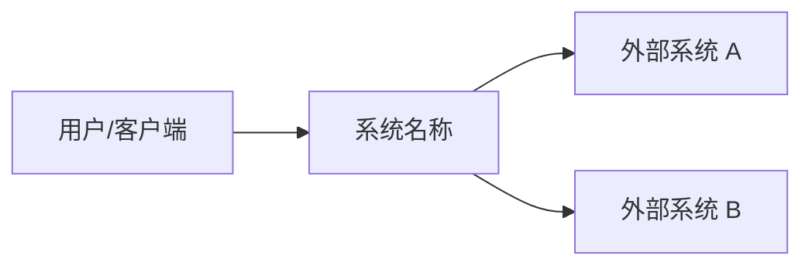

要点：
- 一个方框代表整个系统（不展示内部）
- 标注外部参与者（用户、系统）和数据/控制流方向
- 标注通信协议

#### 容器图（Container Diagram）

展示系统内部的高层容器（应用、数据存储、微服务）：

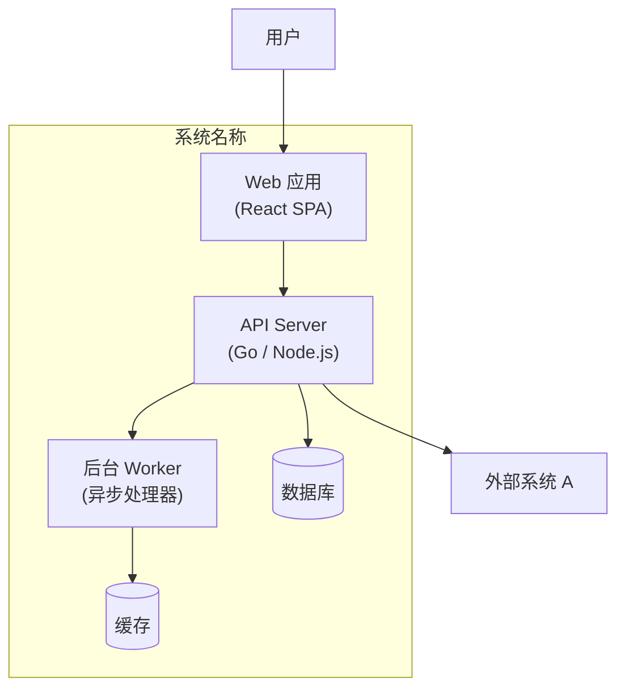

要点：
- 每个容器是独立部署单元
- 在容器上标注技术选型
- 数据存储用圆柱体
- 箭头标注通信协议

#### 组件图（Component Diagram）

下钻到容器内部，展示组件：

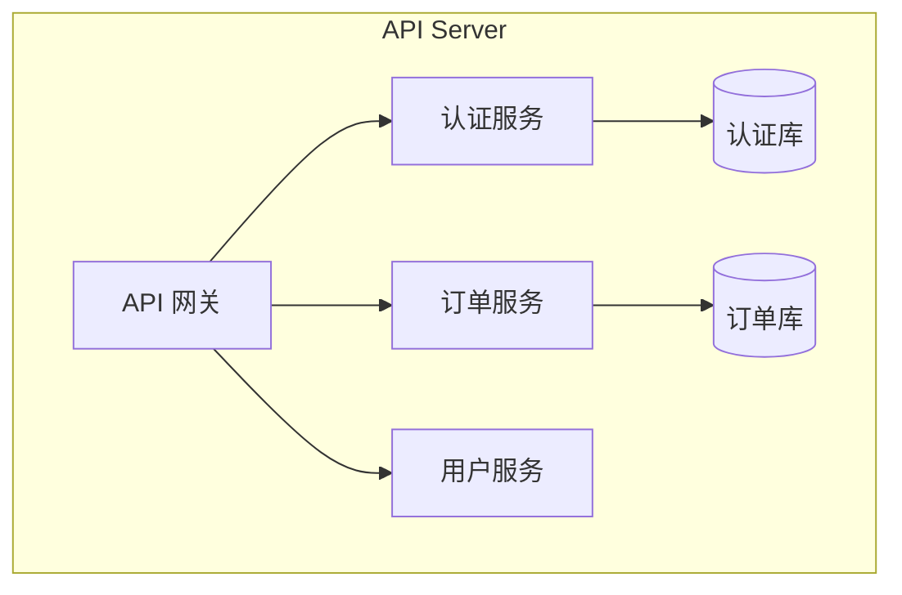

要点：
- 组件是容器内的逻辑模块
- 展示职责，不展示实现细节
- 每容器 5-10 个组件；超过则考虑拆分容器

### 4.2 架构原则模板

```markdown
1. 高内聚低耦合 — 模块内部紧密相关，模块之间松散依赖
2. 领域驱动 — 以业务领域为核心组织代码
3. 异步解耦 — 能异步的不要同步，能解耦的不要耦合
4. 云原生优先 — 无状态设计，水平扩展
5. 可扩展优先 — 新功能通过扩展而非修改加入
```

### 4.3 架构风格决策

在 C4 图之前，先确定架构风格并说明原因：

```markdown
### 架构风格：[选中风格]

**原因：**
- [原因 1]
- [原因 2]
- [原因 3]

**代价：**
- [代价 1]
- [代价 2]

**演进路径：** [未来如何调整此风格]
```

### 4.4 核心链路设计

识别 3-5 条关键链路，用时序图描述：

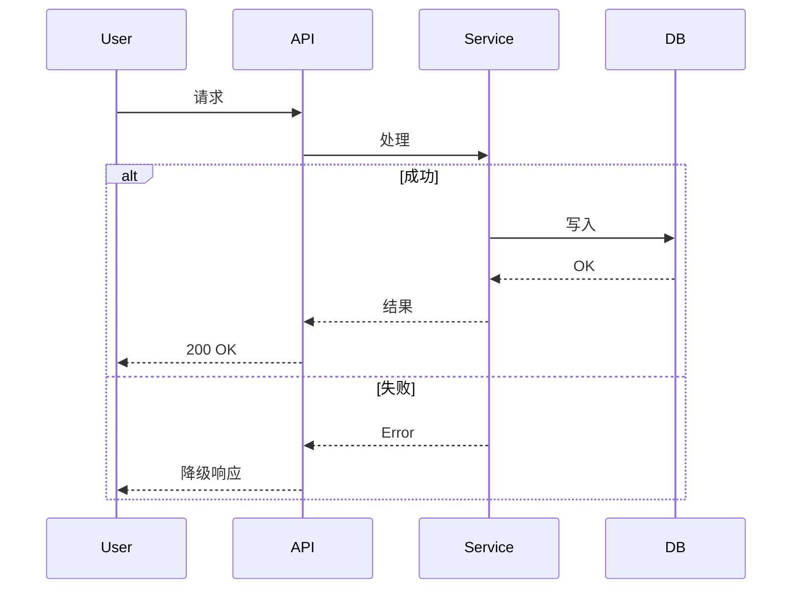

每条链路必须包含：正常流程 → 异常/降级路径 → 边界情况

---

## §5 模块设计

### 5.1 模块拆分方法

1. **领域驱动设计（DDD）** — 从 PRD 的领域语言识别限界上下文
2. **按业务能力拆分** — 一个业务能力一个模块
3. **按子域拆分** — 核心/支撑/通用子域

### 5.2 拆分决策标准

| 因素 | 倾向更少模块 | 倾向更多模块 |
|------|-------------|-------------|
| 团队规模 | 小团队 | 大组织 |
| 领域复杂度 | 简单领域 | 多个限界上下文 |
| 扩展需求 | 负载均匀 | 各功能扩展需求不同 |
| 发布独立性 | 统一发布周期 | 需独立发布节奏 |

### 5.3 红旗信号

- 依赖 5+ 个其他模块的模块 — 边界可能不对
- 总是一起变化的两个模块 — 考虑合并
- 只有 CRUD 操作的模块 — 可能不需要独立存在

### 5.4 模块描述模板

```markdown
### [模块名]

**职责：** 1 句话描述做什么

**不做什么：** 明确边界

**核心能力：**
- 能力 1
- 能力 2

**关键方法：**（高风险模块需要伪代码）
- method1(params): ReturnType — 简要说明
- method2(params): ReturnType — 简要说明

**状态机：**（有状态模块必须）
  StateA → StateB [触发条件] / 副作用

**依赖：** 依赖哪些其他模块
```

### 5.5 模块关系图

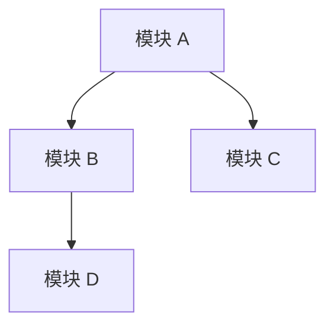

要点：
- 箭头方向表示依赖方向
- 避免循环依赖
- 标注模块间通信模式（直接调用 / 事件 / MQ）

---

## §6 数据与存储设计

### 6.1 领域模型

#### 实体识别

从 PRD 识别：
1. **核心实体** — 业务围绕的名词（用户、订单、产品）
2. **值对象** — 无独立身份的属性（地址、金额、日期范围）
3. **聚合** — 一致性边界，将实体分组（订单 + 订单项）
4. **关系** — 一对一、一对多、多对多

#### ER 图模板

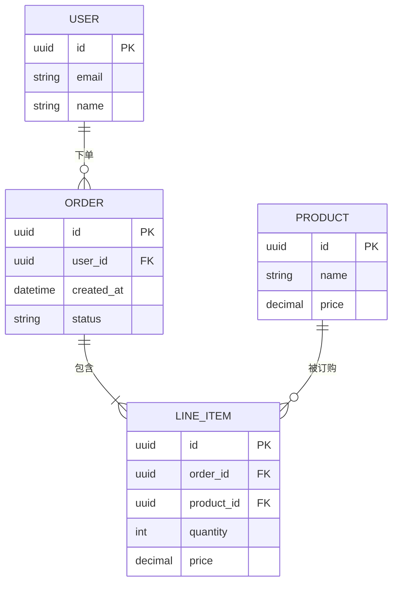

#### 聚合边界与数据归属

- 每个聚合由且仅由一个模块拥有
- 其他模块只能通过 API 访问，不能直连数据库
- 若两个模块频繁需要同一数据，考虑：(a) API 组合 (b) 事件同步的数据副本 (c) 重新审视边界

### 6.2 数据流转

#### 数据流转图模板

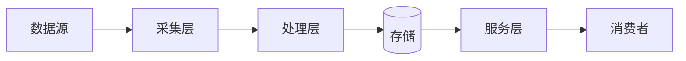

每步标注：输入/输出/执行者/触发条件

#### 关键问题

- 数据从哪里进入系统？（用户输入、外部 API、文件上传、事件流）
- 数据在哪里转换？（校验、富化、聚合）
- 数据存储在哪里？（主存储、缓存、搜索索引、数据仓库）
- 数据如何离开系统？（API 响应、报表、事件通知、导出）

### 6.3 存储选型矩阵

| 需求 | 关系型 (PostgreSQL, MySQL) | 文档型 (MongoDB) | KV 型 (Redis) | 搜索型 (Elasticsearch) | 对象型 (S3) |
|------|------|------|------|------|------|
| 复杂查询与关联 | ★★★ | ★☆☆ | ☆☆☆ | ★★☆ | ☆☆☆ |
| 灵活 Schema | ★★☆ | ★★★ | ★☆☆ | ★★☆ | ★☆☆ |
| 低延迟读取 | ★★☆ | ★★☆ | ★★★ | ★★☆ | ★☆☆ |
| 全文检索 | ★☆☆ | ★★☆ | ☆☆☆ | ★★★ | ☆☆☆ |
| 大二进制数据 | ★☆☆ | ★☆☆ | ☆☆☆ | ☆☆☆ | ★★★ |
| ACID 事务 | ★★★ | ★★☆ | ☆☆☆ | ☆☆☆ | ☆☆☆ |

### 6.4 读写分离决策

适用条件：
- 读多写少（读写比 > 5:1）
- 读写延迟要求不同
- 读取可容忍最终一致性

方案：
- **CQRS** — 读写模型分离，通过事件同步
- **读副本** — 数据库级复制，读扩展
- **缓存旁路（Cache-aside）** — 应用显式管理缓存（查缓存 → 未命中 → 查库 → 回填缓存）

### 6.5 缓存策略

| 模式 | 适用场景 | 失效策略 |
|------|----------|----------|
| Cache-aside | 通用、读多 | TTL + 写时显式失效 |
| Write-through | 不容忍脏读 | 写时同步更新缓存 |
| Write-behind | 写多、可容忍短暂不一致 | 写缓冲、异步刷盘 |

### 6.6 数据一致性

#### 一致性模型

| 模型 | 保证 | 适用场景 |
|------|------|----------|
| 强一致性 | 读始终返回最新写 | 金融交易、库存 |
| 最终一致性 | 读随时间收敛到最新 | 社交动态、分析、搜索索引 |
| 因果一致性 | 因果相关操作按序可见 | 协同编辑、消息 |

#### Saga 模式（分布式事务）

跨模块业务操作时使用：

**编排式 Saga：** 各模块发布事件，下游模块响应
```
订单模块：createOrder → 发布 OrderCreated
库存模块：reserveStock → 发布 StockReserved
支付模块：processPayment → 发布 PaymentCompleted
订单模块：confirmOrder
```

**协调式 Saga：** 中心协调器指挥每一步
```
协调器 → 订单模块：createOrder
协调器 → 库存模块：reserveStock
协调器 → 支付模块：processPayment
协调器 → 订单模块：confirmOrder
```

选择：简单流程（2-3 步）用编排式，复杂流程（4+ 步、有条件分支）用协调式。

---

## §7 接口与通信设计

### 7.1 API 契约设计

#### REST API 模板

```
资源: /api/v1/{resource}
方法:
  GET    /api/v1/{resource}      — 列表（分页、过滤）
  GET    /api/v1/{resource}/{id} — 按 ID 获取
  POST   /api/v1/{resource}      — 创建
  PUT    /api/v1/{resource}/{id} — 全量更新
  PATCH  /api/v1/{resource}/{id} — 部分更新
  DELETE /api/v1/{resource}/{id} — 删除

请求/响应:
  Content-Type: application/json
  错误格式: { "error": { "code": "STRING", "message": "STRING" } }
```

#### 事件/消息契约模板

```
Topic/Queue: {domain}.{event-type}
Schema:
  {
    "eventId": "UUID",
    "eventType": "STRING",
    "timestamp": "ISO-8601",
    "payload": { ... }
  }
```

### 7.2 外部系统接口契约模板

对每个外部系统集成：

```markdown
### [外部系统名称]

**用途：** 提供什么数据或能力
**方向：** 入站（对方调用我方） / 出站（我方调用对方） / 双向
**协议：** REST / GraphQL / gRPC / 消息队列 / WebSocket
**认证：** API Key / OAuth2 / mTLS / Basic Auth / 无

**端点/主题：**
| 方向 | 路径/主题 | 方法/动作 | 请求 Schema | 响应 Schema |
|------|----------|----------|-------------|-------------|
| 出站 | /api/v1/resource | GET | - | { ... } |
| 入站 | /webhook/event | POST | { ... } | 200 OK |

**SLA：**
- 可用性: 99.9% / 尽力而为
- 延迟: p99 < 200ms / 无保证
- 限流: 1000 req/min / 无限制

**错误处理：** 重试策略、熔断阈值、降级行为
```

### 7.3 协议选型

| 协议 | 适用场景 | 权衡 |
|------|----------|------|
| REST (HTTP/JSON) | CRUD API、公开 API、简单集成 | 冗余、无流式、仅请求-响应 |
| GraphQL | 灵活查询、前端驱动数据获取 | 复杂度高、N+1 风险、缓存难 |
| gRPC | 内部服务间通信、低延迟、流式 | 二进制协议（调试难）、需 Proto 定义 |
| 消息队列 (AMQP) | 异步工作流、事件驱动、解耦 | 最终一致性、顺序挑战、运维开销 |
| WebSocket | 实时双向通信（聊天、实时更新） | 连接管理、扩展复杂 |
| 文件传输 (S3/SFTP) | 批量数据交换、大数据集 | 高延迟、非实时、调度复杂 |

**决策框架：**

1. 同步还是异步？
   - 同步 → REST、GraphQL、gRPC
   - 异步 → 消息队列、文件传输
2. 内部还是外部？
   - 内部 → gRPC 或 REST
   - 外部 → REST（最广泛支持）
3. 需要实时推送？
   - 是 → WebSocket 或 SSE
   - 否 → 标准请求-响应或轮询

### 7.4 数据同步策略

| 模式 | 工作方式 | 适用场景 |
|------|----------|----------|
| **API 轮询** | 周期性调用外部 API 获取更新 | 外部系统无推送机制；数据变更不频繁 |
| **Webhook** | 外部系统推送事件到我方端点 | 外部系统支持 Webhook；需准实时 |
| **变更数据捕获（CDC）** | 监控数据库变更日志（如 Debezium） | 需从自有数据库同步；无应用层事件 |
| **事件流** | 发布/订阅事件主题 | 高吞吐、多消费者、需回放能力 |
| **批量 ETL** | 定时提取-转换-加载 | 大数据集、可容忍延迟（小时级）、数据仓库 |

数据同步流程：

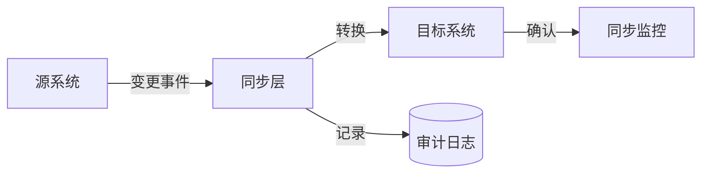

跨系统一致性要点：
- **数据权威源：** 明确哪个系统拥有每个数据实体，其他系统持有投影或缓存副本
- **冲突解决：** 最后写入胜出、应用层合并、人工解决 — 提前决定
- **幂等性：** 所有同步操作必须幂等，使用关联 ID 去重

### 7.5 故障隔离与降级

#### 熔断器模式

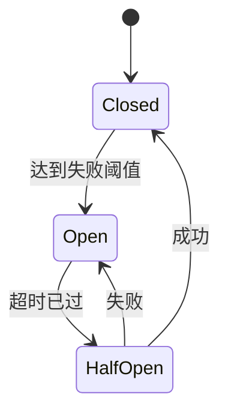

配置：
- 失败阈值：M 秒内 N 次失败 → 熔断
- 熔断时长：等待多久后测试恢复
- 半开：放行 1 个请求；成功 → 关闭，失败 → 继续熔断

#### 降级策略

| 策略 | 实现方式 | 适用场景 |
|------|----------|----------|
| **缓存响应** | 返回上一次有效响应 | 数据变更不快，脏数据可接受 |
| **默认值** | 返回硬编码的合理默认值 | 非关键数据，有值比报错好 |
| **优雅降级** | 禁用该功能，展示提示 | 功能对核心流程非必需 |
| **排队重试** | 存储请求，恢复后处理 | 操作必须最终成功，可等待 |

#### 超时策略

- **连接超时：** 2-5 秒（快速发现不可达）
- **读取超时：** 匹配外部系统 p99 延迟 + 50% 余量
- **总超时：** 连接 + 读取 + 1 次重试预算

#### 舱壁模式

将外部系统调用隔离到独立的线程池或连接池，防止一个慢外部系统耗尽其他系统所需的资源。

#### 错误映射链

| 外部错误 | 适配器捕获 | 适配器返回/包装 | 核心层看到 | 调用方处理 |
|---------|-----------|---------------|-----------|-----------|
| — | — | — | — | — |

关键原则：适配器确保外部系统的异常不会泄漏到核心层。

---

## §8 代码库与工程结构设计

### 8.1 Monorepo 与 Multi-repo 对比

| 维度 | Monorepo | Multi-repo |
|------|----------|------------|
| 代码管理 | 统一管理、原子提交 | 独立清晰、权限隔离 |
| 依赖共享 | 共享方便、版本统一 | 版本分散、同步成本高 |
| 协作效率 | 跨模块重构容易 | 跨仓库协作复杂 |
| CI/CD | 统一流水线、影响范围大 | 独立流水线、互不影响 |
| 仓库体积 | 随增长变大 | 各仓库轻量 |
| AI 工具友好 | 高（上下文完整） | 低（需多仓库切换） |
| 适用场景 | Agent 平台、企业中台、0→1 阶段 | 开源项目、独立产品、大团队 |

**决策因素：**
- 团队规模小、模块紧密耦合 → Monorepo
- 多团队、独立发布周期 → Multi-repo
- AI Agent 平台 / 企业中台 → 通常 Monorepo 更合理

> AI 时代，代码结构即架构结构。高内聚模块结构 = 更强 AI 可理解性。"AI 友好的工程结构"会成为新一代架构能力。

### 8.2 DDD 单体目录结构模板

```
repo
├── apps
│   ├── gateway/                    # API 网关
│   ├── api-server/                 # 主 API 服务
│   ├── worker/                     # 异步 Worker
│   └── scheduler/                  # 定时任务
│
├── domains/                        # 领域模块（DDD 核心）
│   ├── user-domain/
│   │   ├── application/            # 应用服务（编排、DTO 转换）
│   │   ├── domain/                 # 领域模型（实体、值对象、领域服务）
│   │   ├── infrastructure/         # 基础设施（仓储实现、外部适配）
│   │   └── interfaces/             # 接口层（Controller、消息监听）
│   ├── file-domain/
│   ├── agent-domain/
│   ├── workflow-domain/
│   └── auth-domain/
│
├── infrastructure/                 # 共享基础设施
│   ├── mq/                         # 消息队列封装
│   ├── storage/                    # 存储封装
│   ├── cache/                      # 缓存封装
│   └── ai-model/                   # AI 模型调用封装
│
├── shared/                         # 共享内核
│   ├── common/                     # 通用工具、异常定义
│   └── kernel/                     # 领域事件基类、聚合基类
│
├── sdk/                            # 外部 SDK / 客户端库
├── deployment/                     # 部署配置（Docker、Helm、Terraform）
└── docs/                           # 文档
```

### 8.3 微服务目录结构模板

```
repo
├── services/
│   ├── user-service/
│   │   ├── cmd/                    # 入口（main.go / Application.java）
│   │   ├── internal/
│   │   │   ├── handler/            # HTTP/gRPC Handler
│   │   │   ├── service/            # 业务逻辑
│   │   │   ├── repository/         # 数据访问
│   │   │   └── model/              # 数据模型
│   │   ├── api/                    # Proto / OpenAPI 定义
│   │   ├── config/                 # 配置文件
│   │   └── Dockerfile
│   ├── order-service/
│   ├── payment-service/
│   └── notification-service/
│
├── pkg/                            # 跨服务共享包
│   ├── logger/
│   ├── middleware/
│   └── errors/
│
├── api-gateway/                    # API 网关配置
├── proto/                          # 共享 Proto 定义
├── scripts/                        # 构建/部署脚本
├── deployment/                     # K8s Helm Charts / Docker Compose
└── docs/
```

### 8.4 分层结构设计

每个领域模块必须遵循四层架构，严格控制依赖方向：

```
┌─────────────────────────────────┐
│  interfaces（接口层）            │  Controller / 消息监听 / GraphQL Resolver
│  接收外部请求，转换为应用层调用    │
├─────────────────────────────────┤
│  application（应用层）           │  应用服务 / 编排 / DTO
│  协调领域对象完成业务用例         │
├─────────────────────────────────┤
│  domain（领域层）                │  实体 / 值对象 / 聚合 / 领域服务 / 领域事件
│  核心业务逻辑，无外部依赖         │
├─────────────────────────────────┤
│  infrastructure（基础设施层）     │  仓储实现 / 外部 API 客户端 / MQ 生产者
│  技术实现，依赖倒置由领域层定义    │
└─────────────────────────────────┘
```

**依赖方向（严格单向）：**

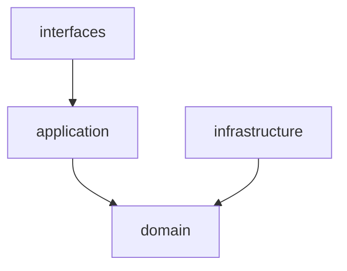

标注：
- 实线箭头 = 编译时依赖
- 虚线箭头 = 运行时依赖（依赖注入）

### 8.5 禁止依赖规则

| 禁止 | 原因 |
|------|------|
| domain 层依赖 infrastructure 层 | 领域层必须纯业务逻辑，通过依赖倒置由基础设施实现接口 |
| domain 层依赖 application 层 | 领域是被调用的核心，不应反向依赖编排层 |
| domain 层依赖任何外部框架 | 保持领域模型的独立性与可测试性 |
| infrastructure 层直接被 interfaces 层调用 | 必须经过 application 层编排 |
| 跨 domain 直接依赖另一个 domain 的内部类 | 领域间只能通过接口或领域事件通信 |
| shared/kernel 包含业务逻辑 | 共享内核仅放技术工具和基类 |

### 8.6 模块依赖关系图

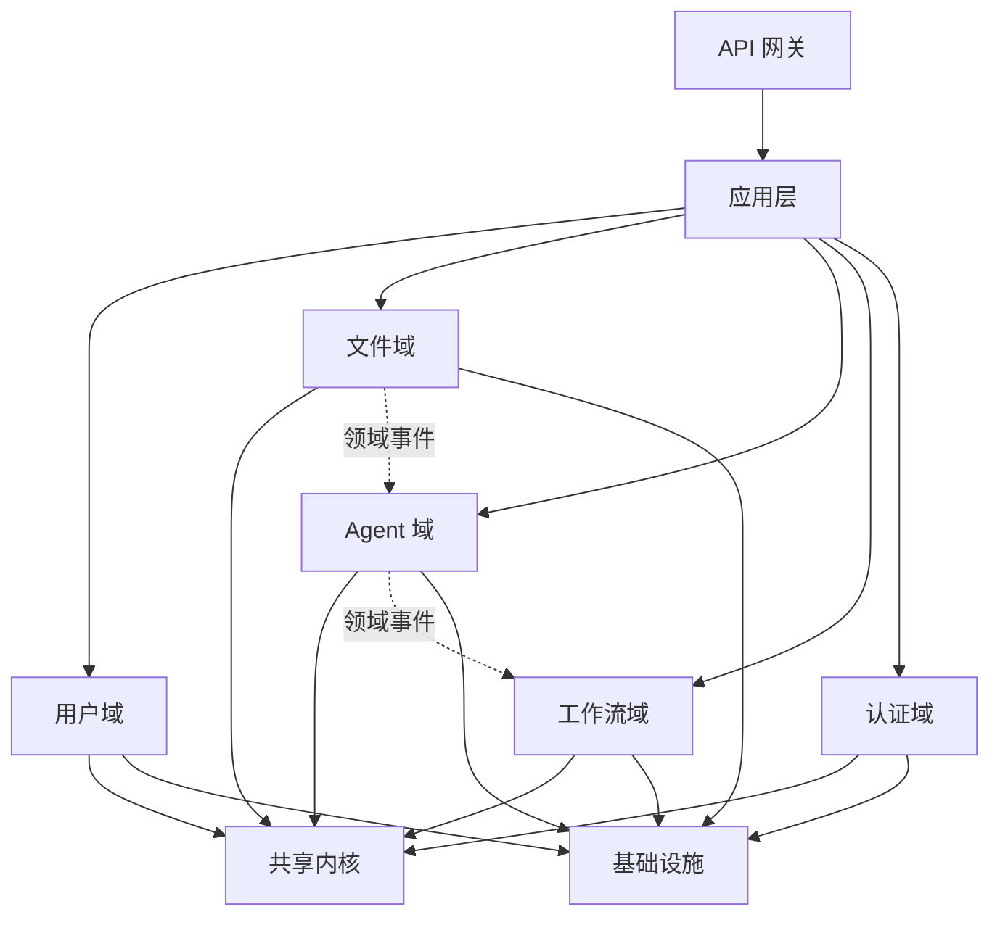

说明：实线为直接依赖，虚线为领域事件通信（松耦合）。

### 8.7 工程规范检查清单

- [ ] **API 规范：** RESTful 风格统一、版本化路径（/api/v1/）、错误码体系
- [ ] **包结构规范：** 按领域模块组织，禁止按技术层跨领域混放
- [ ] **DTO 规范：** 入站 DTO（Request）与出站 DTO（Response）分离，禁止领域对象直接暴露
- [ ] **异常规范：** 统一异常层次结构，业务异常与技术异常分离，全局异常处理器
- [ ] **日志规范：** 结构化日志、TraceId 贯穿、敏感字段脱敏
- [ ] **配置规范：** 环境变量外置、敏感配置走 Vault/Secrets Manager、配置类统一管理
- [ ] **依赖规范：** 禁止循环依赖、禁止 domain 依赖外部框架、依赖版本统一管理
- [ ] **测试规范：** 领域层单元测试、应用层集成测试、接口层契约测试
- [ ] **代码生成规范：** DTO/Proto 生成的代码不入库、生成脚本可重复执行

---

## §9 非功能设计

### 9.1 可用性设计

| 机制 | 说明 |
|------|------|
| 多副本 | 无状态服务 ≥ 2 副本 |
| 熔断 | 失败阈值 → 开路 → 超时后半开 → 试探恢复 |
| 限流 | 令牌桶/滑动窗口，防止过载 |
| 重试 | 指数退避 + 抖动，幂等操作才重试 |
| 灰度 | 新版本先切 5% 流量验证 |

### 9.2 性能设计

**容量预估表：**

| 指标 | 数值 |
|------|------|
| QPS | — |
| 峰值吞吐 | — |
| 数据量 | — |
| 用户数 | — |

**热路径分析：** 对延迟关键流程，逐步估算耗时：

```
请求进入 → 网关路由 (5ms) → 参数校验 (2ms) → 业务逻辑 (10ms) → DB 查询 (15ms) → 响应序列化 (3ms)
总计：~35ms（p99 目标 <100ms ✓）
```

**优化策略：** CDN、缓存、异步化、分片、读写分离

### 9.3 安全设计

#### STRIDE 威胁模型（必须按此格式）

| 威胁类型 | 攻击场景 | 影响 | 缓解措施 |
|---------|---------|------|---------|
| 伪装 (Spoofing) | — | — | — |
| 篡改 (Tampering) | — | — | — |
| 否认 (Repudiation) | — | — | — |
| 信息泄露 (Info Disclosure) | — | — | — |
| 拒绝服务 (DoS) | — | — | — |
| 提权 (Elevation) | — | — | — |

#### 安全清单

- [ ] **身份认证：** JWT / OAuth2 / SSO — 用户如何证明身份
- [ ] **权限控制：** RBAC / ABAC / ACL — 权限如何执行
- [ ] **数据加密：** 静态加密（AES-256）与传输加密（TLS 1.2+）
- [ ] **输入校验：** 所有用户输入服务端校验
- [ ] **密钥管理：** 代码中无密钥，使用 Vault 或托管密钥服务
- [ ] **API 安全：** 限流、CORS、输入净化
- [ ] **依赖安全：** 自动化漏洞扫描（Dependabot、Snyk）
- [ ] **审计日志：** 谁在什么时候从哪里做了什么
- [ ] **网络安全：** VPC、安全组、面向公网时加 WAF
- [ ] **合规：** GDPR、SOC2、HIPAA — 视 PRD 约束而定

### 9.4 可观测性设计

#### 三大支柱

| 支柱 | 工具示例 | 回答什么问题 |
|------|----------|-------------|
| **指标（Metrics）** | Prometheus, Grafana | 多少？多快？多频繁？ |
| **日志（Logs）** | ELK, Loki | 发生了什么？状态是什么？ |
| **链路追踪（Traces）** | Jaeger, SkyWalking | 请求去了哪？瓶颈在哪？ |

#### 必备指标

- **RED 指标（服务）：** Rate（请求率）、Errors（错误率）、Duration（延迟）
- **USE 指标（资源）：** Utilization（使用率）、Saturation（饱和度）、Errors（错误）
- **业务指标：** 订单/分钟、活跃用户、转化率

#### 关键指标定义（必须具体）

| 指标名 | 计算方法 | 采集点 | 阈值 |
|-------|---------|-------|------|
| 请求延迟 p99 | histogram_quantile(0.99, rate(http_duration_bucket[5m])) | API Gateway | > 500ms 告警 |
| 错误率 | errors / total_requests | API Server | > 5% 告警 |

#### 告警策略

- **立即告警：** 服务宕机、错误率 > 5%、数据丢失
- **工作时间告警：** 高延迟（p99 > 阈值）、磁盘 > 80%
- **工单/通知：** 渐进趋势、容量规划信号

### 9.5 质量属性场景（QAS）

```
场景 ID: QA-01
质量属性: 性能
刺激源: 用户提交编排任务
刺激: 并发 10 个编排请求
环境: 正常负载
制品: Orchestrator
响应: 调度请求并返回模型选择
响应度量: 调度延迟 < 100ms（p99）
```

**Utility Tree 格式：**

```
Utility
  +-- 性能
  |     +-- 编排调度
  |     |     +-- QA-01: "并发 10 请求时调度延迟 < 100ms" (高重要, 低难度)
  |     +-- 模型响应
  |           +-- QA-02: "模型调用超时 30s 后自动降级" (高重要, 中难度)
  +-- 安全
        +-- Hook 隔离
              +-- QA-03: "Hook 只能访问白名单 API" (高重要, 中难度)
```

优先级标注：(业务重要性, 技术难度) — H/M/L

---

## §10 部署与运维设计

### 10.1 部署拓扑模式

| 模式 | 适用场景 |
|------|----------|
| **单服务器** | MVP、低流量、简单运维 |
| **应用与数据库分离** | 大多数 Web 应用、中等流量 |
| **微服务** | 复杂领域、独立扩展 |
| **Serverless** | 事件驱动、流量波动、低运维 |

#### 单服务器

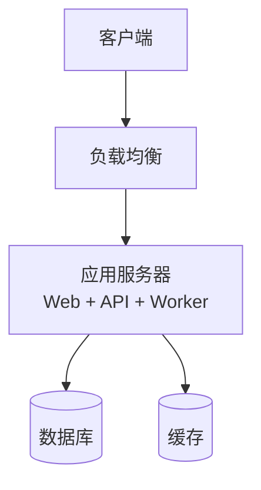

#### 应用与数据库分离

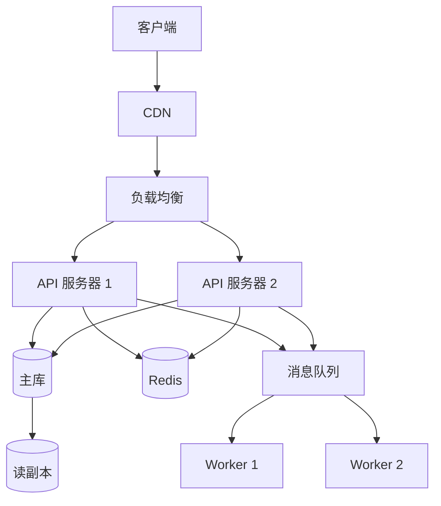

### 10.2 关键基础设施决策

- **负载均衡：** L4（TCP）vs L7（HTTP），健康检查策略
- **数据库：** 托管 vs 自建，备份策略，容灾方案
- **密钥管理：** Vault、AWS Secrets Manager、环境变量（仅开发）
- **网络：** VPC 设计，公有/私有子网，安全组

### 10.3 环境划分

| 环境 | 用途 | 数据 |
|------|------|------|
| dev | 开发自测 | 模拟数据 |
| test | 集成测试 | 测试数据 |
| pre | 预发布验证 | 生产镜像 + 脱敏数据 |
| prod | 生产 | 生产数据 |

### 10.4 CI/CD 要点

- **流水线：** 代码提交 → 构建 → 单元测试 → 集成测试 → 部署 → 冒烟测试
- **配置中心：** Apollo / Nacos / Spring Cloud Config
- **密钥管理：** Vault / 云厂商密钥服务
- **服务发现：** K8s Service / Consul / Nacos
- **灰度发布：** 金丝雀发布、蓝绿部署
- **回滚机制：** 版本回退、数据库迁移回滚

---

## §11 风险与架构演进

### 11.1 风险登记模板

```markdown
### 风险: [标题]

**可能性:** 高 / 中 / 低
**影响:** 高 / 中 / 低
**缓解措施:** [做什么来预防]
**应急方案:** [发生时做什么]
```

**常见风险类别：**
- 技术风险 — 未验证的技术、复杂集成、性能未知数
- 组织风险 — 团队能力缺口、关键人依赖、供应商锁定
- 进度风险 — 架构复杂度 vs 时间线、外部依赖可用性
- 运维风险 — 监控盲区、部署复杂度、灾难恢复
- 安全风险 — 敏感数据处理、认证缺口、合规要求

### 11.2 常见架构风险示例

| 风险 | 影响 | 缓解方案 |
|------|------|----------|
| 微服务过多 | 运维复杂、调试困难 | 一期 DDD 单体，按子域模块化 |
| 消息队列积压 | 延迟升高、业务受阻 | 削峰限流、消费者水平扩展 |
| 技术选型过新 | 版本不稳定、Breaking Change | 锁定版本、跟进 Changelog、有降级方案 |
| 单点故障 | 服务不可用 | 多副本、自动故障转移 |
| 数据一致性 | 业务数据错误 | Saga 补偿、对账机制 |
| AI 模型幻觉 | 输出不可信 | HITL（人工审批）、Guardrail、评估体系 |

### 11.3 架构演进路线模板

```markdown
**一期（MVP）：**
- 架构模式: DDD 单体
- 目标: 快速验证核心业务

**二期：**
- 变化: 高流量模块独立拆分
- 触发条件: QPS > 5000 或团队 > 8 人

**三期：**
- 变化: 事件驱动 + 服务网格
- 触发条件: 模块 > 10 且需要独立发布
```

关键：每期写明**触发条件**，不是按时间规划，而是按指标规划。

### 11.4 迁移计划模板（有现有系统时）

```markdown
### 当前状态
- 系统现状描述

### 目标状态
- 架构目标描述

### 迁移路径
1. Phase 1: [第一步] — 风险最低、价值最高
2. Phase 2: [第二步]
3. Phase 3: [第三步]

### 向后兼容
- 兼容策略
- 废弃计划

### 回滚方案
- 每个阶段的回滚方法
```
