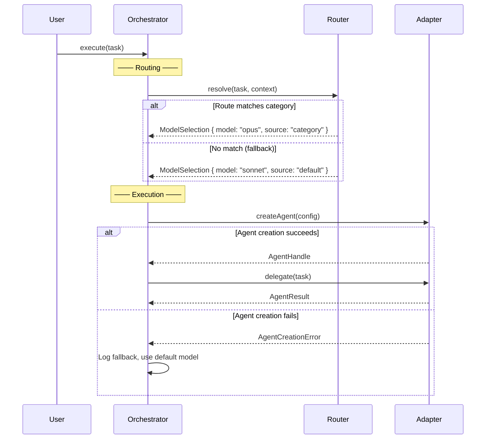

# 架构文档深度要求指南

核心原则：架构文档就是详细设计文档，每个组件、每个模块、每个接口都必须深到开发者可以直接据此实现。不存在"浅层区域"。

## 统一深度要求

| 元素 | 必须达到的深度 |
|------|--------------|
| 组件/模块 | 职责 + 关键方法 + 不做什么 + 伪代码（非平凡逻辑）+ 状态机（有状态组件） |
| API 契约 | 接口 + 错误类型 + 1 个使用示例 |
| 状态机 | 状态 + 触发条件 + 守卫条件 + 副作用 |
| 交互序列 | happy path + ≥1 错误/降级路径 |
| 算法 | 伪代码或逐步流程 |
| 数据 Schema | 每个持久化数据的 JSON/YAML 样本 |
| 技术选型 | 选定方案 + 备选方案 + 选型理由 + 风险 |
| 错误处理 | 外部错误 → 内部错误 → 调用方可见错误（完整映射链） |
| 非功能设计 | 具体的设计决策 + 量化目标，不是模糊标签 |

---

## 元素深度对比

### 组件/模块描述

#### 浅（不可接受）

```
DAGEngine — executes workflow steps
```

#### 深（必须）

```
DAGEngine — executes workflow steps in dependency order.

Key methods:
- execute(workflow: IWorkflowDefinition): Promise<WorkflowResult>
- getStepState(stepId: string): StepStatus

Does NOT: parse YAML, manage state persistence, choose models

State machine:
  Pending → Running [all dependencies done] / init step state
  Running → Done [agent returns success] / write audit, store output
  Running → Failed [agent throws] / write audit, check on_failure
  Failed → Retrying [on_failure=retry, retry_count>0] / decrement retry
  Retrying → Running [retry triggered] / re-execute agent
```

### API 契约

#### 浅（不可接受）

```typescript
interface IHarnessAdapter {
  createAgent(config: AgentConfig): IAgentHandle;
}
```

#### 深（必须）

```typescript
interface IHarnessAdapter {
  readonly name: string;
  createAgent(config: AgentConfig): IAgentHandle;
  listTools(): IToolDescriptor[];
  callTool(name: string, args: Record<string, unknown>): Promise<ToolResult>;
}

// Error types this interface can produce:
// - AgentCreationError: model not available, config invalid
// - HarnessUnavailableError: harness process disconnected
// - ToolPermissionError: tool call rejected by harness
//
// Concrete usage:
const handle = adapter.createAgent({ model: "opus", max_turns: 10 });
try {
  const result = await handle.delegate("Review this code");
} catch (e) {
  if (e instanceof AgentCreationError) {
    // Fallback: use default model
  }
}
```

### 状态机

#### 浅（不可接受）

```
Step goes from pending → running → done/failed
```

#### 深（必须）

```
States: Pending, Running, Done, Failed, Retrying, Skipped, Aborted, TimedOut

Transitions:
  Pending → Running   [dependencies satisfied]   / init step execution
  Running → Done      [agent returns result]      / store output, write audit
  Running → Failed    [agent throws exception]    / write audit, check on_failure
  Running → TimedOut  [step timeout_ms exceeded]  / write audit, abort agent
  Failed → Retrying   [on_failure=retry, retries>0] / decrement retry counter
  Retrying → Running  [retry triggered]            / re-execute agent
  Failed → Skipped    [on_failure=skip]            / continue workflow
  Failed → Aborted    [on_failure=abort]           / stop entire workflow
  TimedOut → Failed   [no retry]                   / same as Failed

State types (drive orchestration logic):
  SCHEDULED: Pending          → wait for dependencies
  RUNNING:   Running, Retrying → executing, await result
  COMPLETED: Done, Skipped    → terminal, downstream can proceed
  FAILED:    Failed, TimedOut, Aborted → terminal, check policy
```

### 数据 Schema

#### 浅（不可接受）

```
Session state stored as JSON in ~/.claude-orchestrator/state/
```

#### 深（必须）

```json
{
  "session_id": "sess_abc123",
  "project_path": "/Users/dev/my-project",
  "created_at": "2026-05-27T10:00:00Z",
  "routing_overrides": {
    "debug": "opus"
  },
  "active_executions": {
    "exec_def456": {
      "id": "exec_def456",
      "workflow_name": "code-review",
      "status": "running",
      "started_at": "2026-05-27T10:05:00Z",
      "steps": {
        "review": { "status": "done", "model_used": "opus", "tokens_used": 4200 },
        "fix": { "status": "running", "model_used": "sonnet" }
      }
    }
  }
}
```

### 交互序列

#### 浅（不可接受）

```
User → Orchestrator → Agent → Result
```

#### 深（必须）

包含 happy path AND 至少一条错误/降级路径：



### 扩展点

#### 浅（不可接受）

```
Uses strategy pattern — users can plug in custom routing strategies.
```

#### 深（必须）

```typescript
// Extension interface
interface IRoutingStrategy {
  resolve(task: string, context: RoutingContext): ModelSelection;
}

// Built-in implementation (1 example required)
class DefaultStrategy implements IRoutingStrategy {
  resolve(task: string, context: RoutingContext): ModelSelection {
    if (context.model) return { model: context.model, source: "explicit" };
    // ... category matching logic
    return { model: "sonnet", source: "default" };
  }
}

// Registration mechanism
class RoutingManager {
  private strategy: IRoutingStrategy;
  constructor(strategy?: IRoutingStrategy) {
    this.strategy = strategy ?? new DefaultStrategy();
  }
}

// Usage
const manager = new RoutingManager(new CustomStrategy());
```

### 算法

#### 浅（不可接受）

```
Steps are executed in order, with parallel steps running concurrently.
```

#### 深（必须）

```
Step scheduling algorithm:
1. Group steps into parallel groups:
   - Consecutive parallel=true steps → same group
   - parallel=false or unmarked → each in its own group
2. Execute groups sequentially:
   - Sequential group: execute step, await result
   - Parallel group: dispatch all steps, await all results
3. On step failure within a group:
   - Check step's on_failure policy
   - abort → terminate entire workflow
   - skip → mark step as Skipped, continue next group
   - retry → re-execute up to retry_count times
     - If retry exhausted → treat as Failed → apply on_failure again
4. Data passing between steps:
   - After each step completes, store output in stepOutputs[stepId]
   - Resolve input_from references: "review.output" → stepOutputs["review"]["output"]
   - Validate references at parse time (referenced step must exist)
```

### 错误映射链

#### 浅（不可接受）

```
Errors are caught and handled by the adapter layer.
```

#### 深（必须）

| 外部错误 | 适配器捕获 | 适配器返回/包装 | 核心层看到 | 调用方处理 |
|---------|-----------|---------------|-----------|-----------|
| Model not available | `ModelNotFoundError` | `AgentCreationError` | `AgentResult { status: "failed" }` | DAGEngine: on_failure policy |
| Agent timeout | `TimeoutError` | `AgentTimeoutError` | `AgentResult { status: "timeout" }` | DAGEngine: on_failure policy |
| Permission denied | `PermissionError` | `ToolPermissionError` | `AgentResult { status: "failed" }` | DAGEngine: audit + on_failure |
| Process disconnected | `DisconnectError` | `HarnessUnavailableError` | 传播至 Orchestrator | Orchestrator: stop + audit |

关键原则：适配器确保外部系统的异常不会泄漏到核心层。核心只看到 `AgentResult { status }` 和 `HarnessUnavailableError`。

### 技术选型对比

#### 浅（不可接受）

```
用 Kafka 做消息队列，用 Redis 做缓存。
```

#### 深（必须）

| 能力 | 候选方案 | 选定 | 原因 | 风险 |
|------|---------|------|------|------|
| MQ | Kafka / RabbitMQ / SQS | Kafka | 高吞吐、持久化、回放能力 | 运维复杂、学习成本 |
| 缓存 | Redis / Memcached | Redis | 数据结构丰富、持久化、生态成熟 | 单线程、内存成本 |
