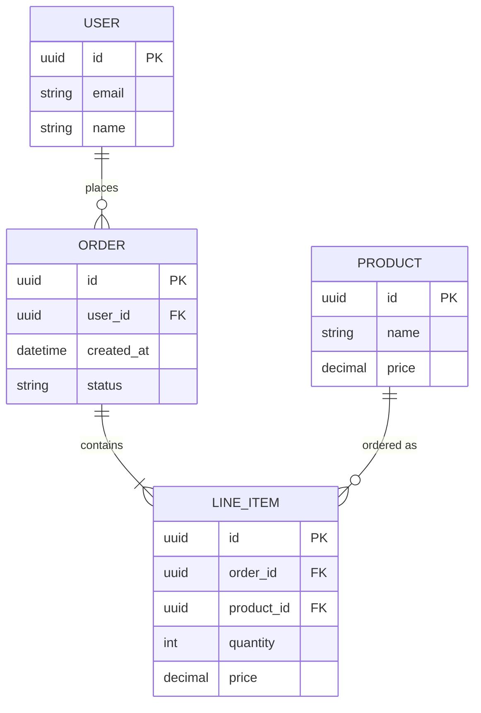
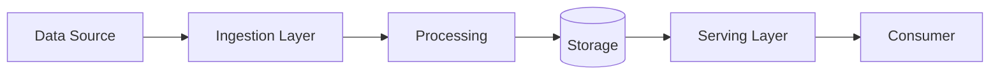

# Information Architecture Guide

Guidance for designing information architecture — depends on application architecture's service boundaries to determine data ownership and flow boundaries.

## Domain Model

### Entity Identification

From the PRD, identify:
1. **Core entities** — the nouns that the business revolves around (User, Order, Product)
2. **Value objects** — attributes with no independent identity (Address, Money, DateRange)
3. **Aggregates** — consistency boundaries grouping entities (Order + LineItems)
4. **Relationships** — one-to-one, one-to-many, many-to-many

### Entity Relationship Diagram Template



### Data Ownership Rules

- Each aggregate is owned by exactly one service
- Services access other services' data only through APIs, not direct DB access
- If two services frequently need the same data, consider: (a) API composition, (b) data replication with event sync, (c) rethinking the boundary

## Data Flow

### Data Flow Diagram Template



### Key Questions

- Where does data enter the system? (user input, external APIs, file uploads, event streams)
- Where is data transformed? (validation, enrichment, aggregation)
- Where does data live at rest? (primary store, cache, search index, data warehouse)
- How does data leave the system? (API responses, reports, event notifications, exports)

## Storage Strategy

### Selection Matrix

| Need | Relational (PostgreSQL, MySQL) | Document (MongoDB) | Key-Value (Redis) | Search (Elasticsearch) | Object (S3) |
|------|------|------|------|------|------|
| Complex queries & joins | ★★★ | ★☆☆ | ☆☆☆ | ★★☆ | ☆☆☆ |
| Flexible schema | ★★☆ | ★★★ | ★☆☆ | ★★☆ | ★☆☆ |
| Low-latency reads | ★★☆ | ★★☆ | ★★★ | ★★☆ | ★☆☆ |
| Full-text search | ★☆☆ | ★★☆ | ☆☆☆ | ★★★ | ☆☆☆ |
| Large binary data | ★☆☆ | ★☆☆ | ☆☆☆ | ☆☆☆ | ★★★ |
| ACID transactions | ★★★ | ★★☆ | ☆☆☆ | ☆☆☆ | ☆☆☆ |

### Read/Write Separation Decision

Apply when:
- Read-heavy workload (read:write ratio > 5:1)
- Reads have different latency requirements than writes
- Reads can tolerate eventual consistency

Patterns:
- **CQRS** — separate read and write models, sync via events
- **Read replica** — database-level replication for read scaling
- **Cache-aside** — application manages cache explicitly (check cache → miss → fetch from DB → populate cache)

### Caching Strategy

| Pattern | Use When | Invalidation |
|---------|----------|-------------|
| Cache-aside | General purpose, read-heavy | TTL + explicit invalidation on write |
| Write-through | Cannot tolerate stale reads | Cache updated synchronously on write |
| Write-behind | Write-heavy, can tolerate brief inconsistency | Writes buffered, flushed asynchronously |

## Data Consistency

### Consistency Models

| Model | Guarantee | Use When |
|-------|-----------|----------|
| Strong consistency | Read always returns latest write | Financial transactions, inventory |
| Eventual consistency | Reads converge to latest over time | Social feeds, analytics, search indexes |
| Causal consistency | Causally related operations seen in order | Collaborative editing, messaging |

### Saga Pattern for Distributed Transactions

When a business operation spans multiple services:

**Choreography-based saga:** Each service publishes events; next service reacts.
```
Order Service: createOrder → publish OrderCreated
Inventory Service: reserveStock → publish StockReserved
Payment Service: processPayment → publish PaymentCompleted
Order Service: confirmOrder
```

**Orchestration-based saga:** A central orchestrator commands each step.
```
Orchestrator → Order Service: createOrder
Orchestrator → Inventory Service: reserveStock
Orchestrator → Payment Service: processPayment
Orchestrator → Order Service: confirmOrder
```

Choose choreography for simple flows (2-3 steps), orchestration for complex flows (4+ steps, conditional branching).
