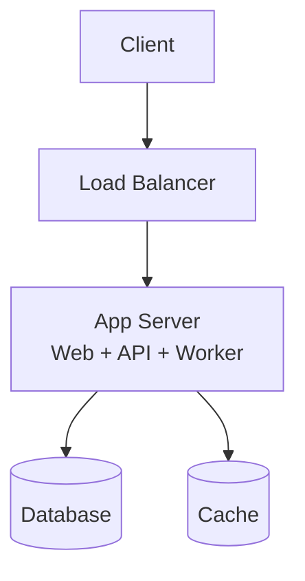
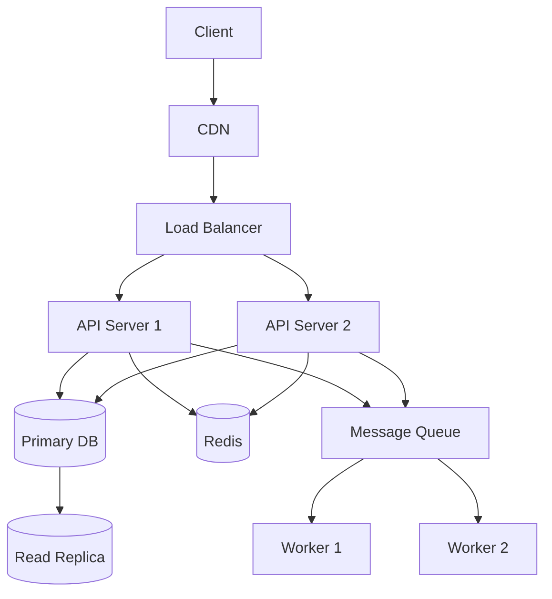

# Technical Architecture Guide

Guidance for designing technical architecture — depends on constraints from application, information, and integration architecture to make informed technology and infrastructure choices.

## Tech Stack Selection

### Selection Framework

For each technology category, evaluate candidates against these criteria:

| Criterion | Weight | Description |
|-----------|--------|-------------|
| **Team expertise** | High | Does the team have experience? Learning curve cost? |
| **Ecosystem maturity** | High | Libraries, tools, community support, documentation |
| **Performance fit** | Medium | Does it meet the quality attributes from PRD? |
| **Operational fit** | Medium | Monitoring, debugging, deployment complexity |
| **Long-term viability** | Medium | Active maintenance, adoption trend, vendor lock-in risk |
| **Cost** | Low-Medium | License, hosting, developer productivity |

### Decision Record Template

For each tech selection, document:

```markdown
### [Category]: [Selected Technology]

**Alternatives considered:**
1. [Option A] — [brief description, why rejected]
2. [Option B] — [brief description, why rejected]
3. [Selected] — [brief description, why chosen]

**Rationale:** [2-3 sentences on key differentiator]

**Risk:** [What could go wrong, mitigation]
```

### Common Categories

| Category | Options (examples) |
|----------|-------------------|
| Frontend framework | React, Vue, Svelte, Next.js, Nuxt |
| Backend language | Go, Node.js, Python, Java, Rust |
| Backend framework | Express, FastAPI, Spring Boot, Gin |
| Primary database | PostgreSQL, MySQL, MongoDB, DynamoDB |
| Cache | Redis, Memcached |
| Message queue | RabbitMQ, Kafka, SQS, NATS |
| Search | Elasticsearch, Meilisearch, Typesense |
| Object storage | S3, GCS, MinIO |
| Container orchestration | Kubernetes, ECS, Docker Compose |
| CI/CD | GitHub Actions, GitLab CI, CircleCI |
| Monitoring | Prometheus + Grafana, Datadog, New Relic |

## Deployment Topology

### Patterns

| Pattern | Diagram | Use When |
|---------|---------|----------|
| **Single server** | App + DB on one machine | MVP, low traffic, simple ops |
| **App + DB split** | App server(s) + managed DB | Most web apps, moderate traffic |
| **Microservices** | Multiple services + service mesh | Complex domain, independent scaling |
| **Serverless** | Functions + managed services | Event-driven, variable traffic, low ops |

### Single Server



### App + DB Split



### Key Infrastructure Decisions

- **Load balancing:** L4 (TCP) vs L7 (HTTP), health check strategy
- **Database:** Managed vs self-hosted, backup strategy, disaster recovery
- **Secrets management:** Vault, AWS Secrets Manager, environment variables (dev only)
- **Networking:** VPC design, public/private subnets, security groups

## Security Approach

### Security Checklist

- [ ] **Authentication:** How users prove identity (JWT, session cookies, OAuth2)
- [ ] **Authorization:** How permissions are enforced (RBAC, ABAC, ACL)
- [ ] **Data encryption:** At rest (AES-256) and in transit (TLS 1.2+)
- [ ] **Input validation:** Server-side validation for all user input
- [ ] **Secrets management:** No secrets in code, use vault or managed secrets
- [ ] **API security:** Rate limiting, CORS, input sanitization
- [ ] **Dependency security:** Automated vulnerability scanning (Dependabot, Snyk)
- [ ] **Audit logging:** Who did what, when, from where
- [ ] **Network security:** VPC, security groups, WAF if public-facing
- [ ] **Compliance:** GDPR, SOC2, HIPAA — if applicable from PRD constraints

### Threat Modeling (Lightweight)

For each major component, consider:
1. **Spoofing** — Can an attacker impersonate a user or service?
2. **Tampering** — Can data be modified in transit or at rest?
3. **Repudiation** — Can actions be denied? (audit logs)
4. **Information disclosure** — Can data be leaked?
5. **Denial of service** — Can the system be overwhelmed?
6. **Elevation of privilege** — Can a user gain unauthorized access levels?

## Observability Approach

### Three Pillars

| Pillar | Tool Examples | What It Answers |
|--------|--------------|----------------|
| **Metrics** | Prometheus, CloudWatch, Datadog | "How many? How fast? How often?" |
| **Logs** | ELK Stack, Loki, CloudWatch Logs | "What happened? What was the state?" |
| **Traces** | Jaeger, Zipkin, AWS X-Ray | "Where did the request go? Where is the bottleneck?" |

### Must-Have Metrics

- **RED metrics (for services):** Rate, Errors, Duration (latency)
- **USE metrics (for resources):** Utilization, Saturation, Errors
- **Business metrics:** Orders/min, active users, conversion rate

### Alerting Strategy

- **Page immediately:** Service down, error rate > 5%, data loss
- **Page during business hours:** High latency (p99 > threshold), disk > 80%
- **Ticket/notify:** Gradual trends, capacity planning signals

### Dashboard Structure

1. **Overview dashboard** — system health at a glance (traffic, errors, latency, uptime)
2. **Service dashboards** — per-service RED metrics + dependencies
3. **Infrastructure dashboard** — CPU, memory, disk, network per node
4. **Business dashboard** — key business metrics from PRD
