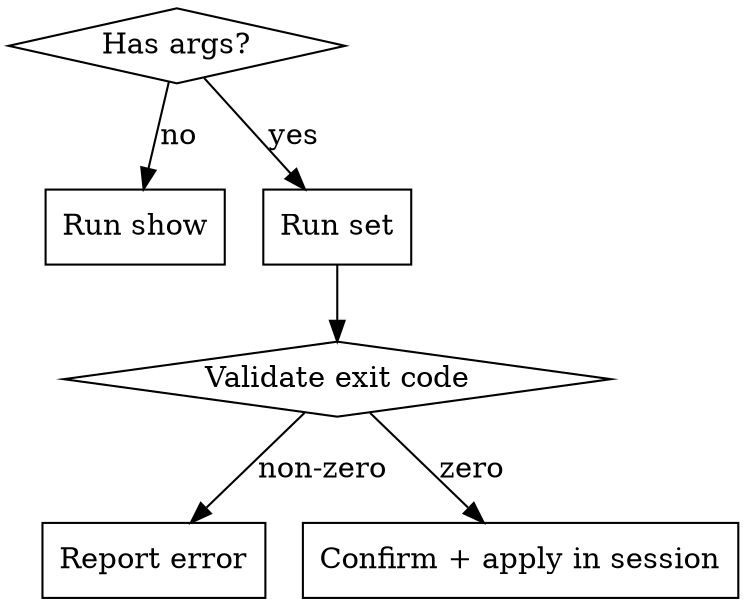

# Variables

查看和修改 superpowers-pro 插件变量。

## 调用方式

- `/superpowers-pro:variables` — 查看所有变量及当前值
- `/superpowers-pro:variables <name> <value>` — 修改变量值

## 流程

### 查看变量

1. 定位变量文件: `${CLAUDE_PLUGIN_ROOT}/.claude-plugin/variables.json`
2. 执行: `bash "${CLAUDE_PLUGIN_ROOT}/skills/variables/scripts/variables.sh" show <variables-json-path>`
3. 将输出展示给用户

###修改变量

1. 定位变量文件: `${CLAUDE_PLUGIN_ROOT}/.claude-plugin/variables.json`
2. 执行: `bash "${CLAUDE_PLUGIN_ROOT}/skills/variables/scripts/variables.sh" set <variables-json-path> <name> <value>`
3. 检查 exit code:
   - **非零**: 展示 stderr 中的错误信息给用户（未知变量 / 非法值）
   - **零**: 向用户确认修改成功，并声明新值在当前会话生效

### 会话覆盖规则

修改变量后，必须在对话中明确声明：

> 变量 `<name>` 已修改为 `<value>`。本次会话中 `<name>` 的值现在是 `<value>`。

此声明进入对话上下文后，后续行为必须以新值为准，忽略 session-start 注入的旧值。

## 限制

- 仅查看和修改，不支持新增或删除变量
- 仅操作 superpowers-pro 自身的 variables.json
- 修改值必须在该变量的 values 列表中（脚本严格校验）
